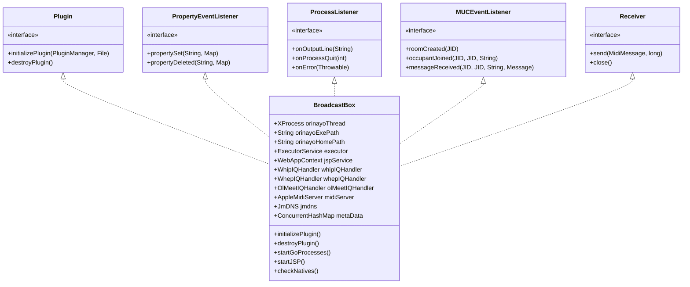
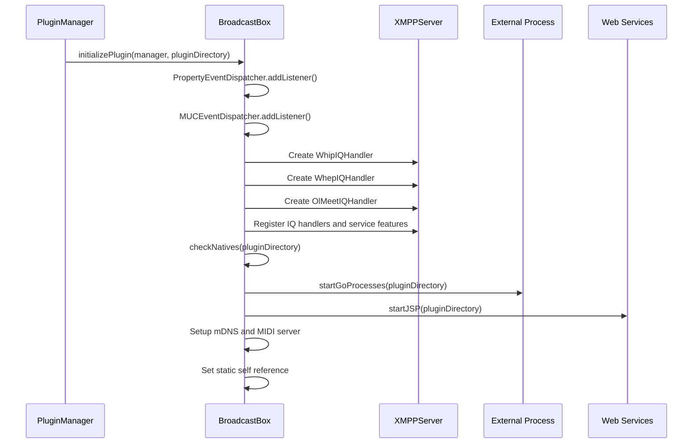
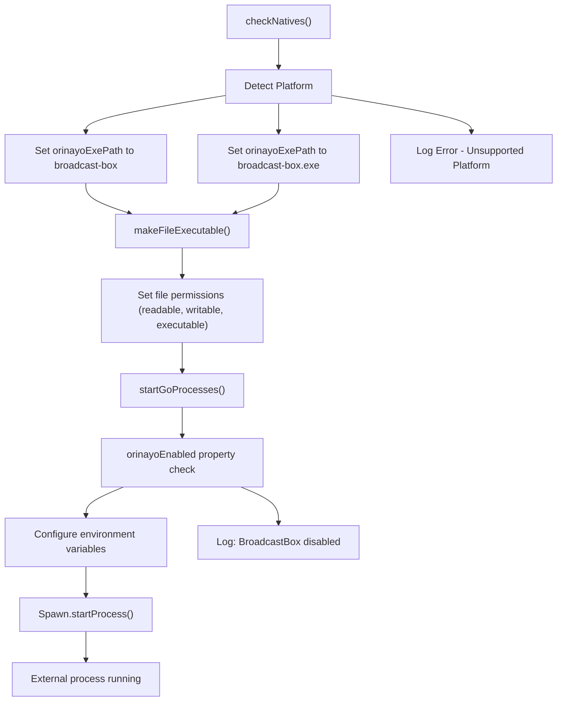
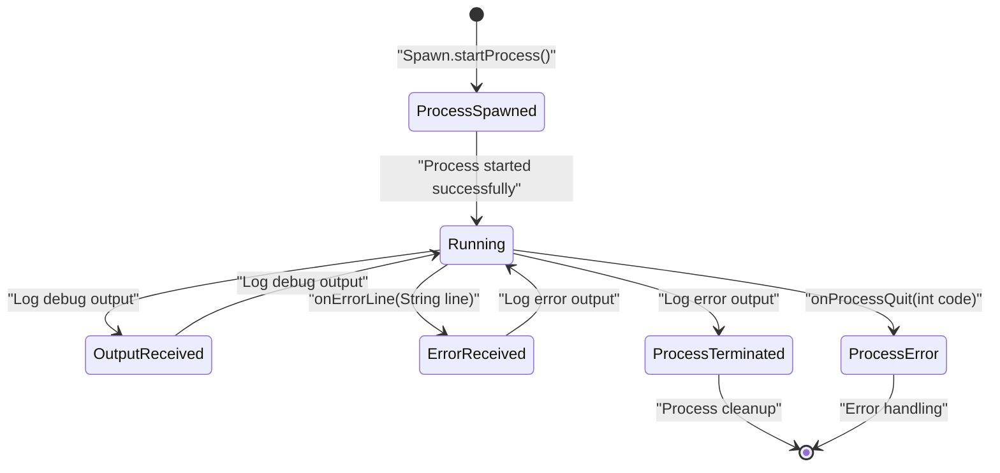
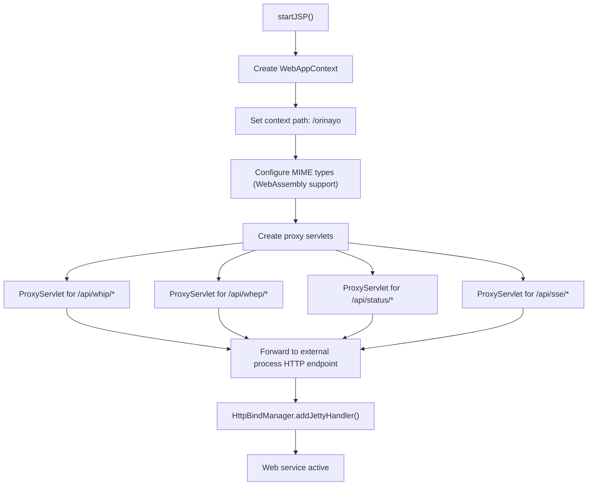
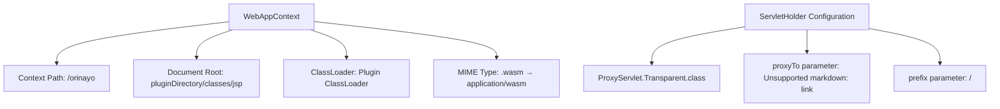
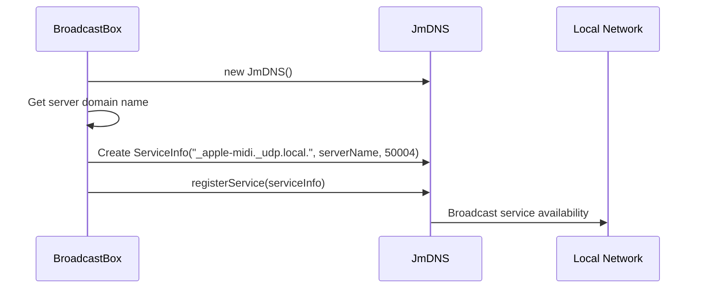
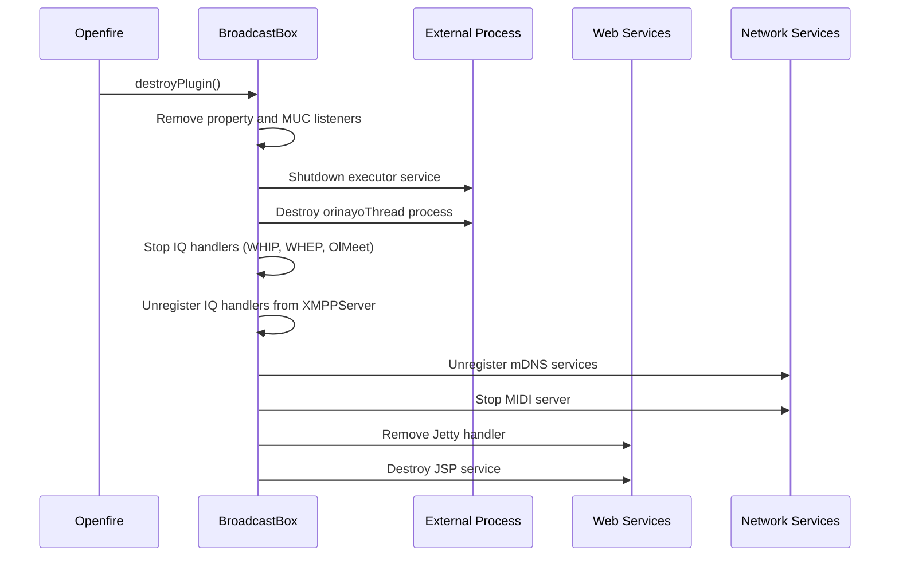

# BroadcastBox Main Class

> **Relevant source files**
> * [classes/jsp/WEB-INF/web.xml](https://github.com/igniterealtime/openfire-orinayo-plugin/blob/932fc61c/classes/jsp/WEB-INF/web.xml)
> * [classes/linux-64/broadcast-box](https://github.com/igniterealtime/openfire-orinayo-plugin/blob/932fc61c/classes/linux-64/broadcast-box)
> * [classes/win-64/broadcast-box.exe](https://github.com/igniterealtime/openfire-orinayo-plugin/blob/932fc61c/classes/win-64/broadcast-box.exe)
> * [src/java/org/ifsoft/orinayo/openfire/BroadcastBox.java](https://github.com/igniterealtime/openfire-orinayo-plugin/blob/932fc61c/src/java/org/ifsoft/orinayo/openfire/BroadcastBox.java)
> * [src/java/org/ifsoft/orinayo/openfire/OlMeetIQHandler.java](https://github.com/igniterealtime/openfire-orinayo-plugin/blob/932fc61c/src/java/org/ifsoft/orinayo/openfire/OlMeetIQHandler.java)

## Purpose and Scope

This document provides detailed documentation of the `BroadcastBox` class, which serves as the main orchestrator and entry point for the Orin Ayo Openfire plugin. The BroadcastBox class manages the complete lifecycle of the collaborative music platform, including external process management, XMPP protocol extensions, web service integration, and MIDI processing capabilities.

For information about XMPP protocol implementations, see [WHIP and WHEP IQ Handlers](./3.1-whip-and-whep-iq-handlers.md). For web interface details, see [Admin Console Integration](./4.1-admin-console-integration.md). For MIDI processing specifics, see [MIDI and ChordPro Processing](./5.1-midi-and-chordpro-processing.md).

## Class Overview and Architecture

The `BroadcastBox` class implements multiple interfaces to provide comprehensive plugin functionality within the Openfire XMPP server environment. It serves as the central coordination point for all plugin subsystems.

### Class Implementation Structure

Sources: [src/java/org/ifsoft/orinayo/openfire/BroadcastBox.java L68](https://github.com/igniterealtime/openfire-orinayo-plugin/blob/932fc61c/src/java/org/ifsoft/orinayo/openfire/BroadcastBox.java#L68-L68)

## Plugin Lifecycle Management

### Initialization Process

The plugin initialization follows a structured sequence that sets up all required subsystems and external dependencies.

The initialization process configures multiple subsystems in sequence:

1. **Event Listener Registration**: Registers for property changes and MUC events
2. **XMPP Handler Setup**: Creates and registers IQ handlers for WHIP, WHEP, and online meetings
3. **Native Process Management**: Validates and prepares platform-specific executables
4. **Web Service Configuration**: Sets up JSP services and proxy servlets
5. **Network Service Setup**: Configures mDNS and MIDI networking

Sources: [src/java/org/ifsoft/orinayo/openfire/BroadcastBox.java L124-L171](https://github.com/igniterealtime/openfire-orinayo-plugin/blob/932fc61c/src/java/org/ifsoft/orinayo/openfire/BroadcastBox.java#L124-L171)

### Service Discovery Integration

The plugin registers multiple XMPP service discovery features to advertise its capabilities:

| Feature Namespace | Description |
| --- | --- |
| `urn:xmpp:whip:0` | WebRTC HTTP Ingestion Protocol support |
| `urn:xmpp:whip:ice:0` | WHIP ICE candidate management |
| `urn:xmpp:whep:0` | WebRTC HTTP Egress Protocol support |
| `urn:xmpp:whep:ice:0` | WHEP ICE candidate management |
| `urn:xmpp:whep:ext:0` | WHEP protocol extensions |
| `urn:xmpp:http:online-meetings:initiate:0` | Online meeting initiation |
| `urn:xmpp:http:online-meetings#ohun` | Ohun audio conferencing |

Sources: [src/java/org/ifsoft/orinayo/openfire/BroadcastBox.java L133-L146](https://github.com/igniterealtime/openfire-orinayo-plugin/blob/932fc61c/src/java/org/ifsoft/orinayo/openfire/BroadcastBox.java#L133-L146)

## External Process Management

### Platform-Specific Executable Handling

The BroadcastBox class manages platform-specific external processes that provide WebRTC media streaming capabilities. These are compiled Go binaries that implement the actual media server functionality.

The external process configuration includes several environment variables:

| Environment Variable | Purpose |
| --- | --- |
| `APP_ENV` | Application environment (production) |
| `HTTP_ADDRESS` | HTTP bind address and port |
| `HTTP_PUBLIC_HOST` | Public hostname for external access |
| `UDP_MUX_PORT` | UDP multiplexer port for WebRTC |
| `NETWORK_TEST_ON_START` | Disable network testing on startup |
| `DEBUG_PRINT_OFFER` | Enable SDP offer debugging |
| `DEBUG_PRINT_ANSWER` | Enable SDP answer debugging |
| `STUN_SERVERS` | STUN server list for NAT traversal |
| `NAT_ICE_CANDIDATE_TYPE` | ICE candidate type for NAT scenarios |

Sources: [src/java/org/ifsoft/orinayo/openfire/BroadcastBox.java L289-L323](https://github.com/igniterealtime/openfire-orinayo-plugin/blob/932fc61c/src/java/org/ifsoft/orinayo/openfire/BroadcastBox.java#L289-L323)

 [src/java/org/ifsoft/orinayo/openfire/BroadcastBox.java L325-L360](https://github.com/igniterealtime/openfire-orinayo-plugin/blob/932fc61c/src/java/org/ifsoft/orinayo/openfire/BroadcastBox.java#L325-L360)

### Process Communication and Monitoring

The `BroadcastBox` class implements the `ProcessListener` interface to monitor the external process:

Sources: [src/java/org/ifsoft/orinayo/openfire/BroadcastBox.java L236-L254](https://github.com/igniterealtime/openfire-orinayo-plugin/blob/932fc61c/src/java/org/ifsoft/orinayo/openfire/BroadcastBox.java#L236-L254)

## Web Service Integration

### JSP Service and Proxy Configuration

The plugin sets up a comprehensive web service layer using Jetty's `WebAppContext` with proxy servlets for API endpoint forwarding.

The proxy configuration forwards API requests to the external Go process:

| Proxy Path | Target | Purpose |
| --- | --- | --- |
| `/api/whip/*` | External HTTP endpoint | WebRTC ingestion API |
| `/api/whep/*` | External HTTP endpoint | WebRTC egress API |
| `/api/status/*` | External HTTP endpoint | Status and monitoring |
| `/api/sse/*` | External HTTP endpoint | Server-sent events |

Sources: [src/java/org/ifsoft/orinayo/openfire/BroadcastBox.java L256-L287](https://github.com/igniterealtime/openfire-orinayo-plugin/blob/932fc61c/src/java/org/ifsoft/orinayo/openfire/BroadcastBox.java#L256-L287)

### Web Application Context Configuration

The web application context is configured with several important settings:

Sources: [src/java/org/ifsoft/orinayo/openfire/BroadcastBox.java L257-L287](https://github.com/igniterealtime/openfire-orinayo-plugin/blob/932fc61c/src/java/org/ifsoft/orinayo/openfire/BroadcastBox.java#L257-L287)

## Network Service Configuration

### mDNS Service Registration

The plugin registers Apple MIDI services via mDNS for network discovery:

The mDNS registration enables automatic discovery of MIDI services on port 50004 using the Apple MIDI protocol standard.

Sources: [src/java/org/ifsoft/orinayo/openfire/BroadcastBox.java L153-L161](https://github.com/igniterealtime/openfire-orinayo-plugin/blob/932fc61c/src/java/org/ifsoft/orinayo/openfire/BroadcastBox.java#L153-L161)

### Configuration Properties and URLs

The class provides several utility methods for dynamic configuration:

| Method | Purpose | Default Value |
| --- | --- | --- |
| `getPort()` | HTTP port for external process | "8080" |
| `getUDPPort()` | UDP port for WebRTC | "10000" |
| `getIpAddress()` | Server IP address | Resolved from hostname |
| `getWebappURL()` | Complete webapp URL | HTTPS with secure port |

The webapp URL construction supports override configuration via the `orinayo.webapp.url.override` property.

Sources: [src/java/org/ifsoft/orinayo/openfire/BroadcastBox.java L173-L234](https://github.com/igniterealtime/openfire-orinayo-plugin/blob/932fc61c/src/java/org/ifsoft/orinayo/openfire/BroadcastBox.java#L173-L234)

## Cleanup and Resource Management

### Destruction Process

The plugin cleanup process ensures proper resource deallocation:

The destruction process follows proper cleanup order to prevent resource leaks and ensure graceful shutdown.

Sources: [src/java/org/ifsoft/orinayo/openfire/BroadcastBox.java L87-L122](https://github.com/igniterealtime/openfire-orinayo-plugin/blob/932fc61c/src/java/org/ifsoft/orinayo/openfire/BroadcastBox.java#L87-L122)

## Integration with Openfire Architecture

### Static Instance Management

The `BroadcastBox` class maintains a static self-reference (`self`) that allows other components to access the main plugin instance. This design pattern enables cross-component communication within the plugin ecosystem.

### Event Handling Integration

The class integrates with multiple Openfire event systems:

* **Property Events**: Responds to configuration changes
* **MUC Events**: Handles multi-user chat events for collaborative features
* **MIDI Events**: Processes MIDI messages through the `Receiver` interface

Sources: [src/java/org/ifsoft/orinayo/openfire/BroadcastBox.java L83](https://github.com/igniterealtime/openfire-orinayo-plugin/blob/932fc61c/src/java/org/ifsoft/orinayo/openfire/BroadcastBox.java#L83-L83)

 [src/java/org/ifsoft/orinayo/openfire/BroadcastBox.java L127-L128](https://github.com/igniterealtime/openfire-orinayo-plugin/blob/932fc61c/src/java/org/ifsoft/orinayo/openfire/BroadcastBox.java#L127-L128)

 [src/java/org/ifsoft/orinayo/openfire/BroadcastBox.java L367-L375](https://github.com/igniterealtime/openfire-orinayo-plugin/blob/932fc61c/src/java/org/ifsoft/orinayo/openfire/BroadcastBox.java#L367-L375)