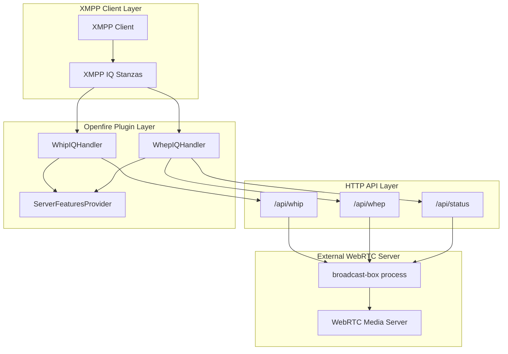
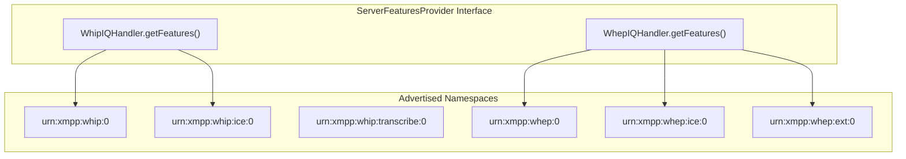
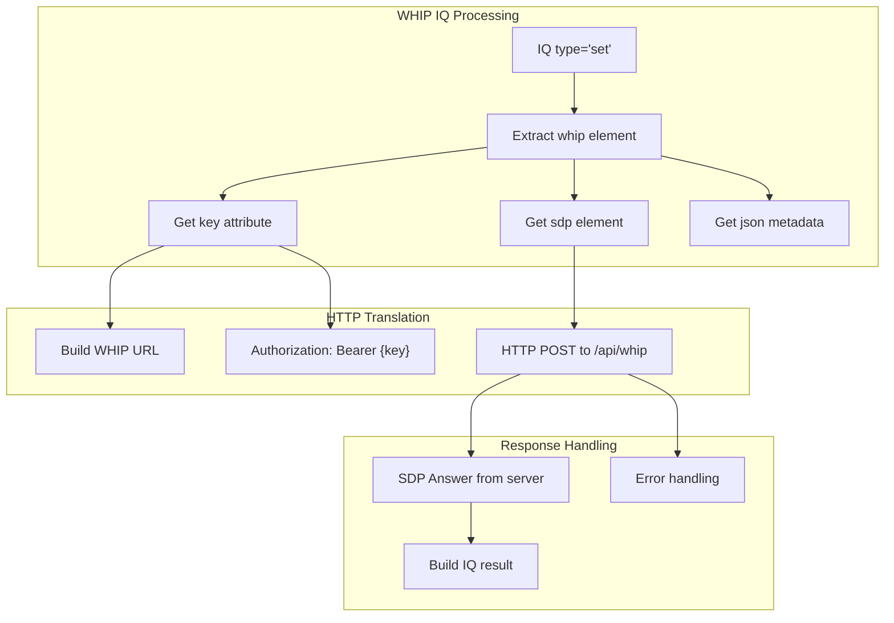
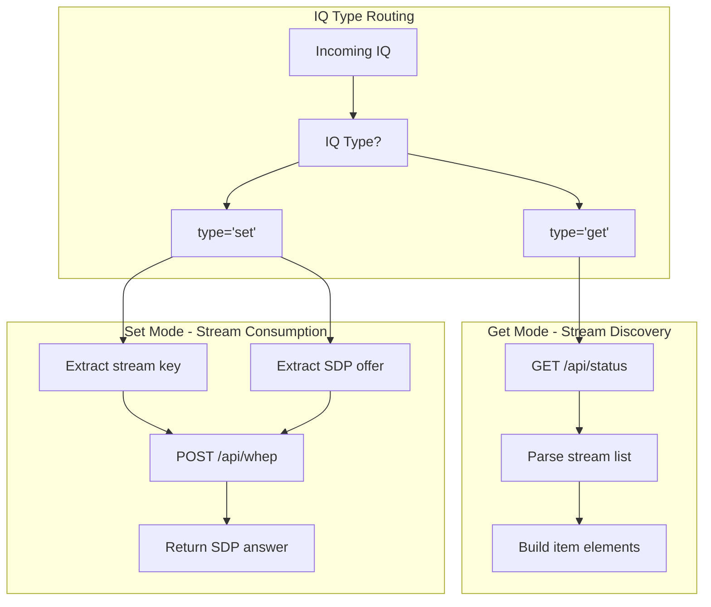
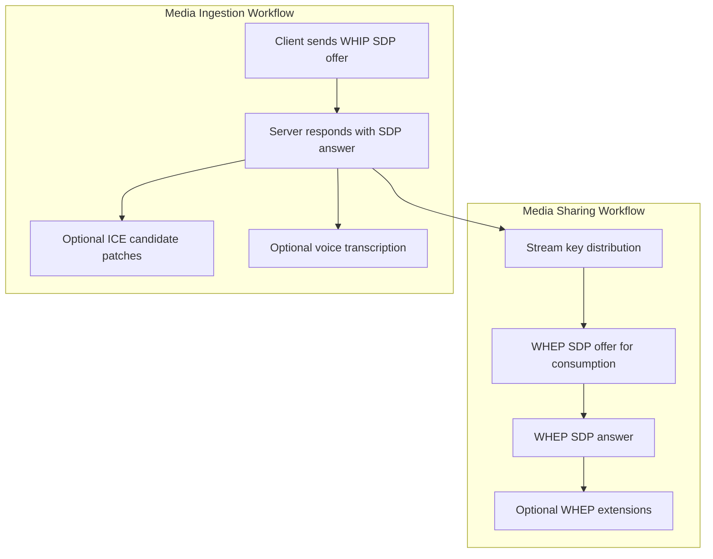

# XMPP Protocol Extensions

> **Relevant source files**
> * [docs/xep/index.htm](https://github.com/igniterealtime/openfire-orinayo-plugin/blob/932fc61c/docs/xep/index.htm)
> * [docs/xep/index.html](https://github.com/igniterealtime/openfire-orinayo-plugin/blob/932fc61c/docs/xep/index.html)
> * [docs/xep/xep-xxxx-http_user_media_streams-01-01.xml](https://github.com/igniterealtime/openfire-orinayo-plugin/blob/932fc61c/docs/xep/xep-xxxx-http_user_media_streams-01-01.xml)
> * [src/java/org/ifsoft/orinayo/openfire/WhepIQHandler.java](https://github.com/igniterealtime/openfire-orinayo-plugin/blob/932fc61c/src/java/org/ifsoft/orinayo/openfire/WhepIQHandler.java)
> * [src/java/org/ifsoft/orinayo/openfire/WhipIQHandler.java](https://github.com/igniterealtime/openfire-orinayo-plugin/blob/932fc61c/src/java/org/ifsoft/orinayo/openfire/WhipIQHandler.java)

This document describes the custom XMPP protocol extensions implemented by the Orin Ayo plugin to enable WebRTC media streaming through XMPP. These extensions provide XMPP-native access to WHIP (WebRTC-HTTP Ingestion Protocol) and WHEP (WebRTC-HTTP Egress Protocol) functionality, allowing clients to publish and consume media streams using standard XMPP IQ stanzas.

For information about the core plugin architecture and external process management, see [Core Plugin Architecture](./2-core-plugin-architecture.md). For details on web client interfaces and HTTP API endpoints, see [Web Interfaces and Client Applications](./4-web-interfaces-and-client-applications.md).

## Protocol Overview

The plugin implements a comprehensive XMPP extension that bridges WebRTC media streaming protocols with XMPP messaging. The system translates XMPP IQ stanzas into HTTP requests to an external WebRTC media server, enabling seamless integration of real-time media capabilities within XMPP-based applications.

## Architecture and Protocol Flow

The XMPP protocol extensions operate through a proxy pattern, where XMPP IQ handlers translate protocol requests into HTTP calls to the underlying WebRTC media server:

**XMPP to WebRTC Protocol Bridge**



Sources: [src/java/org/ifsoft/orinayo/openfire/WhipIQHandler.java L54-L145](https://github.com/igniterealtime/openfire-orinayo-plugin/blob/932fc61c/src/java/org/ifsoft/orinayo/openfire/WhipIQHandler.java#L54-L145)

 [src/java/org/ifsoft/orinayo/openfire/WhepIQHandler.java L51-L148](https://github.com/igniterealtime/openfire-orinayo-plugin/blob/932fc61c/src/java/org/ifsoft/orinayo/openfire/WhepIQHandler.java#L51-L148)

## Namespace Registration and Service Discovery

The plugin registers multiple XML namespaces with Openfire's service discovery mechanism:

| Namespace | Purpose | Handler |
| --- | --- | --- |
| `urn:xmpp:whip:0` | WHIP media ingestion | WhipIQHandler |
| `urn:xmpp:whip:ice:0` | WHIP ICE candidate patches | WhipIQHandler |
| `urn:xmpp:whip:transcribe:0` | Voice transcription | WhipIQHandler |
| `urn:xmpp:whep:0` | WHEP media egress | WhepIQHandler |
| `urn:xmpp:whep:ice:0` | WHEP ICE candidate patches | WhepIQHandler |
| `urn:xmpp:whep:ext:0` | WHEP protocol extensions | WhepIQHandler |

**Service Discovery Implementation**



Sources: [src/java/org/ifsoft/orinayo/openfire/WhipIQHandler.java L139-L145](https://github.com/igniterealtime/openfire-orinayo-plugin/blob/932fc61c/src/java/org/ifsoft/orinayo/openfire/WhipIQHandler.java#L139-L145)

 [src/java/org/ifsoft/orinayo/openfire/WhepIQHandler.java L140-L148](https://github.com/igniterealtime/openfire-orinayo-plugin/blob/932fc61c/src/java/org/ifsoft/orinayo/openfire/WhepIQHandler.java#L140-L148)

 [docs/xep/xep-xxxx-http_user_media_streams-01-01.xml L215-L225](https://github.com/igniterealtime/openfire-orinayo-plugin/blob/932fc61c/docs/xep/xep-xxxx-http_user_media_streams-01-01.xml#L215-L225)

## WHIP IQ Handler Implementation

The `WhipIQHandler` class processes WebRTC ingestion requests by translating XMPP IQ stanzas into HTTP POST requests to the WHIP endpoint:

**WHIP Request Processing Flow**



The core implementation handles SDP offer/answer exchange and metadata storage:

```xml
<iq from='juliet@capulet.lit/producer' type='set'>
  <whip xmlns='urn:xmpp:whip:0' key='stream-key-123'>
    <sdp>...SDP OFFER...</sdp>
    <json>{"metadata": "value"}</json>
  </whip>
</iq>
```

Sources: [src/java/org/ifsoft/orinayo/openfire/WhipIQHandler.java L78-L131](https://github.com/igniterealtime/openfire-orinayo-plugin/blob/932fc61c/src/java/org/ifsoft/orinayo/openfire/WhipIQHandler.java#L78-L131)

 [src/java/org/ifsoft/orinayo/openfire/WhipIQHandler.java L147-L186](https://github.com/igniterealtime/openfire-orinayo-plugin/blob/932fc61c/src/java/org/ifsoft/orinayo/openfire/WhipIQHandler.java#L147-L186)

## WHEP IQ Handler Implementation

The `WhepIQHandler` class manages media consumption requests and stream discovery through two distinct operation modes:

**WHEP Dual Operation Mode**



The handler supports stream discovery through `IQ type='get'` requests, returning available streams:

```xml
<iq type='result'>
  <whep xmlns='urn:xmpp:whep:0'>
    <item key='stream-key-1'/>
    <item key='stream-key-2'/>
  </whep>
</iq>
```

Sources: [src/java/org/ifsoft/orinayo/openfire/WhepIQHandler.java L74-L133](https://github.com/igniterealtime/openfire-orinayo-plugin/blob/932fc61c/src/java/org/ifsoft/orinayo/openfire/WhepIQHandler.java#L74-L133)

 [src/java/org/ifsoft/orinayo/openfire/WhepIQHandler.java L101-L121](https://github.com/igniterealtime/openfire-orinayo-plugin/blob/932fc61c/src/java/org/ifsoft/orinayo/openfire/WhepIQHandler.java#L101-L121)

## XEP Specification Documentation

The plugin includes a complete XEP (XMPP Extension Protocol) specification that formally defines the HTTP User Media Streams protocol. The specification covers:

* **Protocol Requirements**: Integration with existing WebRTC infrastructure while maintaining XMPP compatibility
* **Discovery Mechanisms**: Service advertisement through XEP-0030 (Service Discovery)
* **Workflow Documentation**: Complete message flows for media ingestion and egress
* **Security Considerations**: Authentication and authorization patterns
* **XML Schema Definitions**: Formal protocol element structures

**XEP Protocol Workflow**



The XEP defines integration with existing XMPP standards:

* **XEP-0060**: Publish-Subscribe for stream key distribution
* **XEP-0482**: Call Invites for media session initiation
* **XEP-0030**: Service Discovery for capability advertisement

Sources: [docs/xep/xep-xxxx-http_user_media_streams-01-01.xml L44-L201](https://github.com/igniterealtime/openfire-orinayo-plugin/blob/932fc61c/docs/xep/xep-xxxx-http_user_media_streams-01-01.xml#L44-L201)

 [docs/xep/index.htm L1-L234](https://github.com/igniterealtime/openfire-orinayo-plugin/blob/932fc61c/docs/xep/index.htm#L1-L234)

## HTTP Proxy Integration

Both IQ handlers implement a common HTTP proxy pattern through the `fetch()` method in `WhepIQHandler` and `getSDP()` method in `WhipIQHandler`. These methods:

1. **URL Construction**: Build endpoint URLs using configured IP address and port
2. **Authentication**: Add Bearer token authorization headers using stream keys
3. **Content Negotiation**: Set appropriate HTTP headers for WebRTC SDP exchange
4. **Error Handling**: Translate HTTP errors into XMPP error conditions

The proxy integration enables XMPP clients to access WebRTC functionality without requiring direct HTTP access to the media server, maintaining XMPP's federated architecture while leveraging existing WebRTC infrastructure.

Sources: [src/java/org/ifsoft/orinayo/openfire/WhepIQHandler.java L154-L192](https://github.com/igniterealtime/openfire-orinayo-plugin/blob/932fc61c/src/java/org/ifsoft/orinayo/openfire/WhepIQHandler.java#L154-L192)

 [src/java/org/ifsoft/orinayo/openfire/WhipIQHandler.java L147-L186](https://github.com/igniterealtime/openfire-orinayo-plugin/blob/932fc61c/src/java/org/ifsoft/orinayo/openfire/WhipIQHandler.java#L147-L186)

 [src/java/org/ifsoft/orinayo/openfire/WhipIQHandler.java L100-L102](https://github.com/igniterealtime/openfire-orinayo-plugin/blob/932fc61c/src/java/org/ifsoft/orinayo/openfire/WhipIQHandler.java#L100-L102)