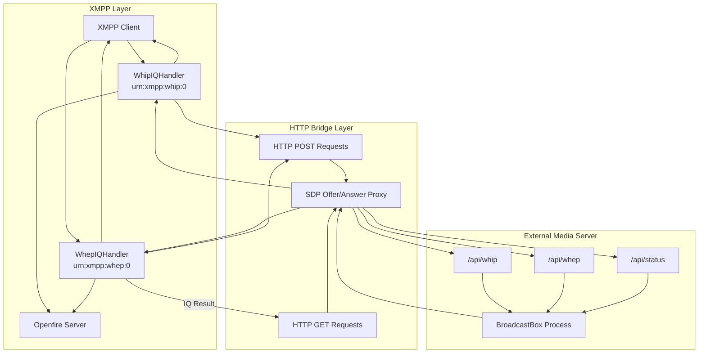
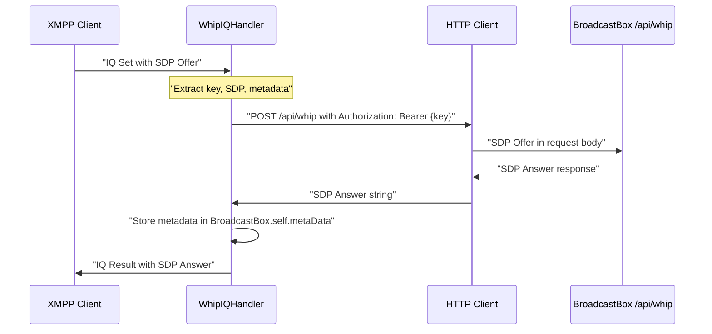
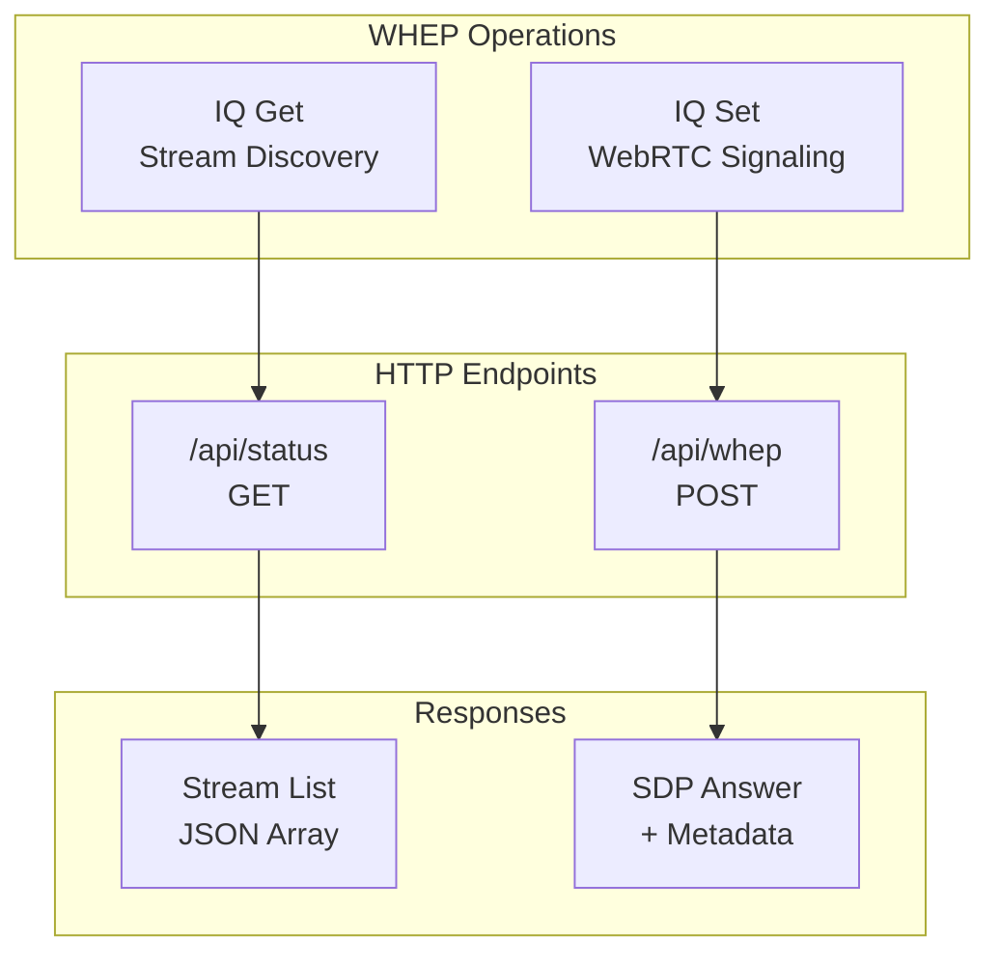

# WHIP and WHEP IQ Handlers

> **Relevant source files**
> * [src/java/org/ifsoft/orinayo/openfire/WhepIQHandler.java](https://github.com/igniterealtime/openfire-orinayo-plugin/blob/932fc61c/src/java/org/ifsoft/orinayo/openfire/WhepIQHandler.java)
> * [src/java/org/ifsoft/orinayo/openfire/WhipIQHandler.java](https://github.com/igniterealtime/openfire-orinayo-plugin/blob/932fc61c/src/java/org/ifsoft/orinayo/openfire/WhipIQHandler.java)

## Purpose and Scope

This document covers the implementation of XMPP IQ handlers for WebRTC HTTP Ingestion Protocol (WHIP) and WebRTC HTTP Egress Protocol (WHEP) in the Orin Ayo plugin. These handlers enable WebRTC signaling over XMPP by translating XMPP IQ stanzas to HTTP API calls to the external broadcast-box media server.

For broader context on the plugin architecture, see [Core Plugin Architecture](./2-core-plugin-architecture.md). For XEP specifications and protocol documentation, see [XEP Specifications and Documentation](./3.2-xep-specifications-and-documentation.md).

## Handler Architecture Overview



Sources: [src/java/org/ifsoft/orinayo/openfire/WhipIQHandler.java L1-L189](https://github.com/igniterealtime/openfire-orinayo-plugin/blob/932fc61c/src/java/org/ifsoft/orinayo/openfire/WhipIQHandler.java#L1-L189)

 [src/java/org/ifsoft/orinayo/openfire/WhepIQHandler.java L1-L194](https://github.com/igniterealtime/openfire-orinayo-plugin/blob/932fc61c/src/java/org/ifsoft/orinayo/openfire/WhepIQHandler.java#L1-L194)

## WhipIQHandler Implementation

The `WhipIQHandler` class provides XMPP integration for WebRTC HTTP Ingestion Protocol, enabling media publishers to establish WebRTC connections through XMPP signaling.

### Class Structure and Configuration

| Component | Value | Description |
| --- | --- | --- |
| Element Name | `whip` | XMPP element name for WHIP requests |
| Primary Namespace | `urn:xmpp:whip:0` | Main WHIP protocol namespace |
| ICE Namespace | `urn:xmpp:whip:ice:0` | ICE candidate exchange namespace |
| Handler Type | `IQHandler` | Openfire IQ packet processor |
| Features Provider | `ServerFeaturesProvider` | Service discovery integration |

### WHIP Protocol Flow



### Request Processing Logic

The `handleIQ()` method processes WHIP requests with the following validation and workflow:

1. **Request Validation**: Verifies IQ type is `set` and contains required `whip` element
2. **Parameter Extraction**: Extracts stream `key`, SDP `offer`, and optional JSON `metadata`
3. **HTTP Forwarding**: Constructs HTTP POST request to `/api/whip` endpoint
4. **Metadata Storage**: Stores metadata in `BroadcastBox.self.metaData` cache for later retrieval
5. **Response Construction**: Returns SDP answer in XMPP IQ result

Sources: [src/java/org/ifsoft/orinayo/openfire/WhipIQHandler.java L78-L131](https://github.com/igniterealtime/openfire-orinayo-plugin/blob/932fc61c/src/java/org/ifsoft/orinayo/openfire/WhipIQHandler.java#L78-L131)

### HTTP Integration Details

The `getSDP()` method handles HTTP communication with the broadcast-box service:

| HTTP Property | Value | Purpose |
| --- | --- | --- |
| Method | `POST` | Submit SDP offer |
| URL | `http://{ipaddr}:{port}/api/whip` | Configurable endpoint |
| Authorization | `Bearer {streamKey}` | Stream authentication |
| Content-Type | `application/json;charset=UTF-8` | JSON payload format |
| Accept | `text/event-stream` | SDP response format |

Sources: [src/java/org/ifsoft/orinayo/openfire/WhipIQHandler.java L147-L186](https://github.com/igniterealtime/openfire-orinayo-plugin/blob/932fc61c/src/java/org/ifsoft/orinayo/openfire/WhipIQHandler.java#L147-L186)

## WhepIQHandler Implementation

The `WhepIQHandler` class provides XMPP integration for WebRTC HTTP Egress Protocol, enabling media consumers to establish WebRTC connections and query available streams.

### Extended Namespace Support

| Namespace | Purpose |
| --- | --- |
| `urn:xmpp:whep:0` | Primary WHEP protocol |
| `urn:xmpp:whep:ice:0` | ICE candidate exchange |
| `urn:xmpp:whep:ext:0` | Protocol extensions |

### Dual Operation Mode

The handler supports both GET and SET IQ operations:



### Stream Discovery Protocol

For `IQ.Type.get` requests, the handler queries available streams:

1. **HTTP GET Request**: Fetches stream status from `/api/status` endpoint
2. **JSON Processing**: Parses response as `JSONArray` containing stream objects
3. **Response Construction**: Creates XMPP response with `item` elements for each stream

The status API returns stream information in this format:

```json
[
  {
    "streamKey": "deleolajide",
    "firstSeenEpoch": 1735911011,
    "audioPacketsReceived": 112,
    "videoStreams": [],
    "whepSessions": []
  }
]
```

Sources: [src/java/org/ifsoft/orinayo/openfire/WhepIQHandler.java L101-L121](https://github.com/igniterealtime/openfire-orinayo-plugin/blob/932fc61c/src/java/org/ifsoft/orinayo/openfire/WhepIQHandler.java#L101-L121)

### WebRTC Signaling Protocol

For `IQ.Type.set` requests, the handler processes WebRTC signaling:

1. **SDP Extraction**: Extracts SDP offer and stream key from XMPP request
2. **HTTP Forwarding**: Sends POST request to `/api/whep` with SDP offer
3. **Metadata Integration**: Retrieves stored metadata from `BroadcastBox.self.metaData`
4. **Enhanced Response**: Returns SDP answer with associated metadata

Sources: [src/java/org/ifsoft/orinayo/openfire/WhepIQHandler.java L85-L98](https://github.com/igniterealtime/openfire-orinayo-plugin/blob/932fc61c/src/java/org/ifsoft/orinayo/openfire/WhepIQHandler.java#L85-L98)

## HTTP Client Implementation

Both handlers use a common HTTP client pattern through the `fetch()` method in `WhepIQHandler`:

### HTTP Request Configuration

| Property | Value | Description |
| --- | --- | --- |
| Connection Type | `HttpURLConnection` | Standard Java HTTP client |
| Method Support | `GET`, `POST` | RESTful operations |
| Authentication | `Bearer {streamKey}` | Token-based auth when provided |
| Character Encoding | `UTF-8` | Unicode support |
| Content Type | `application/json` | JSON payload format |

### Error Handling Strategy

Both handlers implement comprehensive error handling:

1. **Missing Elements**: Returns `not_allowed` error for missing required elements
2. **HTTP Failures**: Logs errors and returns `internal_server_error`
3. **Service Unavailability**: Returns `not_allowed` when HTTP endpoints are unreachable

Sources: [src/java/org/ifsoft/orinayo/openfire/WhepIQHandler.java L154-L192](https://github.com/igniterealtime/openfire-orinayo-plugin/blob/932fc61c/src/java/org/ifsoft/orinayo/openfire/WhepIQHandler.java#L154-L192)

 [src/java/org/ifsoft/orinayo/openfire/WhipIQHandler.java L147-L186](https://github.com/igniterealtime/openfire-orinayo-plugin/blob/932fc61c/src/java/org/ifsoft/orinayo/openfire/WhipIQHandler.java#L147-L186)

## Configuration Integration

Both handlers integrate with Openfire's configuration system:

### Dynamic Endpoint Configuration

```
final String ipaddr = JiveGlobals.getProperty("orinayo.ipaddr", BroadcastBox.getIpAddress());
final String tcpPort = JiveGlobals.getProperty("orinayo.port", BroadcastBox.getPort());
```

| Property | Default | Purpose |
| --- | --- | --- |
| `orinayo.ipaddr` | `BroadcastBox.getIpAddress()` | HTTP endpoint IP address |
| `orinayo.port` | `BroadcastBox.getPort()` | HTTP endpoint port |

### Service Discovery Integration

Both handlers implement `ServerFeaturesProvider` to advertise their capabilities:

* WHIP: Advertises `urn:xmpp:whip:0` and `urn:xmpp:whip:ice:0`
* WHEP: Advertises `urn:xmpp:whep:0`, `urn:xmpp:whep:ice:0`, and `urn:xmpp:whep:ext:0`

Sources: [src/java/org/ifsoft/orinayo/openfire/WhipIQHandler.java L139-L145](https://github.com/igniterealtime/openfire-orinayo-plugin/blob/932fc61c/src/java/org/ifsoft/orinayo/openfire/WhipIQHandler.java#L139-L145)

 [src/java/org/ifsoft/orinayo/openfire/WhepIQHandler.java L140-L148](https://github.com/igniterealtime/openfire-orinayo-plugin/blob/932fc61c/src/java/org/ifsoft/orinayo/openfire/WhepIQHandler.java#L140-L148)