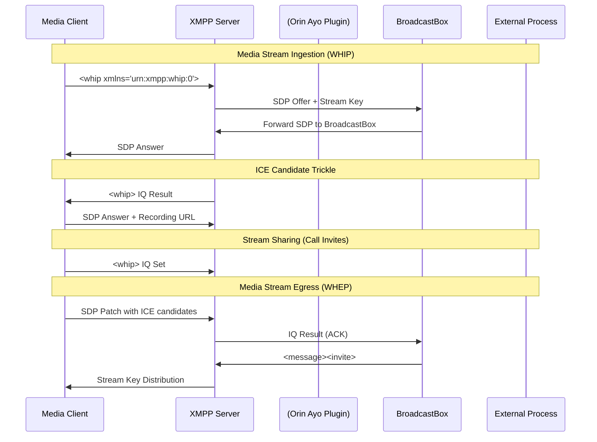

# XEP Specifications and Documentation

> **Relevant source files**
> * [docs/xep/index.htm](https://github.com/igniterealtime/openfire-orinayo-plugin/blob/932fc61c/docs/xep/index.htm)
> * [docs/xep/index.html](https://github.com/igniterealtime/openfire-orinayo-plugin/blob/932fc61c/docs/xep/index.html)
> * [docs/xep/xep-xxxx-http_user_media_streams-01-01.xml](https://github.com/igniterealtime/openfire-orinayo-plugin/blob/932fc61c/docs/xep/xep-xxxx-http_user_media_streams-01-01.xml)
> * [docs/xep/xep.ent](https://github.com/igniterealtime/openfire-orinayo-plugin/blob/932fc61c/docs/xep/xep.ent)
> * [docs/xep/xep.xsl](https://github.com/igniterealtime/openfire-orinayo-plugin/blob/932fc61c/docs/xep/xep.xsl)

This section covers the XMPP Extension Protocol (XEP) specifications and documentation system implemented within the Orin Ayo plugin. The plugin includes a custom XEP specification for HTTP User Media Streams that defines how WebRTC-based media ingestion and egress protocols (WHIP/WHEP) map to XMPP IQ stanzas.

For information about the actual XMPP protocol handlers that implement these specifications, see [WHIP and WHEP IQ Handlers](./3.1-whip-and-whep-iq-handlers.md).

## XEP Document Structure and Generation System

The plugin includes a complete XEP documentation system that follows XMPP Standards Foundation conventions. The system transforms XML specifications into HTML documentation using XSLT processing.

```

```

Sources: [docs/xep/xep-xxxx-http_user_media_streams-01-01.xml L1-L234](https://github.com/igniterealtime/openfire-orinayo-plugin/blob/932fc61c/docs/xep/xep-xxxx-http_user_media_streams-01-01.xml#L1-L234)

 [docs/xep/xep.xsl L1-L1332](https://github.com/igniterealtime/openfire-orinayo-plugin/blob/932fc61c/docs/xep/xep.xsl#L1-L1332)

 [docs/xep/index.htm L1-L219](https://github.com/igniterealtime/openfire-orinayo-plugin/blob/932fc61c/docs/xep/index.htm#L1-L219)

## HTTP User Media Streams XEP Specification

The core XEP document defines a comprehensive protocol for WebRTC media streaming over XMPP. The specification introduces several custom namespaces and maps WHIP/WHEP protocols to XMPP IQ stanzas.

### Protocol Namespaces and Capabilities

```

```

Sources: [docs/xep/xep-xxxx-http_user_media_streams-01-01.xml L59-L86](https://github.com/igniterealtime/openfire-orinayo-plugin/blob/932fc61c/docs/xep/xep-xxxx-http_user_media_streams-01-01.xml#L59-L86)

 [docs/xep/xep-xxxx-http_user_media_streams-01-01.xml L215-L225](https://github.com/igniterealtime/openfire-orinayo-plugin/blob/932fc61c/docs/xep/xep-xxxx-http_user_media_streams-01-01.xml#L215-L225)

### Media Stream Workflow Protocol

The XEP defines detailed workflows for media stream ingestion and egress, including SDP offer/answer exchanges, ICE candidate trickle, and error handling.



Sources: [docs/xep/xep-xxxx-http_user_media_streams-01-01.xml L88-L200](https://github.com/igniterealtime/openfire-orinayo-plugin/blob/932fc61c/docs/xep/xep-xxxx-http_user_media_streams-01-01.xml#L88-L200)

 [docs/xep/xep-xxxx-http_user_media_streams-01-01.xml L141-L199](https://github.com/igniterealtime/openfire-orinayo-plugin/blob/932fc61c/docs/xep/xep-xxxx-http_user_media_streams-01-01.xml#L141-L199)

## XEP Document Metadata and Structure

The XEP document follows standard XMPP Extension Protocol formatting with comprehensive metadata and structured sections.

| Property | Value | Description |
| --- | --- | --- |
| **XEP Number** | `XXXX` | Placeholder for official XEP assignment |
| **Status** | `ProtoXEP` | Pre-publication status |
| **Type** | `Standards Track` | Protocol specification type |
| **Title** | `HTTP User Media Streams` | Official specification title |
| **Short Name** | `http_user_media_streams` | Implementation identifier |
| **Author** | `Dele Olajide` | Primary specification author |
| **Version** | `0.0.1` | Initial specification version |

Sources: [docs/xep/xep-xxxx-http_user_media_streams-01-01.xml L8-L42](https://github.com/igniterealtime/openfire-orinayo-plugin/blob/932fc61c/docs/xep/xep-xxxx-http_user_media_streams-01-01.xml#L8-L42)

## Document Generation and Transformation

The XEP documentation system uses XSLT transformation to generate HTML from XML source documents. The transformation engine includes support for syntax highlighting, table of contents generation, and cross-references.

### XSLT Template Structure

```

```

Sources: [docs/xep/xep.xsl L172-L576](https://github.com/igniterealtime/openfire-orinayo-plugin/blob/932fc61c/docs/xep/xep.xsl#L172-L576)

 [docs/xep/xep.xsl L591-L608](https://github.com/igniterealtime/openfire-orinayo-plugin/blob/932fc61c/docs/xep/xep.xsl#L591-L608)

 [docs/xep/xep.xsl L1117-L1124](https://github.com/igniterealtime/openfire-orinayo-plugin/blob/932fc61c/docs/xep/xep.xsl#L1117-L1124)

## Protocol Examples and Implementation Notes

The XEP specification includes detailed protocol examples showing SDP exchange, error handling, and extension mechanisms.

### Key Protocol Features

* **Stream Key Management**: Unique identifiers for media streams (`juliet-ih28sx61`)
* **SDP Offer/Answer**: WebRTC session description exchange via XMPP IQ stanzas
* **ICE Candidate Trickle**: Progressive ICE candidate discovery and exchange
* **Voice Transcription**: Optional real-time speech-to-text conversion
* **WHEP Extensions**: Support for simulcast layers and server-sent events
* **Error Handling**: Standard XMPP error conditions with descriptive text

Sources: [docs/xep/xep-xxxx-http_user_media_streams-01-01.xml L91-L199](https://github.com/igniterealtime/openfire-orinayo-plugin/blob/932fc61c/docs/xep/xep-xxxx-http_user_media_streams-01-01.xml#L91-L199)

 [docs/xep/xep-xxxx-http_user_media_streams-01-01.xml L50-L57](https://github.com/igniterealtime/openfire-orinayo-plugin/blob/932fc61c/docs/xep/xep-xxxx-http_user_media_streams-01-01.xml#L50-L57)

## XML Entity System

The documentation system includes a comprehensive set of XML entities for common references, shortcuts, and standardized text. The entity definitions support consistent formatting across XEP documents.

### Entity Categories

| Category | Examples | Usage |
| --- | --- | --- |
| **HTML Entities** | `&tm;`, `&copy;`, `&reg;` | Special characters |
| **XMPP Stanza Shortcuts** | `&MESSAGE;`, `&IQ;`, `&PRESENCE;` | Protocol elements |
| **RFC References** | `&rfc2119;`, `&rfc6120;` | Standard citations |
| **XSF References** | `&COUNCIL;`, `&REGISTRAR;` | Organizational links |
| **Error Conditions** | `&badrequest;`, `&notfound;` | Standard error types |

Sources: [docs/xep/xep.ent L42-L220](https://github.com/igniterealtime/openfire-orinayo-plugin/blob/932fc61c/docs/xep/xep.ent#L42-L220)

 [docs/xep/xep.ent L410-L1010](https://github.com/igniterealtime/openfire-orinayo-plugin/blob/932fc61c/docs/xep/xep.ent#L410-L1010)