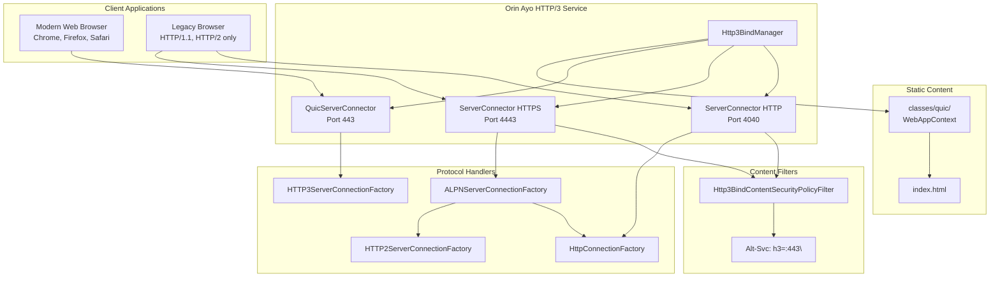
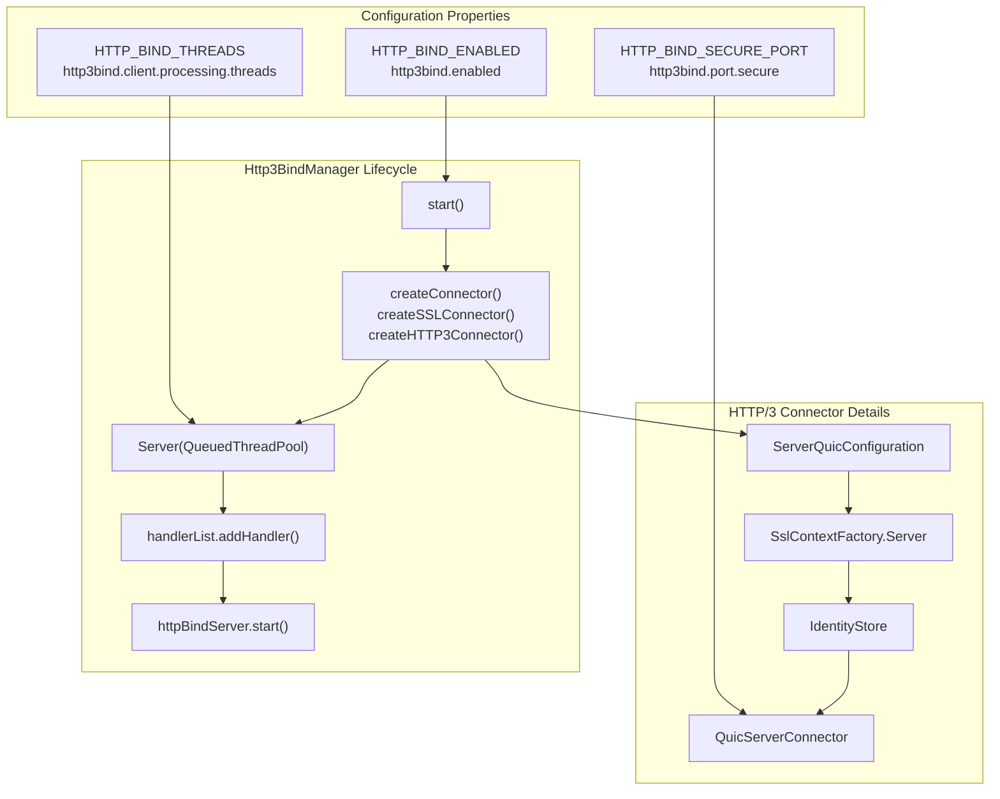
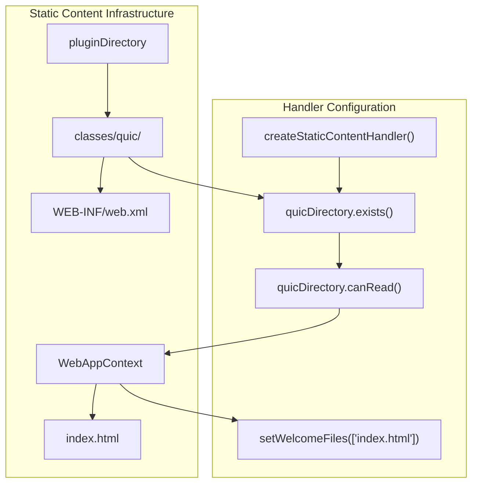
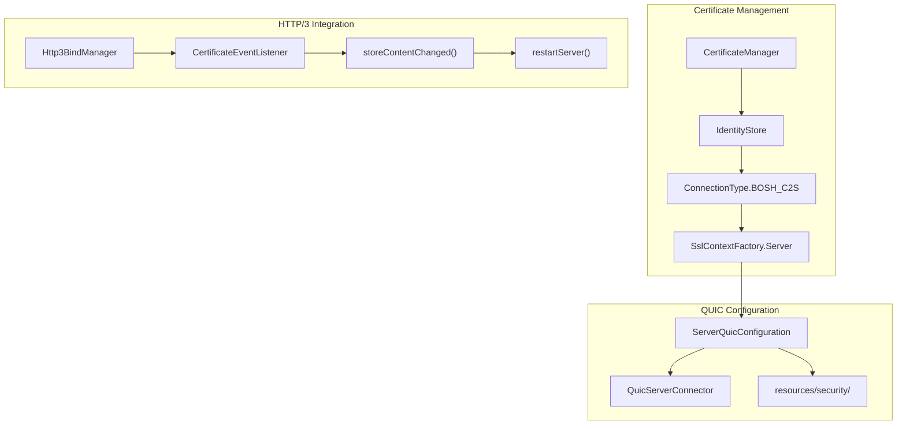

# Modern Web Standards and HTTP/3

> **Relevant source files**
> * [classes/quic/WEB-INF/web.xml](https://github.com/igniterealtime/openfire-orinayo-plugin/blob/932fc61c/classes/quic/WEB-INF/web.xml)
> * [classes/quic/index.html](https://github.com/igniterealtime/openfire-orinayo-plugin/blob/932fc61c/classes/quic/index.html)
> * [src/java/org/ifsoft/orinayo/openfire/Http3BindContentSecurityPolicyFilter.java](https://github.com/igniterealtime/openfire-orinayo-plugin/blob/932fc61c/src/java/org/ifsoft/orinayo/openfire/Http3BindContentSecurityPolicyFilter.java)
> * [src/java/org/ifsoft/orinayo/openfire/Http3BindManager.java](https://github.com/igniterealtime/openfire-orinayo-plugin/blob/932fc61c/src/java/org/ifsoft/orinayo/openfire/Http3BindManager.java)

This page documents the HTTP/3 (QUIC) binding service implementation in the Orin Ayo plugin, which provides modern web protocol support alongside traditional HTTP and HTTPS connectivity. The HTTP/3 service enables cutting-edge web clients to connect using the QUIC transport protocol for improved performance and reliability.

For information about WebRTC media streaming functionality, see [WebRTC Media Streaming](./5.2-webrtc-media-streaming.md). For details about the admin console integration, see [Admin Console Integration](./4.1-admin-console-integration.md).

## HTTP/3 Service Architecture

The HTTP/3 binding service is implemented through the `Http3BindManager` class, which extends Openfire's web service capabilities to support the QUIC protocol. This service runs alongside traditional HTTP and HTTPS connectors, providing protocol negotiation and upgrade capabilities.

### Protocol Stack Integration



Sources: [src/java/org/ifsoft/orinayo/openfire/Http3BindManager.java L1-L943](https://github.com/igniterealtime/openfire-orinayo-plugin/blob/932fc61c/src/java/org/ifsoft/orinayo/openfire/Http3BindManager.java#L1-L943)

 [src/java/org/ifsoft/orinayo/openfire/Http3BindContentSecurityPolicyFilter.java L1-L65](https://github.com/igniterealtime/openfire-orinayo-plugin/blob/932fc61c/src/java/org/ifsoft/orinayo/openfire/Http3BindContentSecurityPolicyFilter.java#L1-L65)

## Http3BindManager Implementation

The `Http3BindManager` class serves as the central orchestrator for HTTP/3 services, managing multiple protocol connectors and their lifecycle.

### Connector Configuration



Sources: [src/java/org/ifsoft/orinayo/openfire/Http3BindManager.java L346-L429](https://github.com/igniterealtime/openfire-orinayo-plugin/blob/932fc61c/src/java/org/ifsoft/orinayo/openfire/Http3BindManager.java#L346-L429)

 [src/java/org/ifsoft/orinayo/openfire/Http3BindManager.java L540-L569](https://github.com/igniterealtime/openfire-orinayo-plugin/blob/932fc61c/src/java/org/ifsoft/orinayo/openfire/Http3BindManager.java#L540-L569)

### System Properties Configuration

The HTTP/3 service is configured through a comprehensive set of `SystemProperty` declarations:

| Property Key | Default Value | Purpose |
| --- | --- | --- |
| `http3bind.enabled` | `true` | Enable/disable HTTP/3 binding |
| `http3bind.port.plain` | `8080` | Plain HTTP port |
| `http3bind.port.secure` | `8443` | HTTPS/HTTP/3 port |
| `http3bind.client.processing.threads` | `200` | Maximum thread pool size |
| `http3bind.client.processing.threads-min` | `8` | Minimum thread pool size |
| `http3bind.CORS.enabled` | `true` | Enable CORS support |
| `http3bind.CSP.enabled` | `true` | Enable Content Security Policy |

Sources: [src/java/org/ifsoft/orinayo/openfire/Http3BindManager.java L74-L282](https://github.com/igniterealtime/openfire-orinayo-plugin/blob/932fc61c/src/java/org/ifsoft/orinayo/openfire/Http3BindManager.java#L74-L282)

## Content Security Policy and Protocol Negotiation

The `Http3BindContentSecurityPolicyFilter` implements protocol negotiation by adding the `Alt-Svc` header to HTTP responses, informing clients about HTTP/3 availability.

### Filter Implementation Flow

```

```

The filter adds the crucial `Alt-Svc: h3=":443"` header [src/java/org/ifsoft/orinayo/openfire/Http3BindContentSecurityPolicyFilter.java L60](https://github.com/igniterealtime/openfire-orinayo-plugin/blob/932fc61c/src/java/org/ifsoft/orinayo/openfire/Http3BindContentSecurityPolicyFilter.java#L60-L60)

 which notifies HTTP/1.1 and HTTP/2 clients that the same resource is available via HTTP/3 on port 443.

Sources: [src/java/org/ifsoft/orinayo/openfire/Http3BindContentSecurityPolicyFilter.java L55-L63](https://github.com/igniterealtime/openfire-orinayo-plugin/blob/932fc61c/src/java/org/ifsoft/orinayo/openfire/Http3BindContentSecurityPolicyFilter.java#L55-L63)

## Static Content Serving

The HTTP/3 service provides static content serving through a dedicated `WebAppContext` that serves files from the `classes/quic` directory.

### Static Content Handler Architecture



The static content handler is configured with security restrictions: `org.eclipse.jetty.servlet.Default.dirAllowed` is set to `false` [src/java/org/ifsoft/orinayo/openfire/Http3BindManager.java L787](https://github.com/igniterealtime/openfire-orinayo-plugin/blob/932fc61c/src/java/org/ifsoft/orinayo/openfire/Http3BindManager.java#L787-L787)

 to prevent directory browsing.

Sources: [src/java/org/ifsoft/orinayo/openfire/Http3BindManager.java L779-L799](https://github.com/igniterealtime/openfire-orinayo-plugin/blob/932fc61c/src/java/org/ifsoft/orinayo/openfire/Http3BindManager.java#L779-L799)

 [classes/quic/index.html L1](https://github.com/igniterealtime/openfire-orinayo-plugin/blob/932fc61c/classes/quic/index.html#L1-L1)

 [classes/quic/WEB-INF/web.xml L1-L8](https://github.com/igniterealtime/openfire-orinayo-plugin/blob/932fc61c/classes/quic/WEB-INF/web.xml#L1-L8)

## Certificate Management Integration

The HTTP/3 service integrates with Openfire's certificate management system through the `CertificateEventListener` interface, automatically restarting when certificates change.

### Certificate Integration Flow



The certificate integration ensures that HTTP/3 connections use the same certificates as other Openfire services, maintaining consistent security across all protocols.

Sources: [src/java/org/ifsoft/orinayo/openfire/Http3BindManager.java L414](https://github.com/igniterealtime/openfire-orinayo-plugin/blob/932fc61c/src/java/org/ifsoft/orinayo/openfire/Http3BindManager.java#L414-L414)

 [src/java/org/ifsoft/orinayo/openfire/Http3BindManager.java L937-L942](https://github.com/igniterealtime/openfire-orinayo-plugin/blob/932fc61c/src/java/org/ifsoft/orinayo/openfire/Http3BindManager.java#L937-L942)

 [src/java/org/ifsoft/orinayo/openfire/Http3BindManager.java L540-L569](https://github.com/igniterealtime/openfire-orinayo-plugin/blob/932fc61c/src/java/org/ifsoft/orinayo/openfire/Http3BindManager.java#L540-L569)