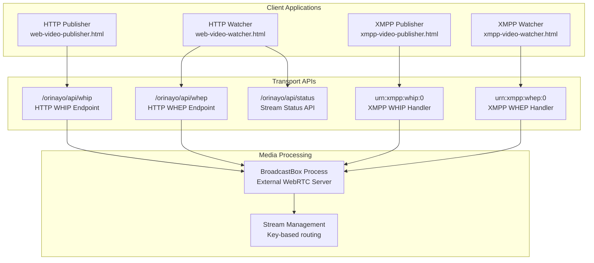
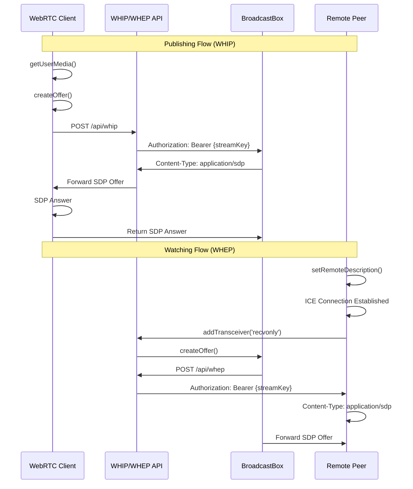
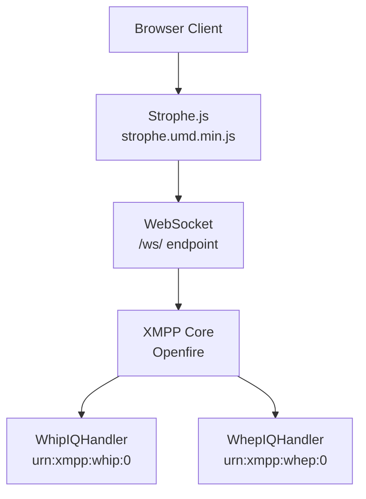

# WebRTC Media Streaming

> **Relevant source files**
> * [classes/jsp/strophe.umd.min.js](https://github.com/igniterealtime/openfire-orinayo-plugin/blob/932fc61c/classes/jsp/strophe.umd.min.js)
> * [classes/jsp/web-audio-publisher.html](https://github.com/igniterealtime/openfire-orinayo-plugin/blob/932fc61c/classes/jsp/web-audio-publisher.html)
> * [classes/jsp/web-audio-watcher.html](https://github.com/igniterealtime/openfire-orinayo-plugin/blob/932fc61c/classes/jsp/web-audio-watcher.html)
> * [classes/jsp/web-video-publisher.html](https://github.com/igniterealtime/openfire-orinayo-plugin/blob/932fc61c/classes/jsp/web-video-publisher.html)
> * [classes/jsp/web-video-watcher.html](https://github.com/igniterealtime/openfire-orinayo-plugin/blob/932fc61c/classes/jsp/web-video-watcher.html)
> * [classes/jsp/xmpp-audio-publisher.html](https://github.com/igniterealtime/openfire-orinayo-plugin/blob/932fc61c/classes/jsp/xmpp-audio-publisher.html)
> * [classes/jsp/xmpp-audio-watcher.html](https://github.com/igniterealtime/openfire-orinayo-plugin/blob/932fc61c/classes/jsp/xmpp-audio-watcher.html)
> * [classes/jsp/xmpp-video-publisher.html](https://github.com/igniterealtime/openfire-orinayo-plugin/blob/932fc61c/classes/jsp/xmpp-video-publisher.html)
> * [classes/jsp/xmpp-video-watcher.html](https://github.com/igniterealtime/openfire-orinayo-plugin/blob/932fc61c/classes/jsp/xmpp-video-watcher.html)
> * [src/root/web/build/audio-publisher.html](https://github.com/igniterealtime/openfire-orinayo-plugin/blob/932fc61c/src/root/web/build/audio-publisher.html)
> * [src/root/web/build/audio-watcher.html](https://github.com/igniterealtime/openfire-orinayo-plugin/blob/932fc61c/src/root/web/build/audio-watcher.html)

This document covers the WebRTC-based audio and video streaming capabilities of the Orin Ayo plugin. The system provides both HTTP and XMPP transport mechanisms for media streaming using the WHIP (WebRTC HTTP Ingestion Protocol) and WHEP (WebRTC HTTP Egress Protocol) standards.

For XMPP protocol extensions that enable WebRTC signaling over XMPP, see [WHIP and WHEP IQ Handlers](./3.1-whip-and-whep-iq-handlers.md). For complete working examples and development tools, see [WebRTC Examples](./6.1-webrtc-examples.md).

## WebRTC Streaming Architecture

The Orin Ayo plugin implements a dual-transport WebRTC streaming system that supports both direct HTTP APIs and XMPP-mediated signaling.

### Transport Layer Architecture



Sources: [classes/jsp/web-video-publisher.html L1-L76](https://github.com/igniterealtime/openfire-orinayo-plugin/blob/932fc61c/classes/jsp/web-video-publisher.html#L1-L76)

 [classes/jsp/xmpp-video-publisher.html L1-L91](https://github.com/igniterealtime/openfire-orinayo-plugin/blob/932fc61c/classes/jsp/xmpp-video-publisher.html#L1-L91)

 [classes/jsp/web-video-watcher.html L1-L63](https://github.com/igniterealtime/openfire-orinayo-plugin/blob/932fc61c/classes/jsp/web-video-watcher.html#L1-L63)

 [classes/jsp/xmpp-video-watcher.html L1-L84](https://github.com/igniterealtime/openfire-orinayo-plugin/blob/932fc61c/classes/jsp/xmpp-video-watcher.html#L1-L84)

### WebRTC Session Establishment Flow



Sources: [classes/jsp/web-video-publisher.html L68-L73](https://github.com/igniterealtime/openfire-orinayo-plugin/blob/932fc61c/classes/jsp/web-video-publisher.html#L68-L73)

 [classes/jsp/web-video-watcher.html L43-L60](https://github.com/igniterealtime/openfire-orinayo-plugin/blob/932fc61c/classes/jsp/web-video-watcher.html#L43-L60)

## HTTP-Based WebRTC Streaming

The HTTP transport provides direct REST API access to WebRTC streaming functionality using standard WHIP and WHEP protocols.

### HTTP Publisher Implementation

The HTTP publishers use the `fetch` API to communicate directly with the WHIP endpoint:

| Component | Purpose | Key Configuration |
| --- | --- | --- |
| `navigator.mediaDevices.getUserMedia()` | Capture local media | `{audio: true, video: true}` |
| `RTCPeerConnection` | WebRTC connection | Default configuration |
| `peerConnection.addTransceiver()` | Add media tracks | `{direction: 'sendonly'}` |
| WHIP Endpoint | Stream publishing | `/orinayo/api/whip` |

**Video Encoding Configuration**:

```yaml
sendEncodings: [
  { rid: 'high' },
  { rid: 'med', scaleResolutionDownBy: 2.0 },
  { rid: 'low', scaleResolutionDownBy: 4.0 }
]
```

Sources: [classes/jsp/web-video-publisher.html L49-L66](https://github.com/igniterealtime/openfire-orinayo-plugin/blob/932fc61c/classes/jsp/web-video-publisher.html#L49-L66)

 [classes/jsp/web-audio-publisher.html L24-L49](https://github.com/igniterealtime/openfire-orinayo-plugin/blob/932fc61c/classes/jsp/web-audio-publisher.html#L24-L49)

### HTTP Watcher Implementation

HTTP watchers consume streams through the WHEP endpoint and can discover available streams via the status API:

| Operation | Endpoint | Purpose |
| --- | --- | --- |
| Stream Discovery | `/orinayo/api/status` | List active streams |
| Stream Consumption | `/orinayo/api/whep` | Subscribe to stream |

The status API returns stream metadata in JSON format, allowing watchers to discover available `streamKey` values.

Sources: [classes/jsp/web-audio-watcher.html L22-L47](https://github.com/igniterealtime/openfire-orinayo-plugin/blob/932fc61c/classes/jsp/web-audio-watcher.html#L22-L47)

 [classes/jsp/web-video-watcher.html L23-L61](https://github.com/igniterealtime/openfire-orinayo-plugin/blob/932fc61c/classes/jsp/web-video-watcher.html#L23-L61)

## XMPP-Based WebRTC Streaming

The XMPP transport uses Strophe.js to tunnel WHIP and WHEP signaling through XMPP IQ stanzas, enabling WebRTC streaming over existing XMPP connections.

### XMPP Connection Management



**XMPP Connection Initialization**:

```
window.connection = new Strophe.Connection(
  location.protocol.replace("http", "ws") + "//" + location.host + "/ws/"
);
```

Sources: [classes/jsp/xmpp-video-publisher.html L24](https://github.com/igniterealtime/openfire-orinayo-plugin/blob/932fc61c/classes/jsp/xmpp-video-publisher.html#L24-L24)

 [classes/jsp/xmpp-video-watcher.html L23](https://github.com/igniterealtime/openfire-orinayo-plugin/blob/932fc61c/classes/jsp/xmpp-video-watcher.html#L23-L23)

### XMPP WHIP Publishing

XMPP publishers send SDP offers through IQ stanzas to the `urn:xmpp:whip:0` namespace:

```xml
<iq type='set' to='{domain}'>
  <whip xmlns='urn:xmpp:whip:0' key='{streamKey}'>
    <sdp>{base64EncodedSDP}</sdp>
    <json>{}</json>
  </whip>
</iq>
```

The server responds with an SDP answer in the same format.

Sources: [classes/jsp/xmpp-video-publisher.html L71-L80](https://github.com/igniterealtime/openfire-orinayo-plugin/blob/932fc61c/classes/jsp/xmpp-video-publisher.html#L71-L80)

 [classes/jsp/xmpp-audio-publisher.html L53-L62](https://github.com/igniterealtime/openfire-orinayo-plugin/blob/932fc61c/classes/jsp/xmpp-audio-publisher.html#L53-L62)

### XMPP WHEP Consumption

XMPP watchers first discover available streams, then establish WebRTC connections:

**Stream Discovery**:

```xml
<iq type='get' to='{domain}'>
  <whep xmlns='urn:xmpp:whep:0'/>
</iq>
```

**Stream Subscription**:

```xml
<iq type='set' to='{domain}'>
  <whep xmlns='urn:xmpp:whep:0' key='{streamKey}'>
    <sdp>{base64EncodedSDP}</sdp>
  </whep>
</iq>
```

Sources: [classes/jsp/xmpp-video-watcher.html L31-L42](https://github.com/igniterealtime/openfire-orinayo-plugin/blob/932fc61c/classes/jsp/xmpp-video-watcher.html#L31-L42)

 [classes/jsp/xmpp-audio-watcher.html L31-L42](https://github.com/igniterealtime/openfire-orinayo-plugin/blob/932fc61c/classes/jsp/xmpp-audio-watcher.html#L31-L42)

## Media Type Support

The streaming system supports both audio-only and audio+video configurations:

### Audio-Only Streaming

| File | Type | Transport | Media Configuration |
| --- | --- | --- | --- |
| `web-audio-publisher.html` | Publisher | HTTP | `{audio: true, video: false}` |
| `web-audio-watcher.html` | Watcher | HTTP | `addTransceiver('audio', {direction: 'recvonly'})` |
| `xmpp-audio-publisher.html` | Publisher | XMPP | Audio-only getUserMedia |
| `xmpp-audio-watcher.html` | Watcher | XMPP | Audio-only transceivers |

### Video+Audio Streaming

| File | Type | Transport | Media Configuration |
| --- | --- | --- | --- |
| `web-video-publisher.html` | Publisher | HTTP | `{audio: true, video: true}` |
| `web-video-watcher.html` | Watcher | HTTP | Audio+Video transceivers |
| `xmpp-video-publisher.html` | Publisher | XMPP | Full A/V getUserMedia |
| `xmpp-video-watcher.html` | Watcher | XMPP | Audio+Video transceivers |

Sources: [classes/jsp/web-audio-publisher.html L24](https://github.com/igniterealtime/openfire-orinayo-plugin/blob/932fc61c/classes/jsp/web-audio-publisher.html#L24-L24)

 [classes/jsp/web-video-publisher.html L30-L33](https://github.com/igniterealtime/openfire-orinayo-plugin/blob/932fc61c/classes/jsp/web-video-publisher.html#L30-L33)

 [classes/jsp/xmpp-audio-publisher.html L33](https://github.com/igniterealtime/openfire-orinayo-plugin/blob/932fc61c/classes/jsp/xmpp-audio-publisher.html#L33-L33)

 [classes/jsp/xmpp-video-publisher.html L33](https://github.com/igniterealtime/openfire-orinayo-plugin/blob/932fc61c/classes/jsp/xmpp-video-publisher.html#L33-L33)

## Stream Authentication and Management

### Stream Key Authentication

All streams use UUID-based stream keys for authentication:

```javascript
const streamKey = crypto.randomUUID();
// Used in Authorization: Bearer {streamKey} header
```

### Connection State Monitoring

All implementations provide real-time connection state feedback:

```javascript
peerConnection.oniceconnectionstatechange = () => {
  document.getElementById('connectionState').innerText = 
    peerConnection.iceConnectionState;
}
```

The possible states include: `new`, `checking`, `connected`, `completed`, `failed`, `disconnected`, and `closed`.

Sources: [classes/jsp/web-audio-publisher.html L28-L30](https://github.com/igniterealtime/openfire-orinayo-plugin/blob/932fc61c/classes/jsp/web-audio-publisher.html#L28-L30)

 [classes/jsp/xmpp-video-publisher.html L37-L39](https://github.com/igniterealtime/openfire-orinayo-plugin/blob/932fc61c/classes/jsp/xmpp-video-publisher.html#L37-L39)

## Build Artifacts

The system includes standalone build artifacts for development and testing:

| File | Purpose | Configuration |
| --- | --- | --- |
| `audio-publisher.html` | Standalone audio publisher | Configurable WHIP URL |
| `audio-watcher.html` | Standalone audio watcher | Configurable WHEP URL |

These allow testing against external WHIP/WHEP servers by modifying the endpoint URLs.

Sources: [src/root/web/build/audio-publisher.html L11-L12](https://github.com/igniterealtime/openfire-orinayo-plugin/blob/932fc61c/src/root/web/build/audio-publisher.html#L11-L12)

 [src/root/web/build/audio-watcher.html L11-L12](https://github.com/igniterealtime/openfire-orinayo-plugin/blob/932fc61c/src/root/web/build/audio-watcher.html#L11-L12)