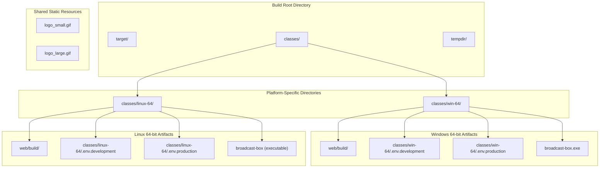
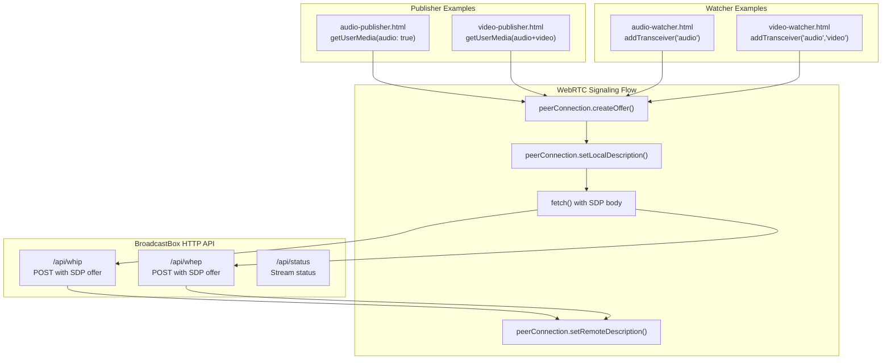
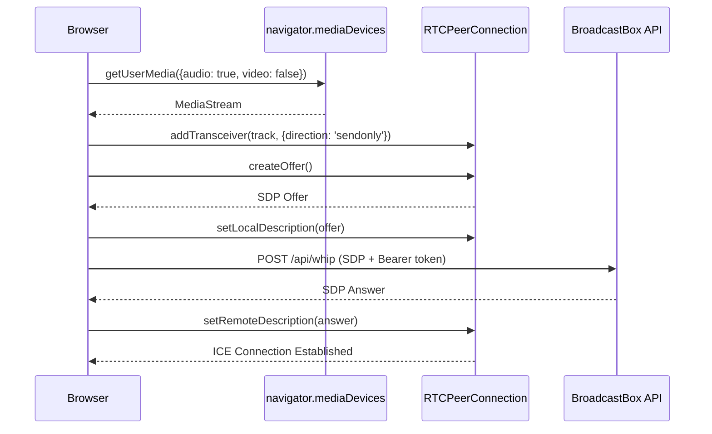
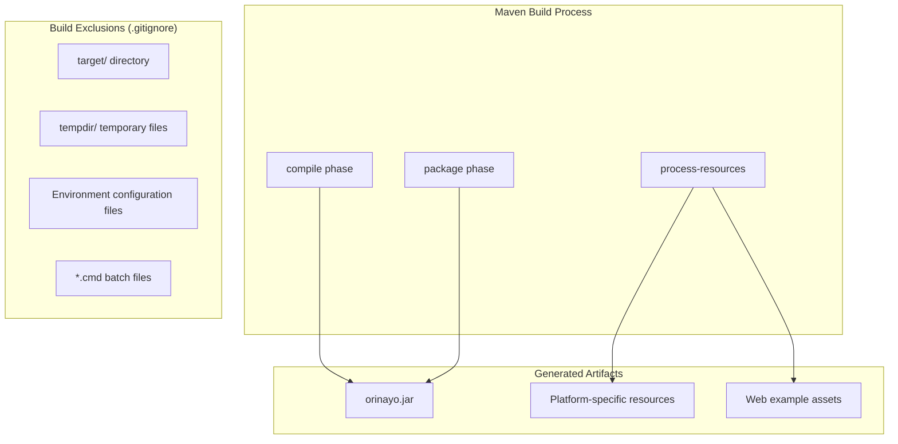

# Build Artifacts and Platform Resources

> **Relevant source files**
> * [.gitignore](https://github.com/igniterealtime/openfire-orinayo-plugin/blob/932fc61c/.gitignore)
> * [classes/linux-64/web/build/audio-publisher.html](https://github.com/igniterealtime/openfire-orinayo-plugin/blob/932fc61c/classes/linux-64/web/build/audio-publisher.html)
> * [classes/linux-64/web/build/audio-watcher.html](https://github.com/igniterealtime/openfire-orinayo-plugin/blob/932fc61c/classes/linux-64/web/build/audio-watcher.html)
> * [classes/linux-64/web/build/video-publisher.html](https://github.com/igniterealtime/openfire-orinayo-plugin/blob/932fc61c/classes/linux-64/web/build/video-publisher.html)
> * [classes/linux-64/web/build/video-watcher.html](https://github.com/igniterealtime/openfire-orinayo-plugin/blob/932fc61c/classes/linux-64/web/build/video-watcher.html)
> * [classes/win-64/web/build/audio-publisher.html](https://github.com/igniterealtime/openfire-orinayo-plugin/blob/932fc61c/classes/win-64/web/build/audio-publisher.html)
> * [classes/win-64/web/build/audio-watcher.html](https://github.com/igniterealtime/openfire-orinayo-plugin/blob/932fc61c/classes/win-64/web/build/audio-watcher.html)
> * [classes/win-64/web/build/video-publisher.html](https://github.com/igniterealtime/openfire-orinayo-plugin/blob/932fc61c/classes/win-64/web/build/video-publisher.html)
> * [classes/win-64/web/build/video-watcher.html](https://github.com/igniterealtime/openfire-orinayo-plugin/blob/932fc61c/classes/win-64/web/build/video-watcher.html)
> * [logo_large.gif](https://github.com/igniterealtime/openfire-orinayo-plugin/blob/932fc61c/logo_large.gif)
> * [logo_small.gif](https://github.com/igniterealtime/openfire-orinayo-plugin/blob/932fc61c/logo_small.gif)

This page documents the platform-specific build artifacts and static resources that are generated and packaged with the Orin Ayo Openfire plugin. These artifacts include WebRTC example applications, platform-specific binaries, static assets, and configuration resources that support the plugin's deployment across different operating systems.

For information about the core build system configuration, see [Plugin Configuration and Build System](./2.2-plugin-configuration-and-build-system.md). For details about the WebRTC streaming functionality these examples demonstrate, see [WebRTC Media Streaming](./5.2-webrtc-media-streaming.md).

## Platform-Specific Build Structure

The plugin generates platform-specific build artifacts organized into separate directories for different target operating systems. This structure supports the plugin's cross-platform deployment requirements and external process management.

**Sources:** [.gitignore L1-L8](https://github.com/igniterealtime/openfire-orinayo-plugin/blob/932fc61c/.gitignore#L1-L8)

## WebRTC Example Applications

Each platform build includes a set of standalone HTML example applications that demonstrate the WHIP and WHEP protocols for WebRTC media streaming. These examples serve as both testing tools and reference implementations for developers.

### Example Application Types

| Application Type | File Name | Purpose | Media Types |
| --- | --- | --- | --- |
| Audio Publisher | `audio-publisher.html` | Publish audio streams via WHIP | Audio only |
| Video Publisher | `video-publisher.html` | Publish video streams via WHIP | Audio + Video |
| Audio Watcher | `audio-watcher.html` | Subscribe to audio streams via WHEP | Audio only |
| Video Watcher | `video-watcher.html` | Subscribe to video streams via WHEP | Audio + Video |

### WebRTC Example Architecture

**Sources:** [classes/linux-64/web/build/audio-publisher.html L1-L62](https://github.com/igniterealtime/openfire-orinayo-plugin/blob/932fc61c/classes/linux-64/web/build/audio-publisher.html#L1-L62)

 [classes/win-64/web/build/video-publisher.html L1-L83](https://github.com/igniterealtime/openfire-orinayo-plugin/blob/932fc61c/classes/win-64/web/build/video-publisher.html#L1-L83)

 [classes/linux-64/web/build/audio-watcher.html L1-L64](https://github.com/igniterealtime/openfire-orinayo-plugin/blob/932fc61c/classes/linux-64/web/build/audio-watcher.html#L1-L64)

 [classes/win-64/web/build/video-watcher.html L1-L68](https://github.com/igniterealtime/openfire-orinayo-plugin/blob/932fc61c/classes/win-64/web/build/video-watcher.html#L1-L68)

## Publisher Example Implementation

The publisher examples demonstrate WebRTC stream ingestion using the WHIP protocol. They use the standard WebRTC APIs to capture media and send it to the BroadcastBox external process.

### Audio Publisher Flow

**Sources:** [classes/linux-64/web/build/audio-publisher.html L36-L59](https://github.com/igniterealtime/openfire-orinayo-plugin/blob/932fc61c/classes/linux-64/web/build/audio-publisher.html#L36-L59)

 [classes/win-64/web/build/audio-publisher.html L36-L59](https://github.com/igniterealtime/openfire-orinayo-plugin/blob/932fc61c/classes/win-64/web/build/audio-publisher.html#L36-L59)

### Video Publisher Enhancements

The video publisher includes additional WebRTC features such as simulcast encoding with multiple resolution layers:

* **High resolution**: Full quality (`rid: 'high'`)
* **Medium resolution**: 2x downscale (`scaleResolutionDownBy: 2.0`)
* **Low resolution**: 4x downscale (`scaleResolutionDownBy: 4.0`)

**Sources:** [classes/linux-64/web/build/video-publisher.html L55-L71](https://github.com/igniterealtime/openfire-orinayo-plugin/blob/932fc61c/classes/linux-64/web/build/video-publisher.html#L55-L71)

 [classes/win-64/web/build/video-publisher.html L55-L71](https://github.com/igniterealtime/openfire-orinayo-plugin/blob/932fc61c/classes/win-64/web/build/video-publisher.html#L55-L71)

## Watcher Example Implementation

The watcher examples demonstrate WebRTC stream consumption using the WHEP protocol. They establish receive-only connections to consume published media streams.

### Common Watcher Pattern

All watcher examples follow this implementation pattern:

1. **Transceiver Setup**: Add receive-only transceivers for target media types
2. **Track Handling**: Attach received streams to HTML media elements
3. **Connection Monitoring**: Display ICE connection state changes
4. **WHEP Signaling**: POST SDP offers to `/api/whep` endpoint with Bearer token authentication

**Sources:** [classes/linux-64/web/build/audio-watcher.html L35-L61](https://github.com/igniterealtime/openfire-orinayo-plugin/blob/932fc61c/classes/linux-64/web/build/audio-watcher.html#L35-L61)

 [classes/win-64/web/build/video-watcher.html L35-L64](https://github.com/igniterealtime/openfire-orinayo-plugin/blob/932fc61c/classes/win-64/web/build/video-watcher.html#L35-L64)

## Static Resources and Assets

The plugin includes static visual assets used in administrative interfaces and client applications.

### Logo Resources

| Asset | File | Usage |
| --- | --- | --- |
| Small Logo | `logo_small.gif` | Admin console icons, compact displays |
| Large Logo | `logo_large.gif` | Main branding, splash screens |

Both logo files use PNG format with transparency support, stored as GIF files for compatibility with older Openfire admin console versions.

**Sources:** [logo_small.gif L1-L9](https://github.com/igniterealtime/openfire-orinayo-plugin/blob/932fc61c/logo_small.gif#L1-L9)

 [logo_large.gif L1-L16](https://github.com/igniterealtime/openfire-orinayo-plugin/blob/932fc61c/logo_large.gif#L1-L16)

## Environment Configuration

Platform-specific environment configuration files support different deployment scenarios:

* **Development Environment**: `.env.development` files contain development-specific settings
* **Production Environment**: `.env.production` files contain production-optimized settings

These files are excluded from version control but included in platform-specific build artifacts to support proper environment separation during deployment.

**Sources:** [.gitignore L5-L8](https://github.com/igniterealtime/openfire-orinayo-plugin/blob/932fc61c/.gitignore#L5-L8)

## Build Artifact Management

The build system generates and manages artifacts through Maven's standard lifecycle while accommodating platform-specific requirements:

The build system ensures that platform-specific artifacts are properly included in the final plugin JAR while excluding development-time artifacts and temporary files from version control.

**Sources:** [.gitignore L1-L8](https://github.com/igniterealtime/openfire-orinayo-plugin/blob/932fc61c/.gitignore#L1-L8)