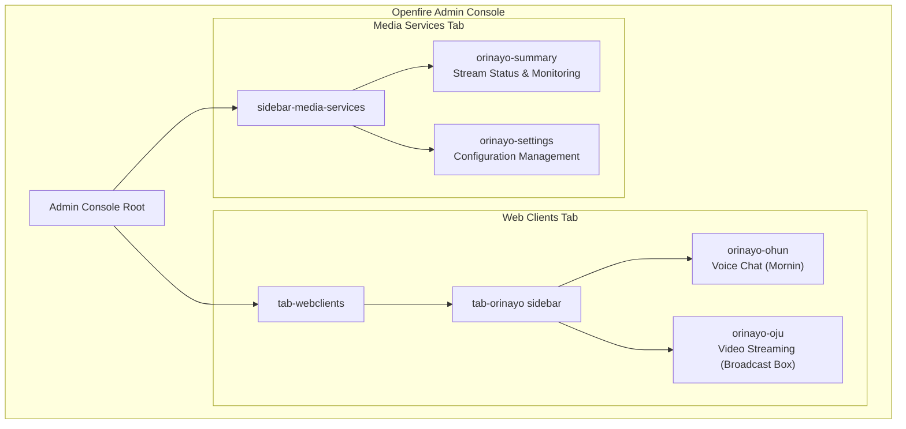
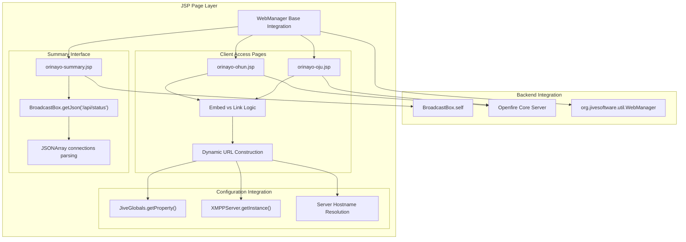
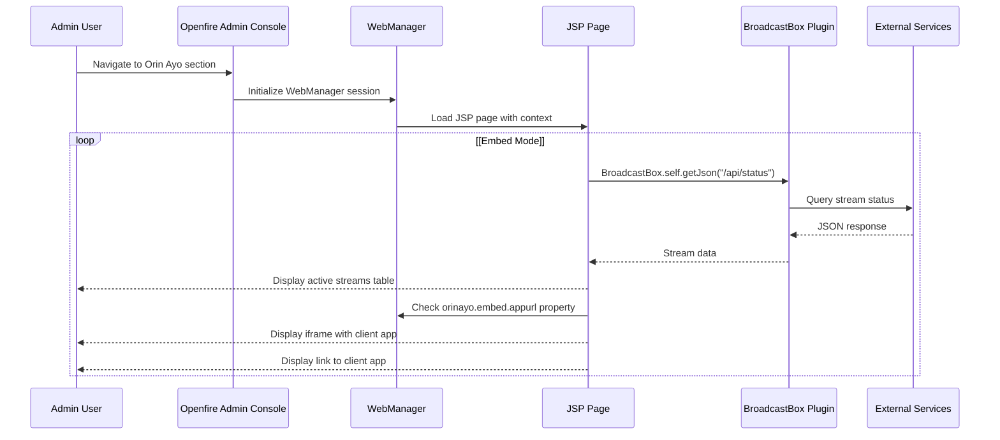

# Admin Console Integration

> **Relevant source files**
> * [changelog.html](https://github.com/igniterealtime/openfire-orinayo-plugin/blob/932fc61c/changelog.html)
> * [classes/jsp/ohun/_nuxt/8512603.js](https://github.com/igniterealtime/openfire-orinayo-plugin/blob/932fc61c/classes/jsp/ohun/_nuxt/8512603.js)
> * [plugin.xml](https://github.com/igniterealtime/openfire-orinayo-plugin/blob/932fc61c/plugin.xml)
> * [pom.xml](https://github.com/igniterealtime/openfire-orinayo-plugin/blob/932fc61c/pom.xml)
> * [src/i18n/orinayo_i18n.properties](https://github.com/igniterealtime/openfire-orinayo-plugin/blob/932fc61c/src/i18n/orinayo_i18n.properties)
> * [src/web/orinayo-ohun.jsp](https://github.com/igniterealtime/openfire-orinayo-plugin/blob/932fc61c/src/web/orinayo-ohun.jsp)
> * [src/web/orinayo-oju.jsp](https://github.com/igniterealtime/openfire-orinayo-plugin/blob/932fc61c/src/web/orinayo-oju.jsp)
> * [src/web/orinayo-summary.jsp](https://github.com/igniterealtime/openfire-orinayo-plugin/blob/932fc61c/src/web/orinayo-summary.jsp)

This document covers the Openfire Admin Console integration for the Orin Ayo plugin, including the web-based administrative interfaces, JSP page implementation, and internationalization support. For information about the core plugin architecture and external process management, see [Core Plugin Architecture](/igniterealtime/openfire-orinayo-plugin/2-core-plugin-architecture). For details about the web client applications themselves, see [Client-Side Applications](/igniterealtime/openfire-orinayo-plugin/4.3-client-side-applications).

## Admin Console Structure

The Orin Ayo plugin integrates with the Openfire Admin Console through a two-tier navigation structure defined in the plugin configuration. The integration provides both administrative controls and direct access to web client applications.



The admin console structure is configured through two main navigation areas:

* **Media Services Tab**: Administrative functions for monitoring and configuration
* **Web Clients Tab**: Direct access to end-user applications with embedded or linked interfaces

Sources: [plugin.xml L12-L23](https://github.com/igniterealtime/openfire-orinayo-plugin/blob/932fc61c/plugin.xml#L12-L23)

## JSP Page Architecture

The admin console integration uses Java Server Pages (JSP) to provide dynamic web interfaces that integrate with the Openfire framework and the BroadcastBox plugin.



### Summary Page Implementation

The `orinayo-summary.jsp` page provides real-time monitoring of active media streams by querying the BroadcastBox API and presenting the data in a tabular format.

Key implementation features:

* **API Integration**: Calls `BroadcastBox.self.getJson("/api/status")` to retrieve current stream status
* **JSON Processing**: Parses the response into a `JSONArray` for display
* **Stream Metrics**: Shows stream keys and subscriber counts for each active connection
* **Dynamic URLs**: Constructs publisher and watcher URLs based on server configuration

Sources: [src/web/orinayo-summary.jsp L17-L29](https://github.com/igniterealtime/openfire-orinayo-plugin/blob/932fc61c/src/web/orinayo-summary.jsp#L17-L29)

 [src/web/orinayo-summary.jsp L38-L41](https://github.com/igniterealtime/openfire-orinayo-plugin/blob/932fc61c/src/web/orinayo-summary.jsp#L38-L41)

 [src/web/orinayo-summary.jsp L74-L86](https://github.com/igniterealtime/openfire-orinayo-plugin/blob/932fc61c/src/web/orinayo-summary.jsp#L74-L86)

### Client Access Pages

The client access pages (`orinayo-ohun.jsp` and `orinayo-oju.jsp`) provide flexible integration options for accessing the web client applications.

**Embedding Logic**: Both pages support two presentation modes:

* **Embedded Mode**: Uses an iframe to embed the application directly in the admin console
* **Link Mode**: Displays a descriptive message with a link to open the application in a new tab

**URL Construction**: Dynamic URL generation based on server configuration:

```
String publicHost = XMPPServer.getInstance().getServerInfo().getHostname() + ":" + 
                   JiveGlobals.getProperty("httpbind.port.secure", "7443");
String url = "https://" + publicHost + "/orinayo/ohun/"; // or /oju/
```

**Configuration Property**: The presentation mode is controlled by the `orinayo.embed.appurl` property.

Sources: [src/web/orinayo-ohun.jsp L35-L36](https://github.com/igniterealtime/openfire-orinayo-plugin/blob/932fc61c/src/web/orinayo-ohun.jsp#L35-L36)

 [src/web/orinayo-ohun.jsp L51-L59](https://github.com/igniterealtime/openfire-orinayo-plugin/blob/932fc61c/src/web/orinayo-ohun.jsp#L51-L59)

 [src/web/orinayo-oju.jsp L35-L36](https://github.com/igniterealtime/openfire-orinayo-plugin/blob/932fc61c/src/web/orinayo-oju.jsp#L35-L36)

 [src/web/orinayo-oju.jsp L51-L59](https://github.com/igniterealtime/openfire-orinayo-plugin/blob/932fc61c/src/web/orinayo-oju.jsp#L51-L59)

## Internationalization Support

The admin console integration includes comprehensive internationalization support through property-based message resolution. The system supports multiple languages and provides localized text for all user-facing elements.

| Property Key | Purpose | Example (English) |
| --- | --- | --- |
| `plugin.title` | Main plugin title | "Orin Ayo" |
| `admin.sidebar.webclients.name` | Web clients tab name | "Web Clients" |
| `admin.sidebar.webclients.item.ohun.name` | Voice chat item name | "Voice Chat (Mornin)" |
| `admin.sidebar.webclients.item.oju.name` | Video streaming item name | "Face Chat (Broadcast Box)" |
| `config.page.summary` | Summary page title | "Broadcast-Box Media Streams" |
| `config.page.settings` | Settings page title | "Broadcast-Box Settings" |

**Supported Languages**: The i18n system provides translations for multiple locales, with message keys covering:

* Navigation labels and descriptions
* Page titles and content descriptions
* Configuration parameter labels
* Status and error messages
* Client application descriptions

**JSP Integration**: Pages use the `<fmt:message>` tag library to resolve localized strings:

```xml
<fmt:message key="admin.sidebar.webclients.item.ohun.description" />
<fmt:message key="orinayo.client.url.desc">
    <fmt:param value="<%=publish_url%>"/>
    <fmt:param value="<%=subscribe_url%>"/>	
</fmt:message>
```

Sources: [src/i18n/orinayo_i18n.properties L1-L51](https://github.com/igniterealtime/openfire-orinayo-plugin/blob/932fc61c/src/i18n/orinayo_i18n.properties#L1-L51)

 [src/web/orinayo-ohun.jsp L41](https://github.com/igniterealtime/openfire-orinayo-plugin/blob/932fc61c/src/web/orinayo-ohun.jsp#L41-L41)

 [src/web/orinayo-summary.jsp L60-L63](https://github.com/igniterealtime/openfire-orinayo-plugin/blob/932fc61c/src/web/orinayo-summary.jsp#L60-L63)

## Build System Integration

The admin console JSP pages are integrated into the Maven build process through the Jetty JSP compilation plugin, ensuring that the pages are pre-compiled and validated during the build.

**Maven Configuration**: The build system includes the `jetty-ee8-jspc-maven-plugin` to handle JSP compilation:

```html
<plugin>
    <groupId>org.eclipse.jetty.ee8</groupId>
    <artifactId>jetty-ee8-jspc-maven-plugin</artifactId>
</plugin>
```

**Compilation Benefits**:

* **Early Error Detection**: JSP syntax and reference errors are caught at build time
* **Performance Optimization**: Pre-compiled JSP pages load faster in production
* **Dependency Validation**: Ensures all referenced classes and resources are available

**Integration with Openfire**: The JSP compilation integrates with the standard Openfire plugin build process, following the same patterns used by other Openfire plugins.

Sources: [pom.xml L68-L72](https://github.com/igniterealtime/openfire-orinayo-plugin/blob/932fc61c/pom.xml#L68-L72)

## Configuration and Navigation Flow

The admin console integration follows Openfire's standard navigation and security model, with automatic authentication and session management handled by the WebManager framework.



**Security Integration**: All JSP pages inherit Openfire's authentication and authorization through the WebManager integration, ensuring that only authenticated administrators can access the interfaces.

**Session Management**: The `webManager.init(request, response, session, application, out)` call establishes the proper Openfire admin session context for each page request.

**Error Handling**: JSP pages include error page directives (`errorPage="error.jsp"`) to provide consistent error handling within the Openfire admin framework.

Sources: [src/web/orinayo-summary.jsp L14](https://github.com/igniterealtime/openfire-orinayo-plugin/blob/932fc61c/src/web/orinayo-summary.jsp#L14-L14)

 [src/web/orinayo-ohun.jsp L33](https://github.com/igniterealtime/openfire-orinayo-plugin/blob/932fc61c/src/web/orinayo-ohun.jsp#L33-L33)

 [src/web/orinayo-oju.jsp L33](https://github.com/igniterealtime/openfire-orinayo-plugin/blob/932fc61c/src/web/orinayo-oju.jsp#L33-L33)

 [plugin.xml L12-L23](https://github.com/igniterealtime/openfire-orinayo-plugin/blob/932fc61c/plugin.xml#L12-L23)