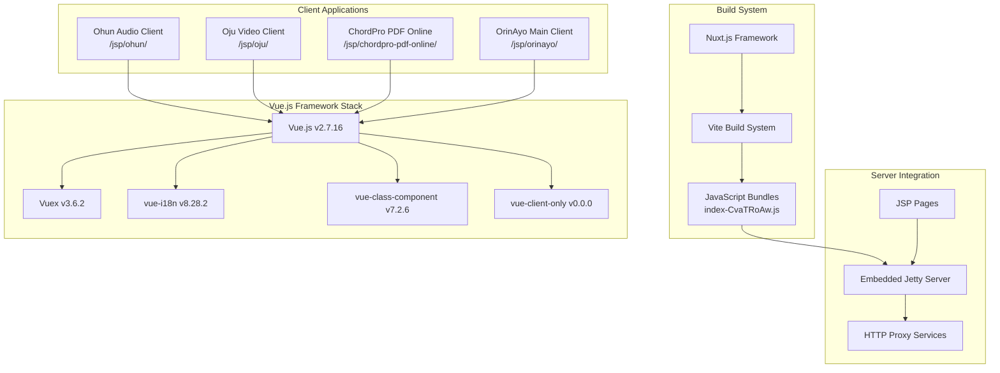
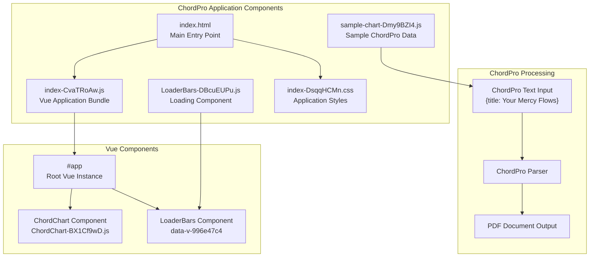
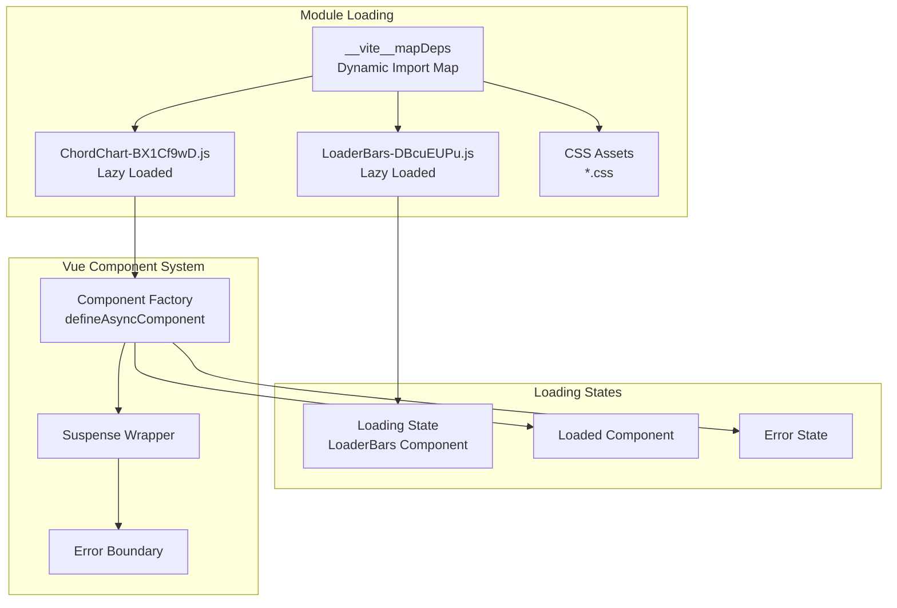
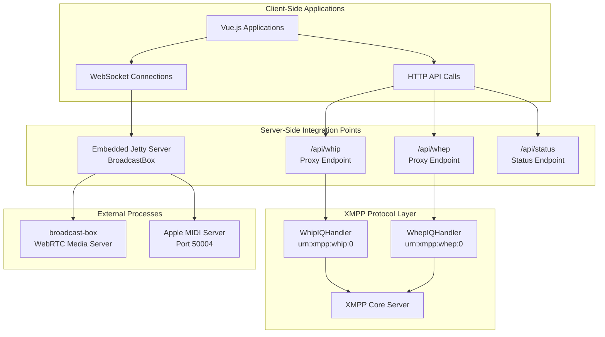

# Client-Side Applications

> **Relevant source files**
> * [classes/jsp/chordpro-pdf-online/assets/ChordChart-BX1Cf9wD.js](https://github.com/igniterealtime/openfire-orinayo-plugin/blob/932fc61c/classes/jsp/chordpro-pdf-online/assets/ChordChart-BX1Cf9wD.js)
> * [classes/jsp/chordpro-pdf-online/assets/LoaderBars-DBcuEUPu.js](https://github.com/igniterealtime/openfire-orinayo-plugin/blob/932fc61c/classes/jsp/chordpro-pdf-online/assets/LoaderBars-DBcuEUPu.js)
> * [classes/jsp/chordpro-pdf-online/assets/index-CvaTRoAw.js](https://github.com/igniterealtime/openfire-orinayo-plugin/blob/932fc61c/classes/jsp/chordpro-pdf-online/assets/index-CvaTRoAw.js)
> * [classes/jsp/chordpro-pdf-online/assets/sample-chart-Dmy9BZI4.js](https://github.com/igniterealtime/openfire-orinayo-plugin/blob/932fc61c/classes/jsp/chordpro-pdf-online/assets/sample-chart-Dmy9BZI4.js)
> * [classes/jsp/chordpro-pdf-online/index.html](https://github.com/igniterealtime/openfire-orinayo-plugin/blob/932fc61c/classes/jsp/chordpro-pdf-online/index.html)
> * [classes/jsp/ohun/_nuxt/LICENSES](https://github.com/igniterealtime/openfire-orinayo-plugin/blob/932fc61c/classes/jsp/ohun/_nuxt/LICENSES)

This page documents the client-side web applications built with Vue.js and Nuxt.js that provide user interfaces for the Orin Ayo collaborative music platform. These applications handle audio/video conferencing, musical score processing, and real-time collaboration features.

For server-side admin interfaces, see [Admin Console Integration](/igniterealtime/openfire-orinayo-plugin/4.1-admin-console-integration). For WebRTC media streaming implementations, see [WebRTC Media Streaming](/igniterealtime/openfire-orinayo-plugin/5.2-webrtc-media-streaming).

## Vue.js Application Architecture

The Orin Ayo plugin includes several Vue.js-based client applications that provide different aspects of the collaborative music experience:



Sources: [classes/jsp/ohun/_nuxt/LICENSES L1-L51](https://github.com/igniterealtime/openfire-orinayo-plugin/blob/932fc61c/classes/jsp/ohun/_nuxt/LICENSES#L1-L51)

 [classes/jsp/chordpro-pdf-online/index.html L1-L14](https://github.com/igniterealtime/openfire-orinayo-plugin/blob/932fc61c/classes/jsp/chordpro-pdf-online/index.html#L1-L14)

 [classes/jsp/chordpro-pdf-online/assets/index-CvaTRoAw.js L1-L20](https://github.com/igniterealtime/openfire-orinayo-plugin/blob/932fc61c/classes/jsp/chordpro-pdf-online/assets/index-CvaTRoAw.js#L1-L20)

## ChordPro PDF Online Application

The ChordPro PDF Online application converts musical chord charts from ChordPro format to PDF documents:



Sources: [classes/jsp/chordpro-pdf-online/index.html L8-L9](https://github.com/igniterealtime/openfire-orinayo-plugin/blob/932fc61c/classes/jsp/chordpro-pdf-online/index.html#L8-L9)

 [classes/jsp/chordpro-pdf-online/assets/sample-chart-Dmy9BZI4.js L1-L59](https://github.com/igniterealtime/openfire-orinayo-plugin/blob/932fc61c/classes/jsp/chordpro-pdf-online/assets/sample-chart-Dmy9BZI4.js#L1-L59)

 [classes/jsp/chordpro-pdf-online/assets/LoaderBars-DBcuEUPu.js L1-L2](https://github.com/igniterealtime/openfire-orinayo-plugin/blob/932fc61c/classes/jsp/chordpro-pdf-online/assets/LoaderBars-DBcuEUPu.js#L1-L2)

The sample ChordPro chart demonstrates the format structure:

```css
{title: Your Mercy Flows}
{artist: Dele Olajide}
{key: E}
{time: 4/4}
{tempo: 100}

{comment: Verse 1}
Your [E:2]mercy [A:2]flows like a [C#m:2]river through my [B:2]soul
```

Sources: [classes/jsp/chordpro-pdf-online/assets/sample-chart-Dmy9BZI4.js L2-L18](https://github.com/igniterealtime/openfire-orinayo-plugin/blob/932fc61c/classes/jsp/chordpro-pdf-online/assets/sample-chart-Dmy9BZI4.js#L2-L18)

## Vue.js Dependencies and Libraries

The client applications utilize a comprehensive set of Vue.js ecosystem libraries:

| Library | Version | Purpose |
| --- | --- | --- |
| `Vue.js` | v2.7.16 | Core reactive framework |
| `Vuex` | v3.6.2 | State management |
| `vue-i18n` | v8.28.2 | Internationalization |
| `vue-class-component` | v7.2.6 | Class-based components |
| `vue-client-only` | v0.0.0 | Client-side only rendering |
| `vue-no-ssr` | v1.1.1 | SSR exclusion |
| `clipboard.js` | v2.0.11 | Clipboard operations |

Sources: [classes/jsp/ohun/_nuxt/LICENSES L1-L51](https://github.com/igniterealtime/openfire-orinayo-plugin/blob/932fc61c/classes/jsp/ohun/_nuxt/LICENSES#L1-L51)

## Component Loading System

The application uses dynamic imports and lazy loading for optimal performance:



Sources: [classes/jsp/chordpro-pdf-online/assets/index-CvaTRoAw.js L1-L2](https://github.com/igniterealtime/openfire-orinayo-plugin/blob/932fc61c/classes/jsp/chordpro-pdf-online/assets/index-CvaTRoAw.js#L1-L2)

 [classes/jsp/chordpro-pdf-online/assets/LoaderBars-DBcuEUPu.js L1-L2](https://github.com/igniterealtime/openfire-orinayo-plugin/blob/932fc61c/classes/jsp/chordpro-pdf-online/assets/LoaderBars-DBcuEUPu.js#L1-L2)

## Integration with Server Components

The client applications integrate with the Openfire plugin's server components through several mechanisms:



Sources: [classes/jsp/chordpro-pdf-online/index.html L5-L6](https://github.com/igniterealtime/openfire-orinayo-plugin/blob/932fc61c/classes/jsp/chordpro-pdf-online/index.html#L5-L6)

The client applications are served through the plugin's embedded Jetty server and communicate with the backend through a combination of HTTP APIs, WebSocket connections, and XMPP protocol extensions for real-time collaborative features.