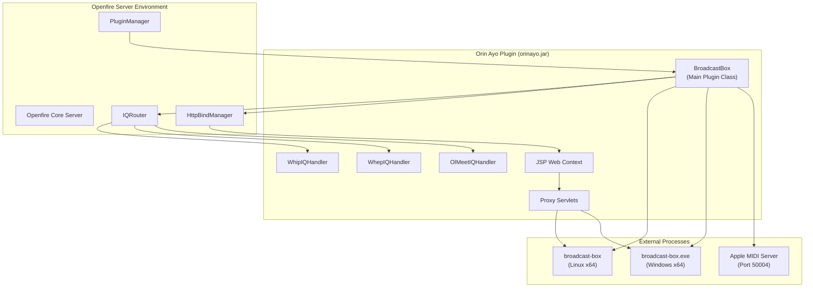
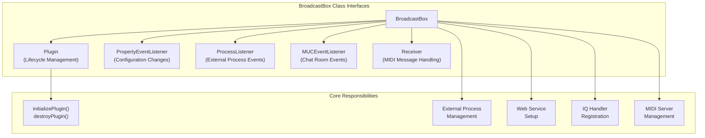
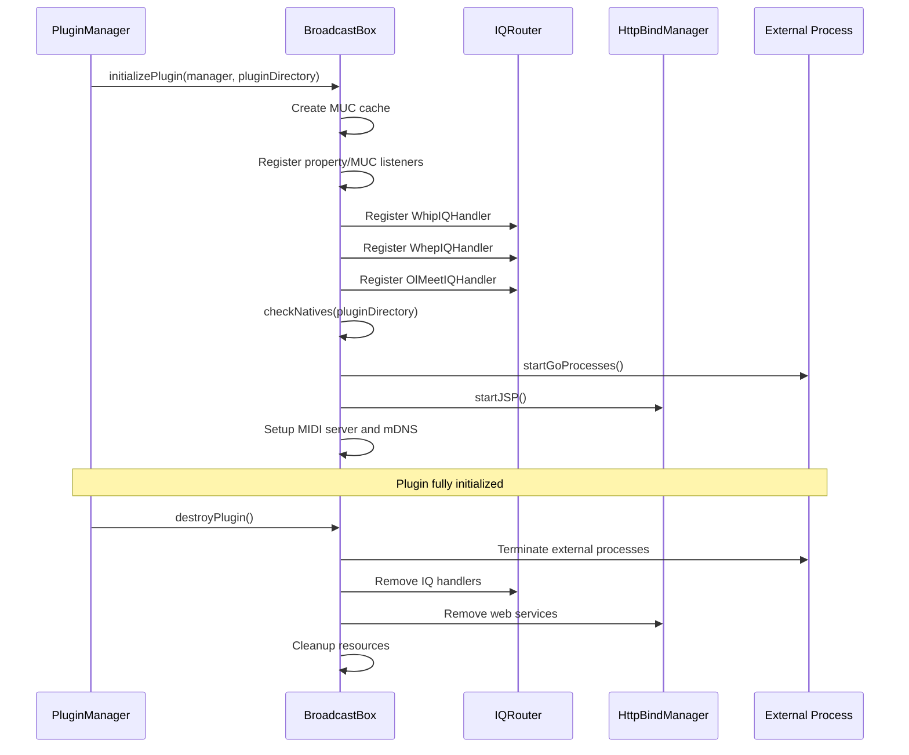
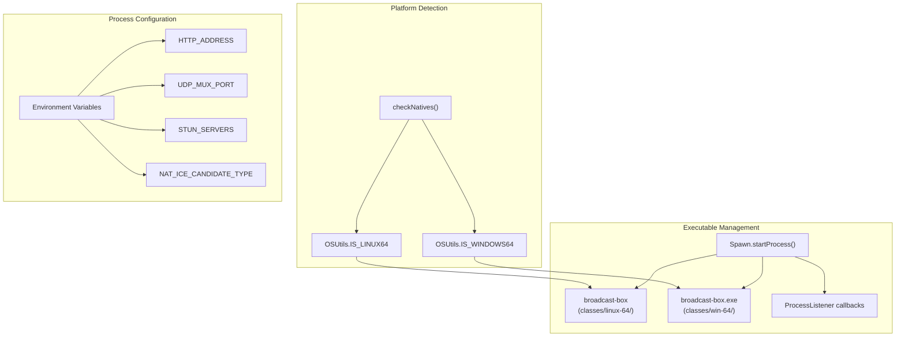
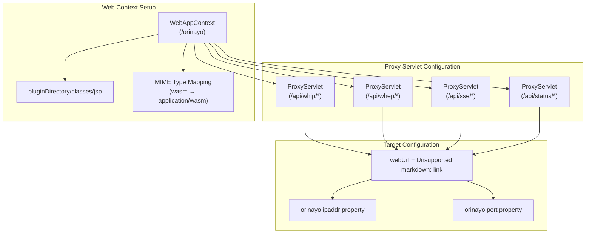
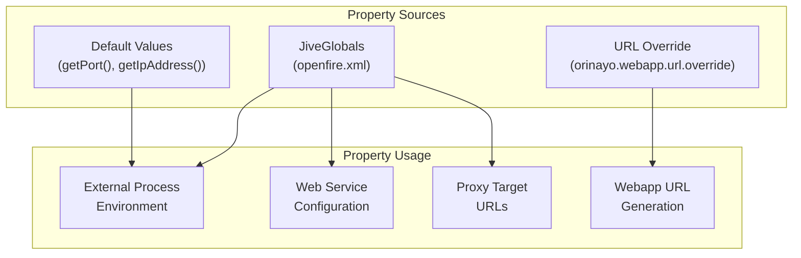
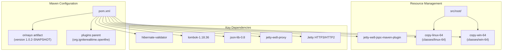

# Core Plugin Architecture

> **Relevant source files**
> * [changelog.html](https://github.com/igniterealtime/openfire-orinayo-plugin/blob/932fc61c/changelog.html)
> * [classes/jsp/WEB-INF/web.xml](https://github.com/igniterealtime/openfire-orinayo-plugin/blob/932fc61c/classes/jsp/WEB-INF/web.xml)
> * [classes/linux-64/broadcast-box](https://github.com/igniterealtime/openfire-orinayo-plugin/blob/932fc61c/classes/linux-64/broadcast-box)
> * [classes/win-64/broadcast-box.exe](https://github.com/igniterealtime/openfire-orinayo-plugin/blob/932fc61c/classes/win-64/broadcast-box.exe)
> * [plugin.xml](https://github.com/igniterealtime/openfire-orinayo-plugin/blob/932fc61c/plugin.xml)
> * [pom.xml](https://github.com/igniterealtime/openfire-orinayo-plugin/blob/932fc61c/pom.xml)
> * [src/i18n/orinayo_i18n.properties](https://github.com/igniterealtime/openfire-orinayo-plugin/blob/932fc61c/src/i18n/orinayo_i18n.properties)
> * [src/java/org/ifsoft/orinayo/openfire/BroadcastBox.java](https://github.com/igniterealtime/openfire-orinayo-plugin/blob/932fc61c/src/java/org/ifsoft/orinayo/openfire/BroadcastBox.java)
> * [src/java/org/ifsoft/orinayo/openfire/OlMeetIQHandler.java](https://github.com/igniterealtime/openfire-orinayo-plugin/blob/932fc61c/src/java/org/ifsoft/orinayo/openfire/OlMeetIQHandler.java)
> * [src/web/orinayo-summary.jsp](https://github.com/igniterealtime/openfire-orinayo-plugin/blob/932fc61c/src/web/orinayo-summary.jsp)

This document describes the core architecture of the Orin Ayo Openfire plugin, focusing on the main plugin class, lifecycle management, and integration with the Openfire XMPP server. For information about XMPP protocol extensions and IQ handlers, see [XMPP Protocol Extensions](/igniterealtime/openfire-orinayo-plugin/3-xmpp-protocol-extensions). For details about web interfaces and client applications, see [Web Interfaces and Client Applications](/igniterealtime/openfire-orinayo-plugin/4-web-interfaces-and-client-applications).

## Plugin Overview and Structure

The Orin Ayo plugin is built as a standard Openfire plugin that extends the XMPP server with collaborative music capabilities. The plugin follows Openfire's plugin architecture patterns while integrating external media streaming processes and custom XMPP extensions.

Sources: [src/java/org/ifsoft/orinayo/openfire/BroadcastBox.java L1-L494](https://github.com/igniterealtime/openfire-orinayo-plugin/blob/932fc61c/src/java/org/ifsoft/orinayo/openfire/BroadcastBox.java#L1-L494)

 [plugin.xml L1-L25](https://github.com/igniterealtime/openfire-orinayo-plugin/blob/932fc61c/plugin.xml#L1-L25)

 [pom.xml L1-L164](https://github.com/igniterealtime/openfire-orinayo-plugin/blob/932fc61c/pom.xml#L1-L164)

## BroadcastBox Main Class Architecture

The `BroadcastBox` class serves as the central orchestrator for the plugin, implementing multiple interfaces to handle different aspects of the system:

Sources: [src/java/org/ifsoft/orinayo/openfire/BroadcastBox.java L68-L85](https://github.com/igniterealtime/openfire-orinayo-plugin/blob/932fc61c/src/java/org/ifsoft/orinayo/openfire/BroadcastBox.java#L68-L85)

 [src/java/org/ifsoft/orinayo/openfire/BroadcastBox.java L124-L171](https://github.com/igniterealtime/openfire-orinayo-plugin/blob/932fc61c/src/java/org/ifsoft/orinayo/openfire/BroadcastBox.java#L124-L171)

 [src/java/org/ifsoft/orinayo/openfire/BroadcastBox.java L87-L122](https://github.com/igniterealtime/openfire-orinayo-plugin/blob/932fc61c/src/java/org/ifsoft/orinayo/openfire/BroadcastBox.java#L87-L122)

## Plugin Lifecycle and Initialization

The plugin initialization process follows a structured sequence that sets up all required components and services:

| Phase | Method | Key Actions |
| --- | --- | --- |
| **Startup** | `initializePlugin()` | Initialize caches, register listeners, start services |
| **IQ Registration** | `initializePlugin()` | Register WHIP, WHEP, and OlMeet IQ handlers |
| **Process Management** | `startGoProcesses()` | Launch platform-specific broadcast-box executable |
| **Web Services** | `startJSP()` | Configure Jetty web context and proxy servlets |
| **MIDI Services** | `initializePlugin()` | Setup Apple MIDI server and mDNS registration |
| **Shutdown** | `destroyPlugin()` | Clean shutdown of all services and processes |

Sources: [src/java/org/ifsoft/orinayo/openfire/BroadcastBox.java L124-L171](https://github.com/igniterealtime/openfire-orinayo-plugin/blob/932fc61c/src/java/org/ifsoft/orinayo/openfire/BroadcastBox.java#L124-L171)

 [src/java/org/ifsoft/orinayo/openfire/BroadcastBox.java L87-L122](https://github.com/igniterealtime/openfire-orinayo-plugin/blob/932fc61c/src/java/org/ifsoft/orinayo/openfire/BroadcastBox.java#L87-L122)

 [src/java/org/ifsoft/orinayo/openfire/BroadcastBox.java L289-L323](https://github.com/igniterealtime/openfire-orinayo-plugin/blob/932fc61c/src/java/org/ifsoft/orinayo/openfire/BroadcastBox.java#L289-L323)

## External Process Management

The plugin manages platform-specific external executables that handle the core media streaming functionality:

Sources: [src/java/org/ifsoft/orinayo/openfire/BroadcastBox.java L325-L351](https://github.com/igniterealtime/openfire-orinayo-plugin/blob/932fc61c/src/java/org/ifsoft/orinayo/openfire/BroadcastBox.java#L325-L351)

 [src/java/org/ifsoft/orinayo/openfire/BroadcastBox.java L289-L323](https://github.com/igniterealtime/openfire-orinayo-plugin/blob/932fc61c/src/java/org/ifsoft/orinayo/openfire/BroadcastBox.java#L289-L323)

 [src/java/org/ifsoft/orinayo/openfire/BroadcastBox.java L300-L316](https://github.com/igniterealtime/openfire-orinayo-plugin/blob/932fc61c/src/java/org/ifsoft/orinayo/openfire/BroadcastBox.java#L300-L316)

## Web Services Integration

The plugin integrates with Openfire's HTTP binding manager to serve web content and proxy API requests:

Sources: [src/java/org/ifsoft/orinayo/openfire/BroadcastBox.java L256-L287](https://github.com/igniterealtime/openfire-orinayo-plugin/blob/932fc61c/src/java/org/ifsoft/orinayo/openfire/BroadcastBox.java#L256-L287)

 [src/java/org/ifsoft/orinayo/openfire/BroadcastBox.java L261-L283](https://github.com/igniterealtime/openfire-orinayo-plugin/blob/932fc61c/src/java/org/ifsoft/orinayo/openfire/BroadcastBox.java#L261-L283)

## Configuration and Properties Management

The plugin uses Openfire's property system for configuration management with support for runtime changes:

| Property Key | Default Value | Purpose |
| --- | --- | --- |
| `orinayo.enabled` | `true` | Enable/disable the broadcast-box process |
| `orinayo.ipaddr` | `getIpAddress()` | Local IP address for HTTP server |
| `orinayo.port` | `"8080"` | TCP port for HTTP server |
| `orinayo.port.udp` | `"10000"` | UDP port for media streaming |
| `orinayo.ipaddr.public` | `getPublicIpAddress()` | Public IP for external access |
| `orinayo.webapp.url.override` | `null` | Override webapp URL |
| `orinayo.muc.enabled` | `false` | Enable MUC integration features |

Sources: [src/java/org/ifsoft/orinayo/openfire/BroadcastBox.java L290-L323](https://github.com/igniterealtime/openfire-orinayo-plugin/blob/932fc61c/src/java/org/ifsoft/orinayo/openfire/BroadcastBox.java#L290-L323)

 [src/java/org/ifsoft/orinayo/openfire/BroadcastBox.java L206-L234](https://github.com/igniterealtime/openfire-orinayo-plugin/blob/932fc61c/src/java/org/ifsoft/orinayo/openfire/BroadcastBox.java#L206-L234)

 [src/java/org/ifsoft/orinayo/openfire/BroadcastBox.java L173-L204](https://github.com/igniterealtime/openfire-orinayo-plugin/blob/932fc61c/src/java/org/ifsoft/orinayo/openfire/BroadcastBox.java#L173-L204)

## Build System and Dependencies

The Maven build system handles platform-specific resource management and dependency resolution:

Sources: [pom.xml L22-L74](https://github.com/igniterealtime/openfire-orinayo-plugin/blob/932fc61c/pom.xml#L22-L74)

 [pom.xml L76-L142](https://github.com/igniterealtime/openfire-orinayo-plugin/blob/932fc61c/pom.xml#L76-L142)

 [pom.xml L28-L62](https://github.com/igniterealtime/openfire-orinayo-plugin/blob/932fc61c/pom.xml#L28-L62)