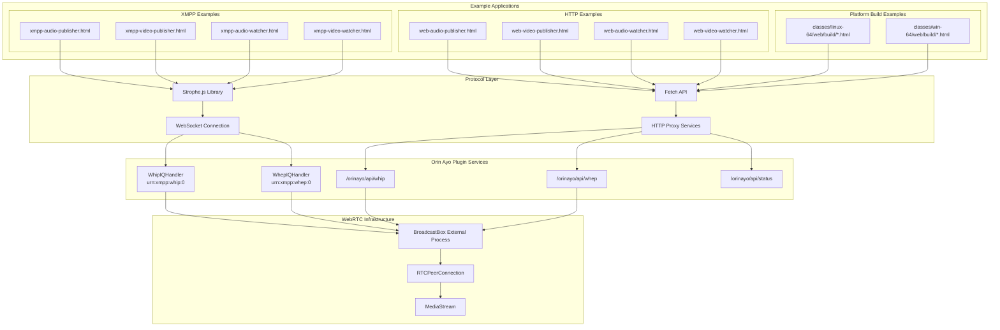
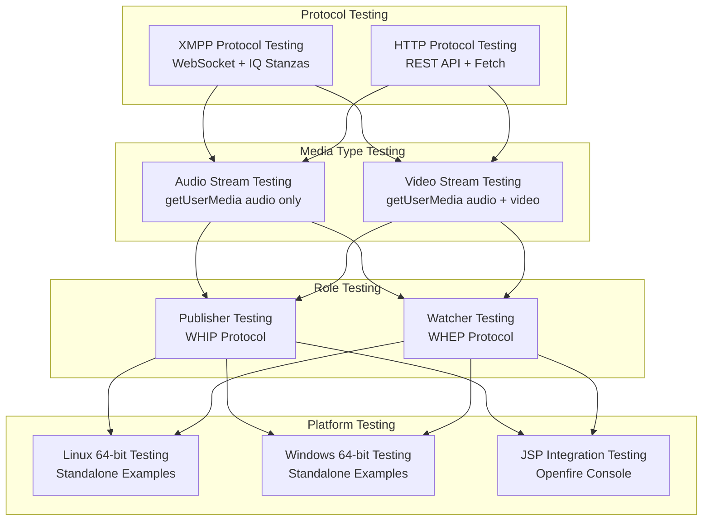

# Examples and Development Tools

> **Relevant source files**
> * [.gitignore](https://github.com/igniterealtime/openfire-orinayo-plugin/blob/932fc61c/.gitignore)
> * [classes/jsp/web-audio-publisher.html](https://github.com/igniterealtime/openfire-orinayo-plugin/blob/932fc61c/classes/jsp/web-audio-publisher.html)
> * [classes/jsp/web-audio-watcher.html](https://github.com/igniterealtime/openfire-orinayo-plugin/blob/932fc61c/classes/jsp/web-audio-watcher.html)
> * [classes/jsp/web-video-publisher.html](https://github.com/igniterealtime/openfire-orinayo-plugin/blob/932fc61c/classes/jsp/web-video-publisher.html)
> * [classes/jsp/web-video-watcher.html](https://github.com/igniterealtime/openfire-orinayo-plugin/blob/932fc61c/classes/jsp/web-video-watcher.html)
> * [classes/jsp/xmpp-audio-publisher.html](https://github.com/igniterealtime/openfire-orinayo-plugin/blob/932fc61c/classes/jsp/xmpp-audio-publisher.html)
> * [classes/jsp/xmpp-audio-watcher.html](https://github.com/igniterealtime/openfire-orinayo-plugin/blob/932fc61c/classes/jsp/xmpp-audio-watcher.html)
> * [classes/jsp/xmpp-video-publisher.html](https://github.com/igniterealtime/openfire-orinayo-plugin/blob/932fc61c/classes/jsp/xmpp-video-publisher.html)
> * [classes/jsp/xmpp-video-watcher.html](https://github.com/igniterealtime/openfire-orinayo-plugin/blob/932fc61c/classes/jsp/xmpp-video-watcher.html)
> * [classes/linux-64/web/build/audio-publisher.html](https://github.com/igniterealtime/openfire-orinayo-plugin/blob/932fc61c/classes/linux-64/web/build/audio-publisher.html)
> * [classes/linux-64/web/build/audio-watcher.html](https://github.com/igniterealtime/openfire-orinayo-plugin/blob/932fc61c/classes/linux-64/web/build/audio-watcher.html)
> * [classes/linux-64/web/build/video-publisher.html](https://github.com/igniterealtime/openfire-orinayo-plugin/blob/932fc61c/classes/linux-64/web/build/video-publisher.html)
> * [classes/linux-64/web/build/video-watcher.html](https://github.com/igniterealtime/openfire-orinayo-plugin/blob/932fc61c/classes/linux-64/web/build/video-watcher.html)
> * [classes/win-64/web/build/audio-publisher.html](https://github.com/igniterealtime/openfire-orinayo-plugin/blob/932fc61c/classes/win-64/web/build/audio-publisher.html)
> * [classes/win-64/web/build/audio-watcher.html](https://github.com/igniterealtime/openfire-orinayo-plugin/blob/932fc61c/classes/win-64/web/build/audio-watcher.html)
> * [classes/win-64/web/build/video-publisher.html](https://github.com/igniterealtime/openfire-orinayo-plugin/blob/932fc61c/classes/win-64/web/build/video-publisher.html)
> * [classes/win-64/web/build/video-watcher.html](https://github.com/igniterealtime/openfire-orinayo-plugin/blob/932fc61c/classes/win-64/web/build/video-watcher.html)

This document covers the example implementations, development utilities, and testing tools provided with the Orin Ayo plugin. These resources demonstrate how to integrate with the plugin's WebRTC streaming capabilities using both XMPP and HTTP protocols. The examples serve as reference implementations for developers building client applications that interact with the plugin's media streaming services.

For detailed information about the underlying WebRTC streaming architecture, see [WebRTC Media Streaming](/igniterealtime/openfire-orinayo-plugin/5.2-webrtc-media-streaming). For admin console and web interface details, see [Web Interfaces and Client Applications](/igniterealtime/openfire-orinayo-plugin/4-web-interfaces-and-client-applications).

## Example Architecture Overview

The plugin provides comprehensive examples demonstrating two primary integration approaches: XMPP-based signaling and direct HTTP API access. Both approaches support audio and video streaming using WHIP (publishing) and WHEP (watching) protocols.



**Sources:** [classes/jsp/xmpp-audio-publisher.html L1-L74](https://github.com/igniterealtime/openfire-orinayo-plugin/blob/932fc61c/classes/jsp/xmpp-audio-publisher.html#L1-L74)

 [classes/jsp/web-audio-publisher.html L1-L52](https://github.com/igniterealtime/openfire-orinayo-plugin/blob/932fc61c/classes/jsp/web-audio-publisher.html#L1-L52)

 [classes/linux-64/web/build/audio-publisher.html L1-L62](https://github.com/igniterealtime/openfire-orinayo-plugin/blob/932fc61c/classes/linux-64/web/build/audio-publisher.html#L1-L62)

## XMPP-Based Examples

The XMPP examples demonstrate integration using the custom WHIP and WHEP IQ handlers over WebSocket connections. These examples use the `Strophe.js` library for XMPP communication and showcase the plugin's native XMPP protocol extensions.

### XMPP Audio Publisher

The XMPP audio publisher demonstrates how to publish audio streams using the `urn:xmpp:whip:0` namespace. The implementation establishes a WebSocket connection to the XMPP server and uses IQ stanzas for WebRTC signaling.

| Component | Implementation |
| --- | --- |
| Connection | `Strophe.Connection` with WebSocket binding |
| Media Capture | `navigator.mediaDevices.getUserMedia({audio: true, video: false})` |
| WebRTC Setup | `RTCPeerConnection` with sendonly audio transceiver |
| Signaling | WHIP IQ with `streamKey` and SDP offer |

Key implementation details from [classes/jsp/xmpp-audio-publisher.html L23-L62](https://github.com/igniterealtime/openfire-orinayo-plugin/blob/932fc61c/classes/jsp/xmpp-audio-publisher.html#L23-L62)

:

* WebSocket connection establishment at line 24
* Stream key generation using `crypto.randomUUID()` at line 27
* WHIP IQ transmission with SDP offer at lines 53-62

### XMPP Video Publisher

The video publisher extends audio publishing to include video streams with simulcast encoding support. It demonstrates advanced WebRTC features including multiple encoding layers for adaptive streaming.

Video-specific configuration includes simulcast encodings at [classes/jsp/xmpp-video-publisher.html L49-L66](https://github.com/igniterealtime/openfire-orinayo-plugin/blob/932fc61c/classes/jsp/xmpp-video-publisher.html#L49-L66)

:

* High resolution (`rid: 'high'`)
* Medium resolution (`scaleResolutionDownBy: 2.0`)
* Low resolution (`scaleResolutionDownBy: 4.0`)

### XMPP Watchers

The XMPP watcher examples demonstrate stream consumption using the `urn:xmpp:whep:0` namespace. The watcher first queries for available streams using a GET IQ, then establishes a WebRTC connection to watch the stream.

Stream discovery process from [classes/jsp/xmpp-audio-watcher.html L31-L42](https://github.com/igniterealtime/openfire-orinayo-plugin/blob/932fc61c/classes/jsp/xmpp-audio-watcher.html#L31-L42)

:

1. Send WHEP GET IQ to discover available streams
2. Extract stream key from response `item` element
3. Call `viewStream()` function with discovered key

**Sources:** [classes/jsp/xmpp-audio-publisher.html L1-L74](https://github.com/igniterealtime/openfire-orinayo-plugin/blob/932fc61c/classes/jsp/xmpp-audio-publisher.html#L1-L74)

 [classes/jsp/xmpp-video-publisher.html L1-L91](https://github.com/igniterealtime/openfire-orinayo-plugin/blob/932fc61c/classes/jsp/xmpp-video-publisher.html#L1-L91)

 [classes/jsp/xmpp-audio-watcher.html L1-L83](https://github.com/igniterealtime/openfire-orinayo-plugin/blob/932fc61c/classes/jsp/xmpp-audio-watcher.html#L1-L83)

 [classes/jsp/xmpp-video-watcher.html L1-L84](https://github.com/igniterealtime/openfire-orinayo-plugin/blob/932fc61c/classes/jsp/xmpp-video-watcher.html#L1-L84)

## HTTP-Based Examples

The HTTP examples demonstrate direct API integration using the plugin's REST endpoints. These examples bypass XMPP and communicate directly with the HTTP proxy services, making them suitable for web applications that don't require XMPP connectivity.

### HTTP API Endpoints

| Endpoint | Purpose | Method |
| --- | --- | --- |
| `/orinayo/api/whip` | Publish media streams | POST |
| `/orinayo/api/whep` | Watch media streams | POST |
| `/orinayo/api/status` | Query active streams | GET |

### HTTP Publisher Implementation

The HTTP publishers use the Fetch API to send WebRTC offers directly to the WHIP endpoint. Authentication uses Bearer tokens with the stream key.

Core publishing flow from [classes/jsp/web-audio-publisher.html L22-L49](https://github.com/igniterealtime/openfire-orinayo-plugin/blob/932fc61c/classes/jsp/web-audio-publisher.html#L22-L49)

:

1. Generate stream key using `crypto.randomUUID()`
2. Create `RTCPeerConnection` and add media tracks
3. Generate SDP offer
4. POST offer to WHIP endpoint with Authorization header
5. Set remote description from response

Request format at [classes/jsp/web-audio-publisher.html L46](https://github.com/igniterealtime/openfire-orinayo-plugin/blob/932fc61c/classes/jsp/web-audio-publisher.html#L46-L46)

:

```yaml
fetch(whipURL, {
  method: 'POST', 
  body: offer.sdp, 
  headers: {
    Authorization: `Bearer ${streamKey}`, 
    'Content-Type': 'application/sdp'
  }
})
```

### HTTP Watcher Implementation

The HTTP watchers first query the status endpoint to discover available streams, then use the WHEP endpoint to establish viewing connections.

Stream discovery from [classes/jsp/web-audio-watcher.html L23-L26](https://github.com/igniterealtime/openfire-orinayo-plugin/blob/932fc61c/classes/jsp/web-audio-watcher.html#L23-L26)

:

```javascript
const statusURL = location.origin + "/orinayo/api/status";
const resp = await fetch(statusURL);
const streams = await resp.json();
const streamKey = streams[0].streamKey;
```

**Sources:** [classes/jsp/web-audio-publisher.html L1-L52](https://github.com/igniterealtime/openfire-orinayo-plugin/blob/932fc61c/classes/jsp/web-audio-publisher.html#L1-L52)

 [classes/jsp/web-video-publisher.html L1-L77](https://github.com/igniterealtime/openfire-orinayo-plugin/blob/932fc61c/classes/jsp/web-video-publisher.html#L1-L77)

 [classes/jsp/web-audio-watcher.html L1-L50](https://github.com/igniterealtime/openfire-orinayo-plugin/blob/932fc61c/classes/jsp/web-audio-watcher.html#L1-L50)

 [classes/jsp/web-video-watcher.html L1-L64](https://github.com/igniterealtime/openfire-orinayo-plugin/blob/932fc61c/classes/jsp/web-video-watcher.html#L1-L64)

## Platform-Specific Build Artifacts

The plugin includes platform-specific example builds that demonstrate standalone deployment of the WebRTC examples. These are located in the `classes/linux-64/web/build/` and `classes/win-64/web/build/` directories and provide configurable WHIP/WHEP URLs for testing against different server instances.

### Build Example Features

The platform-specific examples include additional configuration options not present in the JSP examples:

| Feature | Purpose |
| --- | --- |
| WHIP URL input field | Configure target streaming server |
| WHEP URL input field | Configure target playback server |
| Stream Key input | Manual stream key specification |
| Input validation | Prevent empty URL/key submission |

Example configuration UI from [classes/linux-64/web/build/audio-publisher.html L11-L13](https://github.com/igniterealtime/openfire-orinayo-plugin/blob/932fc61c/classes/linux-64/web/build/audio-publisher.html#L11-L13)

:

```xml
<b> WHIP URL </b> <input type="text" value="http://localhost:8080/api/whip" id="whipURL" />
<b> Stream Key </b> <input type="text" id="streamKey" />
<button onclick="window.publishStream()"> Publish Stream </button>
```

### Cross-Platform Compatibility

The build artifacts demonstrate deployment across different operating systems while maintaining identical functionality. The examples include proper error handling and user feedback mechanisms.

Input validation example from [classes/win-64/web/build/video-watcher.html L24-L33](https://github.com/igniterealtime/openfire-orinayo-plugin/blob/932fc61c/classes/win-64/web/build/video-watcher.html#L24-L33)

:

```javascript
const whepURL = document.getElementById('whepURL').value
if (whepURL === '') {
  return window.alert('WHEP URL must not be empty')
}
const streamKey = document.getElementById('streamKey').value
if (streamKey === '') {
  return window.alert('Stream Key must not be empty')
}
```

**Sources:** [classes/linux-64/web/build/audio-publisher.html L1-L62](https://github.com/igniterealtime/openfire-orinayo-plugin/blob/932fc61c/classes/linux-64/web/build/audio-publisher.html#L1-L62)

 [classes/win-64/web/build/video-publisher.html L1-L83](https://github.com/igniterealtime/openfire-orinayo-plugin/blob/932fc61c/classes/win-64/web/build/video-publisher.html#L1-L83)

 [classes/linux-64/web/build/video-watcher.html L1-L68](https://github.com/igniterealtime/openfire-orinayo-plugin/blob/932fc61c/classes/linux-64/web/build/video-watcher.html#L1-L68)

 [classes/win-64/web/build/audio-watcher.html L1-L64](https://github.com/igniterealtime/openfire-orinayo-plugin/blob/932fc61c/classes/win-64/web/build/audio-watcher.html#L1-L64)

## Development Tools and Testing Utilities

The examples serve as comprehensive development tools for testing the plugin's WebRTC streaming capabilities. They provide both protocol-level testing (XMPP vs HTTP) and media-type testing (audio vs video) in a matrix of combinations.

### Testing Matrix



### Development Workflow

The examples support iterative development and testing workflows:

1. **Local Development**: Use JSP examples within Openfire admin console
2. **Protocol Testing**: Compare XMPP vs HTTP implementations
3. **Cross-Platform Validation**: Test with platform-specific builds
4. **Integration Testing**: Verify publisher-watcher communication

### Debug and Monitoring Features

All examples include connection state monitoring and console logging for debugging:

* ICE connection state display
* SDP offer/answer logging
* Error handling with console warnings
* Real-time connection status updates

Connection monitoring from [classes/jsp/xmpp-video-watcher.html L61-L63](https://github.com/igniterealtime/openfire-orinayo-plugin/blob/932fc61c/classes/jsp/xmpp-video-watcher.html#L61-L63)

:

```javascript
peerConnection.oniceconnectionstatechange = () => {
  document.getElementById('connectionState').innerText = peerConnection.iceConnectionState;
}
```

**Sources:** [classes/jsp/xmpp-audio-publisher.html L37-L39](https://github.com/igniterealtime/openfire-orinayo-plugin/blob/932fc61c/classes/jsp/xmpp-audio-publisher.html#L37-L39)

 [classes/jsp/web-audio-watcher.html L36-L38](https://github.com/igniterealtime/openfire-orinayo-plugin/blob/932fc61c/classes/jsp/web-audio-watcher.html#L36-L38)

 [classes/linux-64/web/build/video-publisher.html L43-L45](https://github.com/igniterealtime/openfire-orinayo-plugin/blob/932fc61c/classes/linux-64/web/build/video-publisher.html#L43-L45)

 [.gitignore L1-L8](https://github.com/igniterealtime/openfire-orinayo-plugin/blob/932fc61c/.gitignore#L1-L8)