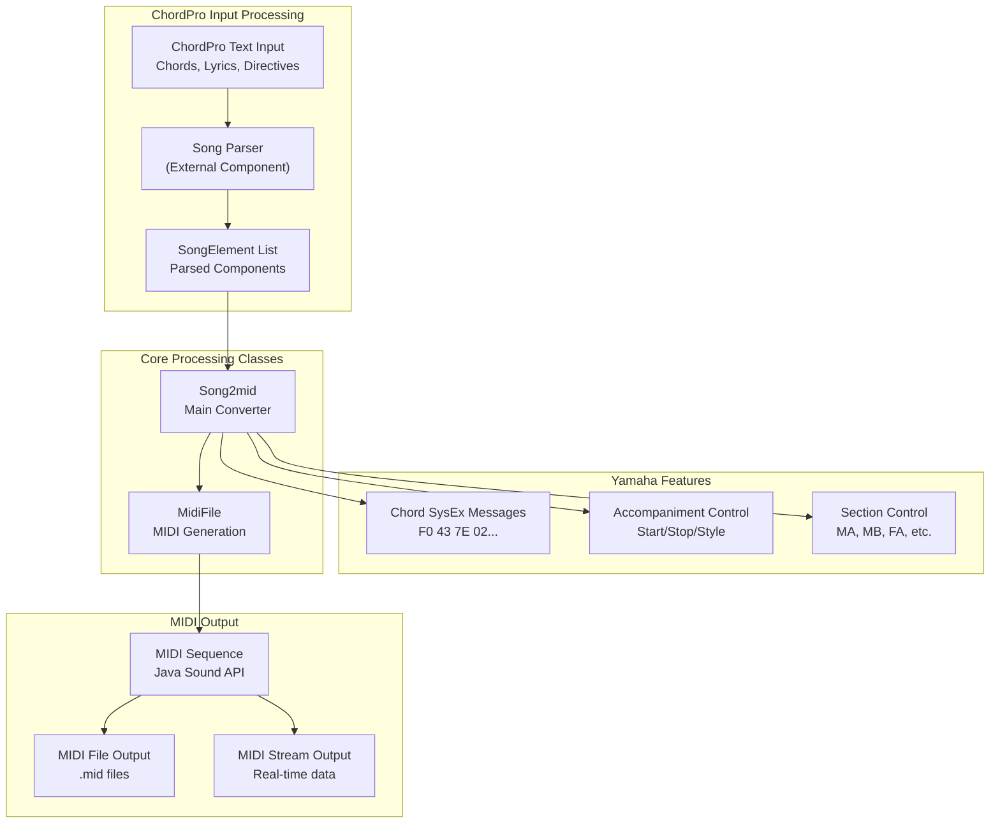
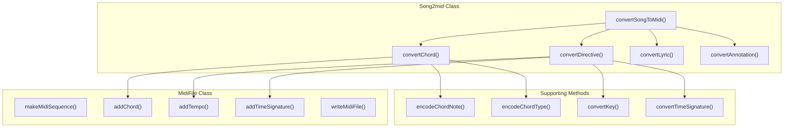
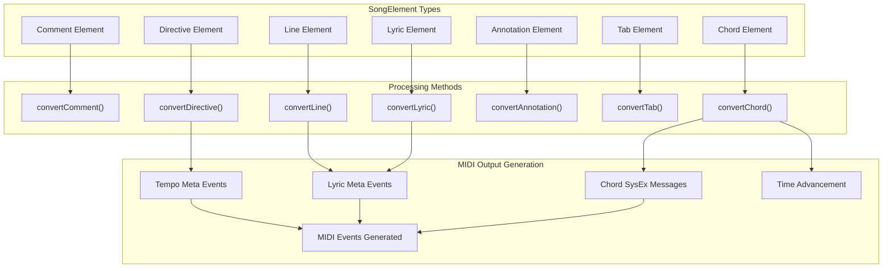
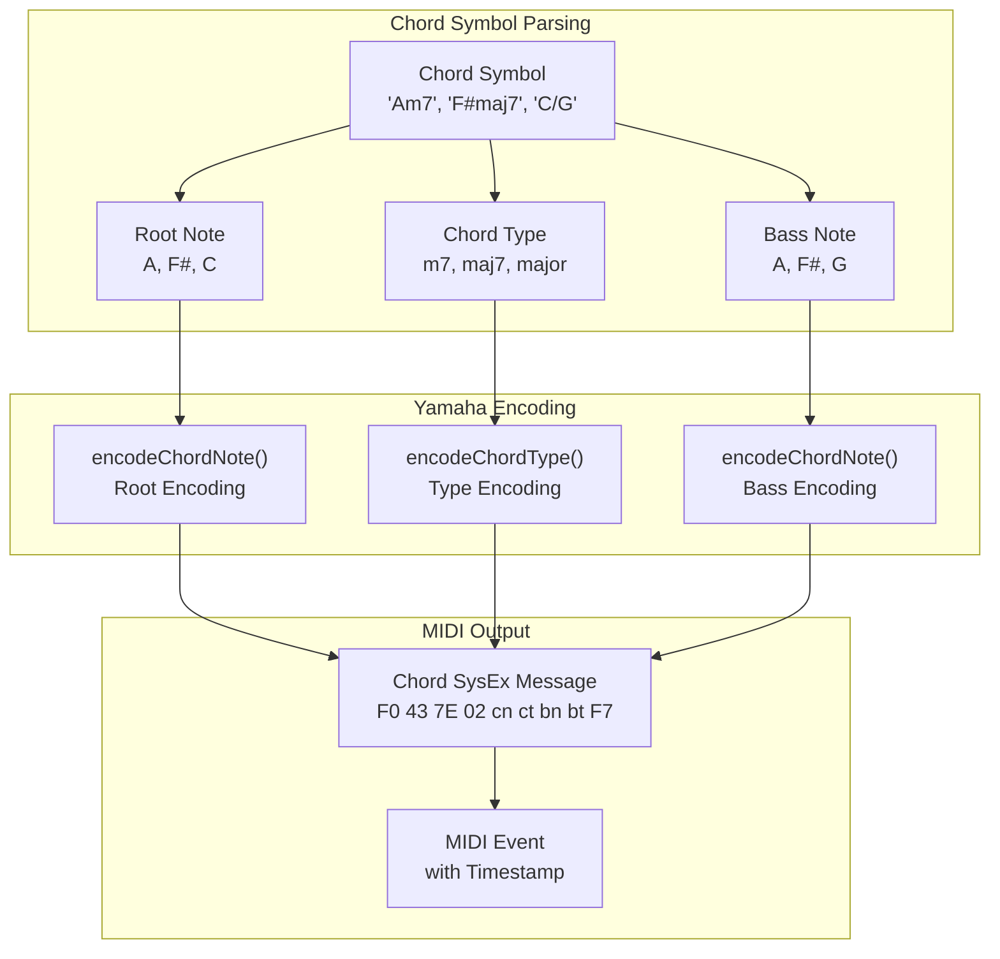
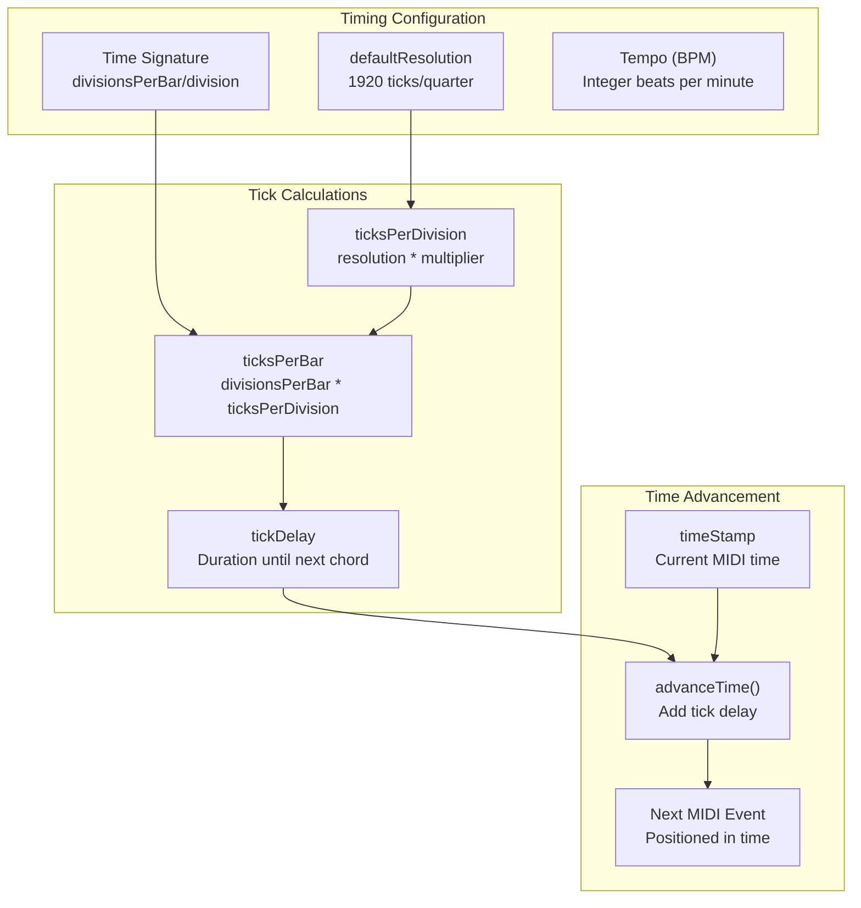

# MIDI and ChordPro Processing

> **Relevant source files**
> * [src/java/org/ifsoft/chordpro/MidiFile.java](https://github.com/igniterealtime/openfire-orinayo-plugin/blob/932fc61c/src/java/org/ifsoft/chordpro/MidiFile.java)
> * [src/java/org/ifsoft/chordpro/Song2mid.java](https://github.com/igniterealtime/openfire-orinayo-plugin/blob/932fc61c/src/java/org/ifsoft/chordpro/Song2mid.java)
> * [src/java/org/ifsoft/orinayo/openfire/CORSFilter.java](https://github.com/igniterealtime/openfire-orinayo-plugin/blob/932fc61c/src/java/org/ifsoft/orinayo/openfire/CORSFilter.java)

This document covers the ChordPro to MIDI conversion system within the Orin Ayo plugin, which transforms musical chord charts and lyrics in ChordPro format into MIDI files with Yamaha arranger keyboard compatibility. The system processes ChordPro directives, chord symbols, lyrics, and annotations to generate time-synchronized MIDI sequences with embedded chord data and accompaniment control.

For WebRTC-based audio and video streaming capabilities, see [WebRTC Media Streaming](/igniterealtime/openfire-orinayo-plugin/5.2-webrtc-media-streaming).

## System Overview

The MIDI and ChordPro processing system consists of two primary components that work together to convert textual musical notation into playable MIDI sequences:

**Sources:** [src/java/org/ifsoft/chordpro/Song2mid.java L1-L738](https://github.com/igniterealtime/openfire-orinayo-plugin/blob/932fc61c/src/java/org/ifsoft/chordpro/Song2mid.java#L1-L738)

 [src/java/org/ifsoft/chordpro/MidiFile.java L1-L436](https://github.com/igniterealtime/openfire-orinayo-plugin/blob/932fc61c/src/java/org/ifsoft/chordpro/MidiFile.java#L1-L436)

## Core Classes and Architecture

The system is built around two main classes that handle the conversion pipeline from ChordPro format to MIDI output:

| Class | Primary Responsibility | Key Methods |
| --- | --- | --- |
| `Song2mid` | ChordPro to MIDI conversion logic | `convertSongToMidi()`, `convertChord()`, `convertDirective()` |
| `MidiFile` | MIDI sequence generation and file I/O | `addChord()`, `addTempo()`, `writeMidiFile()` |

**Sources:** [src/java/org/ifsoft/chordpro/Song2mid.java L38-L61](https://github.com/igniterealtime/openfire-orinayo-plugin/blob/932fc61c/src/java/org/ifsoft/chordpro/Song2mid.java#L38-L61)

 [src/java/org/ifsoft/chordpro/Song2mid.java L690-L736](https://github.com/igniterealtime/openfire-orinayo-plugin/blob/932fc61c/src/java/org/ifsoft/chordpro/Song2mid.java#L690-L736)

 [src/java/org/ifsoft/chordpro/MidiFile.java L59-L72](https://github.com/igniterealtime/openfire-orinayo-plugin/blob/932fc61c/src/java/org/ifsoft/chordpro/MidiFile.java#L59-L72)

## ChordPro Element Processing Pipeline

The `Song2mid` class processes different types of ChordPro elements through a dispatch mechanism that routes each element type to its appropriate conversion method:

**Sources:** [src/java/org/ifsoft/chordpro/Song2mid.java L704-L725](https://github.com/igniterealtime/openfire-orinayo-plugin/blob/932fc61c/src/java/org/ifsoft/chordpro/Song2mid.java#L704-L725)

 [src/java/org/ifsoft/chordpro/Song2mid.java L569-L627](https://github.com/igniterealtime/openfire-orinayo-plugin/blob/932fc61c/src/java/org/ifsoft/chordpro/Song2mid.java#L569-L627)

 [src/java/org/ifsoft/chordpro/Song2mid.java L334-L489](https://github.com/igniterealtime/openfire-orinayo-plugin/blob/932fc61c/src/java/org/ifsoft/chordpro/Song2mid.java#L334-L489)

## Chord Processing and Yamaha Encoding

The system converts ChordPro chord symbols into Yamaha arranger keyboard format using proprietary encoding schemes for chord roots, types, and bass notes:

### Chord Note Encoding

The `encodeChordNote()` method converts musical notes to Yamaha format:

| Note | Modifier | Yamaha Code | Binary Pattern |
| --- | --- | --- | --- |
| C | Natural | 0x31 | 0011 0001 |
| C | Sharp (#) | 0x41 | 0100 0001 |
| C | Flat (b) | 0x21 | 0010 0001 |

**Sources:** [src/java/org/ifsoft/chordpro/Song2mid.java L187-L229](https://github.com/igniterealtime/openfire-orinayo-plugin/blob/932fc61c/src/java/org/ifsoft/chordpro/Song2mid.java#L187-L229)

 [src/java/org/ifsoft/chordpro/Song2mid.java L234-L332](https://github.com/igniterealtime/openfire-orinayo-plugin/blob/932fc61c/src/java/org/ifsoft/chordpro/Song2mid.java#L234-L332)

 [src/java/org/ifsoft/chordpro/Song2mid.java L592-L594](https://github.com/igniterealtime/openfire-orinayo-plugin/blob/932fc61c/src/java/org/ifsoft/chordpro/Song2mid.java#L592-L594)

### Chord Type Classification

The system supports extensive chord type recognition with Yamaha-specific encoding:

| Qualifier | Extensions | Yamaha Type | Usage |
| --- | --- | --- | --- |
| "" (major) | "7" | 0x13 | Dominant 7th |
| "maj" | "7" | 0x02 | Major 7th |
| "min" | "7" | 0x0A | Minor 7th |
| "dim" | "7" | 0x12 | Diminished 7th |

**Sources:** [src/java/org/ifsoft/chordpro/Song2mid.java L234-L332](https://github.com/igniterealtime/openfire-orinayo-plugin/blob/932fc61c/src/java/org/ifsoft/chordpro/Song2mid.java#L234-L332)

## MIDI File Generation and Timing

The `MidiFile` class manages MIDI sequence creation, timing calculations, and Yamaha-specific system exclusive messages:

### Timing System

The system uses a default resolution of 1920 ticks per quarter note and calculates timing based on time signatures:

**Sources:** [src/java/org/ifsoft/chordpro/Song2mid.java L21-L28](https://github.com/igniterealtime/openfire-orinayo-plugin/blob/932fc61c/src/java/org/ifsoft/chordpro/Song2mid.java#L21-L28)

 [src/java/org/ifsoft/chordpro/Song2mid.java L51-L54](https://github.com/igniterealtime/openfire-orinayo-plugin/blob/932fc61c/src/java/org/ifsoft/chordpro/Song2mid.java#L51-L54)

 [src/java/org/ifsoft/chordpro/Song2mid.java L66-L68](https://github.com/igniterealtime/openfire-orinayo-plugin/blob/932fc61c/src/java/org/ifsoft/chordpro/Song2mid.java#L66-L68)

 [src/java/org/ifsoft/chordpro/MidiFile.java L57-L58](https://github.com/igniterealtime/openfire-orinayo-plugin/blob/932fc61c/src/java/org/ifsoft/chordpro/MidiFile.java#L57-L58)

### MIDI Event Generation

The `MidiFile` class provides methods for generating various types of MIDI events with proper timing:

| Event Type | Method | Purpose |
| --- | --- | --- |
| Chord Data | `addChord()` | Yamaha chord SysEx messages |
| Accompaniment | `addAccompStart()`, `addAccompStop()` | Control auto-accompaniment |
| Section Control | `addSectionControl()` | Song structure (MA, MB, FA, etc.) |
| Lyrics | `addLyric()`, `addLineBreak()` | Text synchronization |
| Style | `addStyleCode()` | Yamaha style selection |

**Sources:** [src/java/org/ifsoft/chordpro/MidiFile.java L343-L414](https://github.com/igniterealtime/openfire-orinayo-plugin/blob/932fc61c/src/java/org/ifsoft/chordpro/MidiFile.java#L343-L414)

 [src/java/org/ifsoft/chordpro/MidiFile.java L315-L341](https://github.com/igniterealtime/openfire-orinayo-plugin/blob/932fc61c/src/java/org/ifsoft/chordpro/MidiFile.java#L315-L341)

 [src/java/org/ifsoft/chordpro/MidiFile.java L362-L370](https://github.com/igniterealtime/openfire-orinayo-plugin/blob/932fc61c/src/java/org/ifsoft/chordpro/MidiFile.java#L362-L370)

## ChordPro Directive Processing

The system processes ChordPro directives to configure MIDI file parameters and generate appropriate meta events:

### Core Directives

```mermaid
flowchart TD

TITLE_DIR["{title}"]
TEMPO_DIR["{tempo}"]
TIME_DIR["{time}"]
KEY_DIR["{key}"]
STYLE_DIR["{stylecode}"]
SOC_DIR["{start_of_chorus}"]
EOC_DIR["{end_of_chorus}"]
SOI_DIR["{start_of_instrumental}"]
EOI_DIR["{end_of_instrumental}"]
START_ACCOMP["{start_accomp}"]
STOP_ACCOMP["{stop_accomp}"]
COMMENT_DIR["{comment}"]
TRACK_NAME["Track Name Meta Event"]
TEMPO_META["Tempo Meta Event"]
TIME_META["Time Signature Meta Event"]
KEY_META["Key Signature Meta Event"]
STYLE_SYSEX["Style Code SysEx"]
PAGE_BREAK["Page Break Meta Event"]
ACCOMP_SYSEX["Accompaniment SysEx"]

TITLE_DIR --> TRACK_NAME
TEMPO_DIR --> TEMPO_META
TIME_DIR --> TIME_META
KEY_DIR --> KEY_META
STYLE_DIR --> STYLE_SYSEX
SOC_DIR --> PAGE_BREAK
SOI_DIR --> PAGE_BREAK
COMMENT_DIR --> PAGE_BREAK
START_ACCOMP --> ACCOMP_SYSEX
STOP_ACCOMP --> ACCOMP_SYSEX

subgraph subGraph3 ["MIDI Events Generated"]
    TRACK_NAME
    TEMPO_META
    TIME_META
    KEY_META
    STYLE_SYSEX
    PAGE_BREAK
    ACCOMP_SYSEX
end

subgraph subGraph2 ["Control Directives"]
    START_ACCOMP
    STOP_ACCOMP
    COMMENT_DIR
end

subgraph subGraph1 ["Structure Directives"]
    SOC_DIR
    EOC_DIR
    SOI_DIR
    EOI_DIR
end

subgraph subGraph0 ["Setup Directives"]
    TITLE_DIR
    TEMPO_DIR
    TIME_DIR
    KEY_DIR
    STYLE_DIR
end
```

**Sources:** [src/java/org/ifsoft/chordpro/Song2mid.java L339-L489](https://github.com/igniterealtime/openfire-orinayo-plugin/blob/932fc61c/src/java/org/ifsoft/chordpro/Song2mid.java#L339-L489)

### Key and Time Signature Conversion

The system includes sophisticated parsing for musical keys and time signatures:

* **Key Conversion**: Supports major and minor keys with circle of fifths encoding
* **Time Signature**: Validates power-of-two denominators and calculates tick subdivisions
* **Tempo**: Converts BPM to MIDI microseconds per quarter note

**Sources:** [src/java/org/ifsoft/chordpro/Song2mid.java L74-L119](https://github.com/igniterealtime/openfire-orinayo-plugin/blob/932fc61c/src/java/org/ifsoft/chordpro/Song2mid.java#L74-L119)

 [src/java/org/ifsoft/chordpro/Song2mid.java L132-L177](https://github.com/igniterealtime/openfire-orinayo-plugin/blob/932fc61c/src/java/org/ifsoft/chordpro/Song2mid.java#L132-L177)

 [src/java/org/ifsoft/chordpro/MidiFile.java L237-L249](https://github.com/igniterealtime/openfire-orinayo-plugin/blob/932fc61c/src/java/org/ifsoft/chordpro/MidiFile.java#L237-L249)

## Integration with Orin Ayo System

The MIDI and ChordPro processing system integrates with the broader Orin Ayo platform through the BroadcastBox plugin architecture, providing musical score processing capabilities for collaborative music applications. The generated MIDI data can be streamed to connected clients or saved for later playback through the system's WebRTC infrastructure.

**Sources:** [src/java/org/ifsoft/chordpro/Song2mid.java L1-L10](https://github.com/igniterealtime/openfire-orinayo-plugin/blob/932fc61c/src/java/org/ifsoft/chordpro/Song2mid.java#L1-L10)

 [src/java/org/ifsoft/chordpro/MidiFile.java L16-L22](https://github.com/igniterealtime/openfire-orinayo-plugin/blob/932fc61c/src/java/org/ifsoft/chordpro/MidiFile.java#L16-L22)