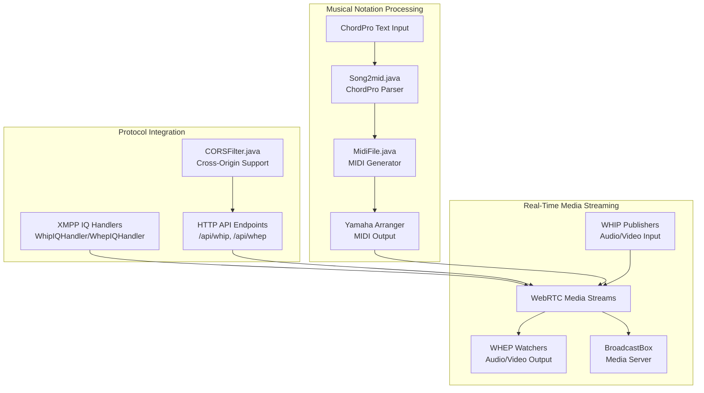
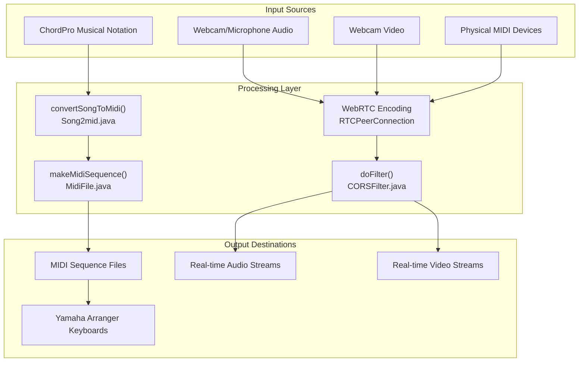
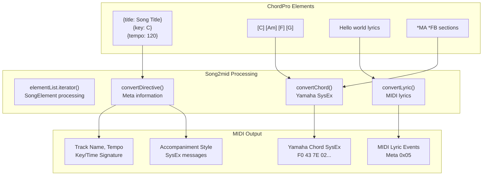
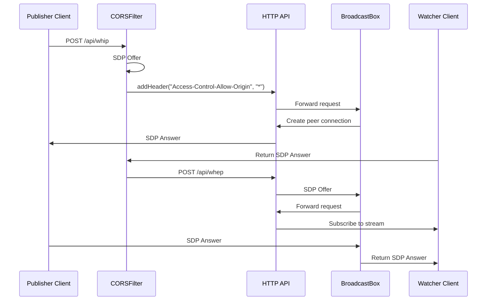
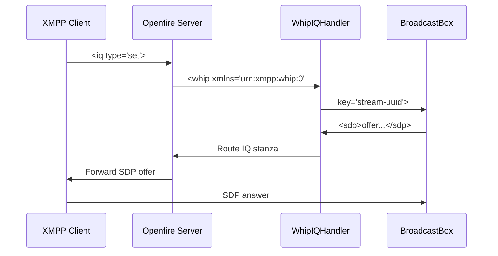
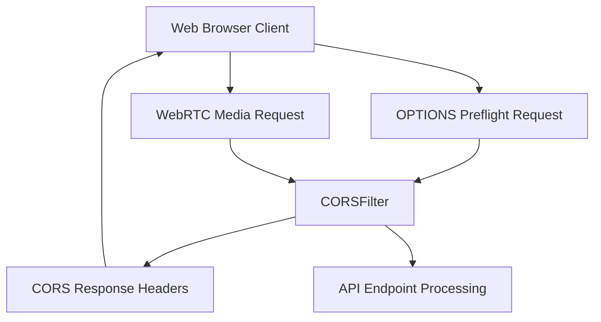

# Media Processing Systems

> **Relevant source files**
> * [classes/jsp/web-audio-publisher.html](https://github.com/igniterealtime/openfire-orinayo-plugin/blob/932fc61c/classes/jsp/web-audio-publisher.html)
> * [classes/jsp/web-audio-watcher.html](https://github.com/igniterealtime/openfire-orinayo-plugin/blob/932fc61c/classes/jsp/web-audio-watcher.html)
> * [classes/jsp/web-video-publisher.html](https://github.com/igniterealtime/openfire-orinayo-plugin/blob/932fc61c/classes/jsp/web-video-publisher.html)
> * [classes/jsp/web-video-watcher.html](https://github.com/igniterealtime/openfire-orinayo-plugin/blob/932fc61c/classes/jsp/web-video-watcher.html)
> * [classes/jsp/xmpp-audio-publisher.html](https://github.com/igniterealtime/openfire-orinayo-plugin/blob/932fc61c/classes/jsp/xmpp-audio-publisher.html)
> * [classes/jsp/xmpp-audio-watcher.html](https://github.com/igniterealtime/openfire-orinayo-plugin/blob/932fc61c/classes/jsp/xmpp-audio-watcher.html)
> * [classes/jsp/xmpp-video-publisher.html](https://github.com/igniterealtime/openfire-orinayo-plugin/blob/932fc61c/classes/jsp/xmpp-video-publisher.html)
> * [classes/jsp/xmpp-video-watcher.html](https://github.com/igniterealtime/openfire-orinayo-plugin/blob/932fc61c/classes/jsp/xmpp-video-watcher.html)
> * [src/java/org/ifsoft/chordpro/MidiFile.java](https://github.com/igniterealtime/openfire-orinayo-plugin/blob/932fc61c/src/java/org/ifsoft/chordpro/MidiFile.java)
> * [src/java/org/ifsoft/chordpro/Song2mid.java](https://github.com/igniterealtime/openfire-orinayo-plugin/blob/932fc61c/src/java/org/ifsoft/chordpro/Song2mid.java)
> * [src/java/org/ifsoft/orinayo/openfire/CORSFilter.java](https://github.com/igniterealtime/openfire-orinayo-plugin/blob/932fc61c/src/java/org/ifsoft/orinayo/openfire/CORSFilter.java)

This document covers the media processing capabilities of the Orin Ayo plugin, including ChordPro to MIDI conversion, MIDI file generation, and WebRTC-based audio/video streaming. The system transforms musical notation into MIDI format for arranger keyboards and provides real-time streaming capabilities for collaborative music sessions.

For detailed implementation of ChordPro conversion algorithms, see [MIDI and ChordPro Processing](/igniterealtime/openfire-orinayo-plugin/5.1-midi-and-chordpro-processing). For WebRTC protocol specifics and streaming examples, see [WebRTC Media Streaming](/igniterealtime/openfire-orinayo-plugin/5.2-webrtc-media-streaming). For client-side streaming applications, see [Client-Side Applications](/igniterealtime/openfire-orinayo-plugin/4.3-client-side-applications).

## System Architecture Overview

The media processing system consists of two primary components: musical notation processing and real-time media streaming. These systems work together to enable collaborative music creation and performance.

Sources: [src/java/org/ifsoft/chordpro/Song2mid.java L1-L737](https://github.com/igniterealtime/openfire-orinayo-plugin/blob/932fc61c/src/java/org/ifsoft/chordpro/Song2mid.java#L1-L737)

 [src/java/org/ifsoft/chordpro/MidiFile.java L1-L434](https://github.com/igniterealtime/openfire-orinayo-plugin/blob/932fc61c/src/java/org/ifsoft/chordpro/MidiFile.java#L1-L434)

 [src/java/org/ifsoft/orinayo/openfire/CORSFilter.java L1-L49](https://github.com/igniterealtime/openfire-orinayo-plugin/blob/932fc61c/src/java/org/ifsoft/orinayo/openfire/CORSFilter.java#L1-L49)

## Media Processing Pipeline

The system processes multiple types of media inputs and transforms them for collaborative music sessions. The pipeline handles both offline musical notation conversion and real-time streaming.

Sources: [src/java/org/ifsoft/chordpro/Song2mid.java L690-L736](https://github.com/igniterealtime/openfire-orinayo-plugin/blob/932fc61c/src/java/org/ifsoft/chordpro/Song2mid.java#L690-L736)

 [src/java/org/ifsoft/chordpro/MidiFile.java L134-L143](https://github.com/igniterealtime/openfire-orinayo-plugin/blob/932fc61c/src/java/org/ifsoft/chordpro/MidiFile.java#L134-L143)

 [src/java/org/ifsoft/orinayo/openfire/CORSFilter.java L28-L43](https://github.com/igniterealtime/openfire-orinayo-plugin/blob/932fc61c/src/java/org/ifsoft/orinayo/openfire/CORSFilter.java#L28-L43)

## ChordPro to MIDI Conversion Architecture

The `Song2mid` class implements a comprehensive ChordPro parser that converts musical chord charts into MIDI sequences optimized for Yamaha arranger keyboards.

| Component | Class/Method | Function |
| --- | --- | --- |
| Parser | `Song2mid.convertSongToMidi()` | Main conversion orchestrator |
| Key Conversion | `Song2mid.convertKey()` | Converts key signatures to MIDI format |
| Time Signature | `Song2mid.convertTimeSignature()` | Handles time signature parsing |
| Chord Encoding | `Song2mid.encodeChordNote()` | Encodes chord notes to Yamaha format |
| Chord Types | `Song2mid.encodeChordType()` | Maps chord qualities to MIDI values |
| MIDI Output | `MidiFile.addChord()` | Generates Yamaha SysEx chord messages |

The conversion process supports musical directives including tempo changes, key modulations, and song structure annotations. The system generates MIDI tracks with embedded lyrics, chord progressions, and accompaniment control messages.

Sources: [src/java/org/ifsoft/chordpro/Song2mid.java L334-L489](https://github.com/igniterealtime/openfire-orinayo-plugin/blob/932fc61c/src/java/org/ifsoft/chordpro/Song2mid.java#L334-L489)

 [src/java/org/ifsoft/chordpro/Song2mid.java L569-L627](https://github.com/igniterealtime/openfire-orinayo-plugin/blob/932fc61c/src/java/org/ifsoft/chordpro/Song2mid.java#L569-L627)

 [src/java/org/ifsoft/chordpro/MidiFile.java L372-L386](https://github.com/igniterealtime/openfire-orinayo-plugin/blob/932fc61c/src/java/org/ifsoft/chordpro/MidiFile.java#L372-L386)

## WebRTC Streaming Implementation

The system implements both HTTP-based and XMPP-based WebRTC streaming using the WHIP (WebRTC HTTP Ingestion Protocol) and WHEP (WebRTC HTTP Egress Protocol) standards.

### Publishing Architecture

Publishers create media streams using `navigator.mediaDevices.getUserMedia()` and establish WebRTC connections through either HTTP endpoints or XMPP IQ handlers.

| Protocol | Endpoint | Authentication | Media Types |
| --- | --- | --- | --- |
| HTTP WHIP | `/orinayo/api/whip` | Bearer token | Audio, Video |
| HTTP WHEP | `/orinayo/api/whep` | Bearer token | Audio, Video |
| XMPP WHIP | `urn:xmpp:whip:0` | XMPP authentication | Audio, Video |
| XMPP WHEP | `urn:xmpp:whep:0` | XMPP authentication | Audio, Video |

### Stream Processing Flow

Sources: [classes/jsp/web-audio-publisher.html L46-L48](https://github.com/igniterealtime/openfire-orinayo-plugin/blob/932fc61c/classes/jsp/web-audio-publisher.html#L46-L48)

 [classes/jsp/xmpp-audio-publisher.html L53-L62](https://github.com/igniterealtime/openfire-orinayo-plugin/blob/932fc61c/classes/jsp/xmpp-audio-publisher.html#L53-L62)

 [src/java/org/ifsoft/orinayo/openfire/CORSFilter.java L32-L36](https://github.com/igniterealtime/openfire-orinayo-plugin/blob/932fc61c/src/java/org/ifsoft/orinayo/openfire/CORSFilter.java#L32-L36)

## XMPP Integration for Media Streaming

The XMPP integration allows WebRTC negotiation through existing XMPP connections, enabling seamless integration with collaborative music sessions.

### XMPP Stanza Flow

The XMPP clients use the Strophe.js library to establish WebSocket connections and send IQ stanzas for WebRTC negotiation. Stream discovery uses WHEP GET requests to enumerate available streams.

Sources: [classes/jsp/xmpp-video-watcher.html L23-L42](https://github.com/igniterealtime/openfire-orinayo-plugin/blob/932fc61c/classes/jsp/xmpp-video-watcher.html#L23-L42)

 [classes/jsp/xmpp-audio-publisher.html L53-L62](https://github.com/igniterealtime/openfire-orinayo-plugin/blob/932fc61c/classes/jsp/xmpp-audio-publisher.html#L53-L62)

## Cross-Origin Resource Sharing Support

The `CORSFilter` class enables browser-based media streaming by handling cross-origin requests and preflight OPTIONS requests required for WebRTC applications.

The filter adds essential CORS headers including `Access-Control-Allow-Private-Network` for local network access and supports all common HTTP methods used by WebRTC applications.

Sources: [src/java/org/ifsoft/orinayo/openfire/CORSFilter.java L32-L42](https://github.com/igniterealtime/openfire-orinayo-plugin/blob/932fc61c/src/java/org/ifsoft/orinayo/openfire/CORSFilter.java#L32-L42)