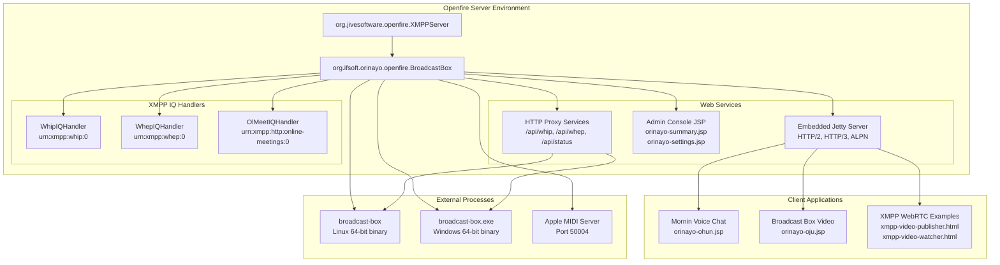
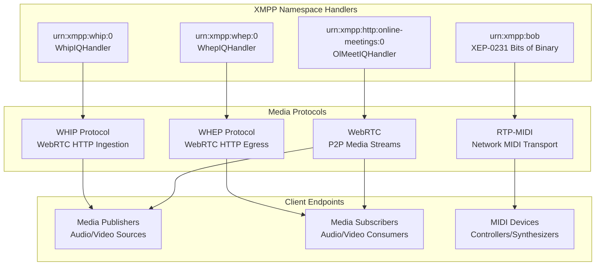
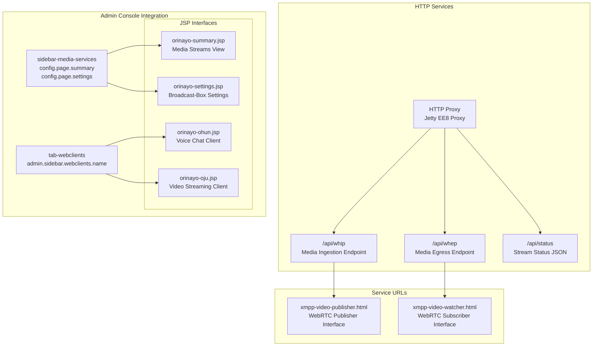

# Overview

> **Relevant source files**
> * [README.md](https://github.com/igniterealtime/openfire-orinayo-plugin/blob/932fc61c/README.md)
> * [changelog.html](https://github.com/igniterealtime/openfire-orinayo-plugin/blob/932fc61c/changelog.html)
> * [plugin.xml](https://github.com/igniterealtime/openfire-orinayo-plugin/blob/932fc61c/plugin.xml)
> * [pom.xml](https://github.com/igniterealtime/openfire-orinayo-plugin/blob/932fc61c/pom.xml)
> * [readme.html](https://github.com/igniterealtime/openfire-orinayo-plugin/blob/932fc61c/readme.html)
> * [src/i18n/orinayo_i18n.properties](https://github.com/igniterealtime/openfire-orinayo-plugin/blob/932fc61c/src/i18n/orinayo_i18n.properties)
> * [src/web/orinayo-summary.jsp](https://github.com/igniterealtime/openfire-orinayo-plugin/blob/932fc61c/src/web/orinayo-summary.jsp)

This document provides a comprehensive overview of the Orin Ayo Openfire plugin, a collaborative music platform that enables real-time musical collaboration through XMPP and WebRTC technologies. The plugin transforms Openfire into a live music server that supports MIDI instrument publishing/subscribing and WebRTC media streaming.

For detailed information about specific subsystems, see [Core Plugin Architecture](/igniterealtime/openfire-orinayo-plugin/2-core-plugin-architecture) for the main plugin implementation, [XMPP Protocol Extensions](/igniterealtime/openfire-orinayo-plugin/3-xmpp-protocol-extensions) for custom XMPP handlers, [Web Interfaces and Client Applications](/igniterealtime/openfire-orinayo-plugin/4-web-interfaces-and-client-applications) for user-facing components, and [Media Processing Systems](/igniterealtime/openfire-orinayo-plugin/5-media-processing-systems) for MIDI and audio/video handling.

## Purpose and Functionality

Orin Ayo (Yoruba for "A Song of Joy") extends Openfire to support collaborative music-making by integrating multiple communication protocols and media processing capabilities. The plugin enables musicians to:

* Share MIDI events over XMPP using XEP-0231 (Bits of Binary)
* Connect wireless MIDI hardware over LAN networks via RTP-MIDI
* Stream audio and video content using WebRTC with WHIP/WHEP protocols
* Convert ChordPro musical notation to MIDI accompaniment
* Participate in voice and video conferences

Sources: [README.md L1-L11](https://github.com/igniterealtime/openfire-orinayo-plugin/blob/932fc61c/README.md#L1-L11)

 [readme.html L36-L46](https://github.com/igniterealtime/openfire-orinayo-plugin/blob/932fc61c/readme.html#L36-L46)

 [plugin.xml L1-L24](https://github.com/igniterealtime/openfire-orinayo-plugin/blob/932fc61c/plugin.xml#L1-L24)

## Core Architecture Overview

The plugin architecture centers around the `BroadcastBox` main class, which orchestrates multiple subsystems including XMPP protocol handlers, web services, and external media processing components.

Sources: [plugin.xml L4](https://github.com/igniterealtime/openfire-orinayo-plugin/blob/932fc61c/plugin.xml#L4-L4)

 [pom.xml L78-L104](https://github.com/igniterealtime/openfire-orinayo-plugin/blob/932fc61c/pom.xml#L78-L104)

 [src/web/orinayo-summary.jsp L17](https://github.com/igniterealtime/openfire-orinayo-plugin/blob/932fc61c/src/web/orinayo-summary.jsp#L17-L17)

## Plugin Configuration and Dependencies

The plugin is built using Maven with a comprehensive dependency stack supporting modern web protocols and media processing capabilities.

| Component | Version/Purpose | Configuration |
| --- | --- | --- |
| Artifact ID | `orinayo` | Version 1.0.2-SNAPSHOT |
| Main Class | `org.ifsoft.orinayo.openfire.BroadcastBox` | Plugin entry point |
| Openfire Version | 5.0.0+ | Minimum server requirement |
| Jetty HTTP/3 | `${jetty.version}` | QUIC protocol support |
| Jetty HTTP/2 | `${jetty.version}` | HTTP/2 with ALPN |
| JSON Processing | json-lib 0.8 | API data exchange |
| Validation | Hibernate Validator 5.2.4 | Input validation |

The build system includes platform-specific resource copying for Linux and Windows 64-bit binaries, with separate execution phases handling `src/root` directory contents for each target platform.

Sources: [pom.xml L13-L15](https://github.com/igniterealtime/openfire-orinayo-plugin/blob/932fc61c/pom.xml#L13-L15)

 [pom.xml L20-L21](https://github.com/igniterealtime/openfire-orinayo-plugin/blob/932fc61c/pom.xml#L20-L21)

 [pom.xml L25-L64](https://github.com/igniterealtime/openfire-orinayo-plugin/blob/932fc61c/pom.xml#L25-L64)

 [pom.xml L76-L141](https://github.com/igniterealtime/openfire-orinayo-plugin/blob/932fc61c/pom.xml#L76-L141)

## XMPP Protocol Integration

The plugin extends XMPP with custom protocol handlers that enable WebRTC signaling and media stream management over existing XMPP infrastructure.

The plugin implements a custom XEP specification for HTTP User Media Streams that bridges WHIP/WHEP protocols with XMPP messaging, enabling media stream coordination through existing XMPP client connections.

Sources: [README.md L6-L8](https://github.com/igniterealtime/openfire-orinayo-plugin/blob/932fc61c/README.md#L6-L8)

 [src/i18n/orinayo_i18n.properties L1-L51](https://github.com/igniterealtime/openfire-orinayo-plugin/blob/932fc61c/src/i18n/orinayo_i18n.properties#L1-L51)

## Web Services and Admin Integration

The plugin integrates with Openfire's admin console through JSP-based interfaces and provides HTTP proxy services for external media processing components.

The admin interfaces provide real-time monitoring of active media streams and configuration management for the underlying broadcast-box media server processes.

Sources: [plugin.xml L12-L23](https://github.com/igniterealtime/openfire-orinayo-plugin/blob/932fc61c/plugin.xml#L12-L23)

 [src/web/orinayo-summary.jsp L22-L26](https://github.com/igniterealtime/openfire-orinayo-plugin/blob/932fc61c/src/web/orinayo-summary.jsp#L22-L26)

 [src/web/orinayo-summary.jsp L38-L40](https://github.com/igniterealtime/openfire-orinayo-plugin/blob/932fc61c/src/web/orinayo-summary.jsp#L38-L40)

 [pom.xml L100-L104](https://github.com/igniterealtime/openfire-orinayo-plugin/blob/932fc61c/pom.xml#L100-L104)

## Technology Stack and External Dependencies

The plugin leverages a modern technology stack combining XMPP messaging, WebRTC media processing, and MIDI protocol support.

| Technology | Purpose | Implementation |
| --- | --- | --- |
| **XMPP Core** | Message routing and presence | Openfire 5.0.0+ integration |
| **WebRTC** | Real-time media streaming | Custom WHIP/WHEP over XMPP |
| **RTP-MIDI** | Network MIDI transport | Java RTP-MIDI library |
| **ChordPro** | Musical notation processing | Paul J. Drongowski conversion code |
| **Jetty HTTP/3** | Modern web protocols | QUIC and HTTP/2 with ALPN |
| **Broadcast-Box** | Media server backend | External Rust-based WebRTC SFU |
| **Apple MIDI** | Wireless MIDI support | Port 50004 network service |

The plugin includes platform-specific binaries for Linux and Windows 64-bit systems, with automatic resource deployment during the Maven build process.

Sources: [README.md L5-L11](https://github.com/igniterealtime/openfire-orinayo-plugin/blob/932fc61c/README.md#L5-L11)

 [pom.xml L78-L92](https://github.com/igniterealtime/openfire-orinayo-plugin/blob/932fc61c/pom.xml#L78-L92)

 [pom.xml L30-L62](https://github.com/igniterealtime/openfire-orinayo-plugin/blob/932fc61c/pom.xml#L30-L62)

 [changelog.html L46-L62](https://github.com/igniterealtime/openfire-orinayo-plugin/blob/932fc61c/changelog.html#L46-L62)