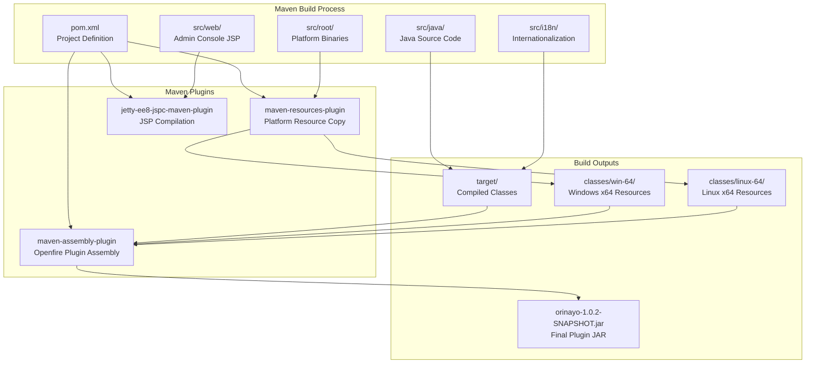
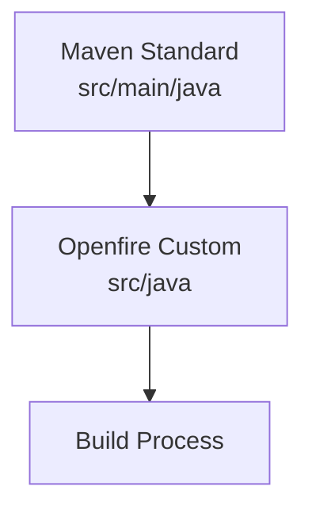
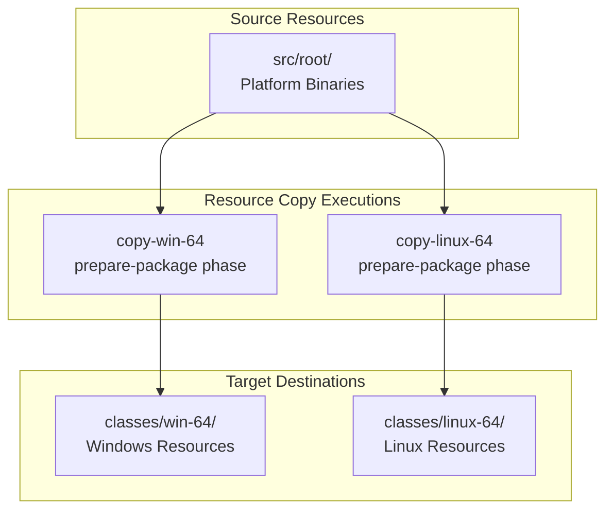
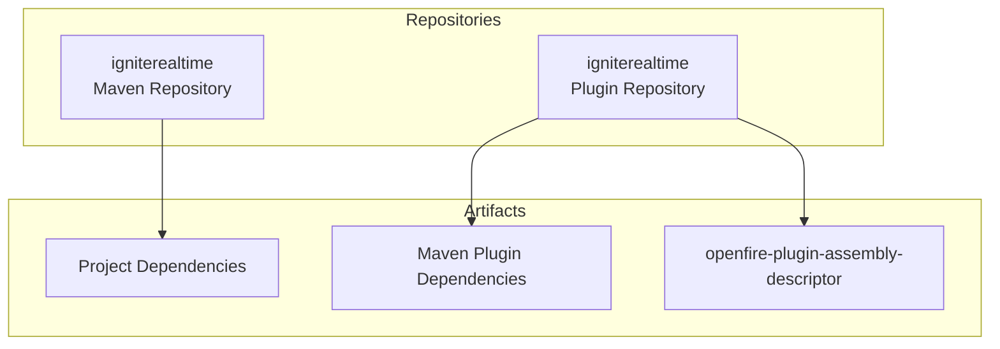
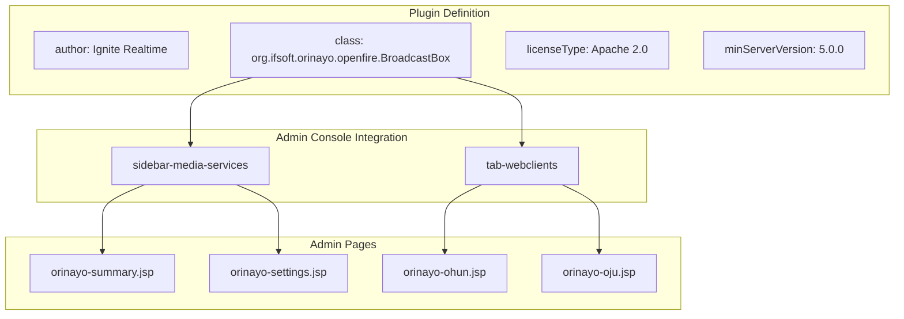
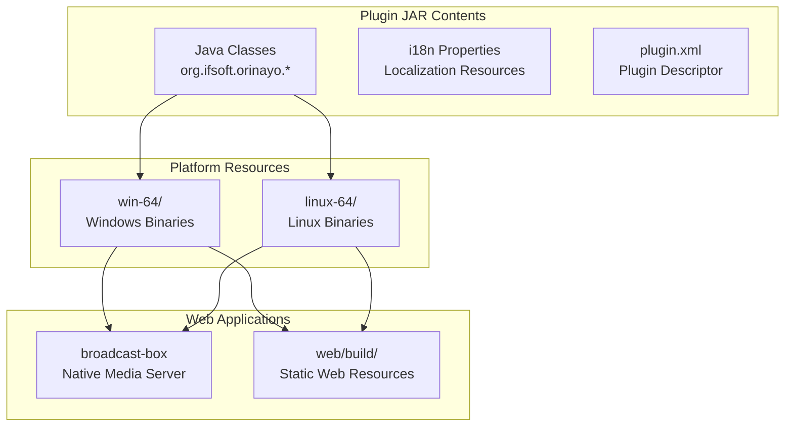

# Plugin Configuration and Build System

> **Relevant source files**
> * [.gitignore](https://github.com/igniterealtime/openfire-orinayo-plugin/blob/932fc61c/.gitignore)
> * [changelog.html](https://github.com/igniterealtime/openfire-orinayo-plugin/blob/932fc61c/changelog.html)
> * [classes/linux-64/web/build/audio-publisher.html](https://github.com/igniterealtime/openfire-orinayo-plugin/blob/932fc61c/classes/linux-64/web/build/audio-publisher.html)
> * [classes/linux-64/web/build/audio-watcher.html](https://github.com/igniterealtime/openfire-orinayo-plugin/blob/932fc61c/classes/linux-64/web/build/audio-watcher.html)
> * [classes/linux-64/web/build/video-publisher.html](https://github.com/igniterealtime/openfire-orinayo-plugin/blob/932fc61c/classes/linux-64/web/build/video-publisher.html)
> * [classes/linux-64/web/build/video-watcher.html](https://github.com/igniterealtime/openfire-orinayo-plugin/blob/932fc61c/classes/linux-64/web/build/video-watcher.html)
> * [classes/win-64/web/build/audio-publisher.html](https://github.com/igniterealtime/openfire-orinayo-plugin/blob/932fc61c/classes/win-64/web/build/audio-publisher.html)
> * [classes/win-64/web/build/audio-watcher.html](https://github.com/igniterealtime/openfire-orinayo-plugin/blob/932fc61c/classes/win-64/web/build/audio-watcher.html)
> * [classes/win-64/web/build/video-publisher.html](https://github.com/igniterealtime/openfire-orinayo-plugin/blob/932fc61c/classes/win-64/web/build/video-publisher.html)
> * [classes/win-64/web/build/video-watcher.html](https://github.com/igniterealtime/openfire-orinayo-plugin/blob/932fc61c/classes/win-64/web/build/video-watcher.html)
> * [plugin.xml](https://github.com/igniterealtime/openfire-orinayo-plugin/blob/932fc61c/plugin.xml)
> * [pom.xml](https://github.com/igniterealtime/openfire-orinayo-plugin/blob/932fc61c/pom.xml)
> * [src/i18n/orinayo_i18n.properties](https://github.com/igniterealtime/openfire-orinayo-plugin/blob/932fc61c/src/i18n/orinayo_i18n.properties)
> * [src/web/orinayo-summary.jsp](https://github.com/igniterealtime/openfire-orinayo-plugin/blob/932fc61c/src/web/orinayo-summary.jsp)

This document covers the Maven build configuration, plugin metadata, dependency management, and platform-specific resource handling for the Orin Ayo Openfire plugin. For information about the core plugin class and lifecycle management, see [BroadcastBox Main Class](/igniterealtime/openfire-orinayo-plugin/2.1-broadcastbox-main-class). For details about build artifacts and static resources, see [Build Artifacts and Platform Resources](/igniterealtime/openfire-orinayo-plugin/6.2-build-artifacts-and-platform-resources).

## Build System Architecture

The Orin Ayo plugin uses Maven for build management with custom resource handling for platform-specific binaries and web applications. The build system is configured to package the plugin as an Openfire-compatible JAR with embedded native executables and web resources.

Sources: [pom.xml L1-L164](https://github.com/igniterealtime/openfire-orinayo-plugin/blob/932fc61c/pom.xml#L1-L164)

 [.gitignore L1-L8](https://github.com/igniterealtime/openfire-orinayo-plugin/blob/932fc61c/.gitignore#L1-L8)

## Maven Project Configuration

The plugin is defined as a Maven project inheriting from the Openfire plugins parent POM, providing standard Openfire plugin build capabilities.

### Project Metadata

| Property | Value | Description |
| --- | --- | --- |
| Group ID | `org.igniterealtime.openfire` | Openfire plugin namespace |
| Artifact ID | `orinayo` | Plugin identifier |
| Version | `1.0.2-SNAPSHOT` | Current development version |
| Name | `Orin Ayo` | Display name |
| Description | `Media Streams Ingestion/Egress` | Functional description |

The project inherits from the Openfire plugins parent with version `5.0.0` and requires minimum server version `5.0.0`.

Sources: [pom.xml L6-L21](https://github.com/igniterealtime/openfire-orinayo-plugin/blob/932fc61c/pom.xml#L6-L21)

 [plugin.xml L1-L11](https://github.com/igniterealtime/openfire-orinayo-plugin/blob/932fc61c/plugin.xml#L1-L11)

### Source Directory Configuration

The build uses a non-standard source directory structure:

Sources: [pom.xml L23](https://github.com/igniterealtime/openfire-orinayo-plugin/blob/932fc61c/pom.xml#L23-L23)

## Platform-Specific Resource Management

The build system handles platform-specific resources through the `maven-resources-plugin` with separate execution phases for Windows and Linux deployments.

### Resource Copy Configuration

Both executions copy the same source directory (`src/root`) to platform-specific output directories with overwrite enabled.

Sources: [pom.xml L25-L63](https://github.com/igniterealtime/openfire-orinayo-plugin/blob/932fc61c/pom.xml#L25-L63)

## Dependency Management

The plugin declares multiple categories of dependencies to support WebRTC media streaming, HTTP/3 protocol support, and administrative functionality.

### Core Dependencies

| Category | Artifact | Version | Purpose |
| --- | --- | --- | --- |
| HTTP/3 | `jetty-http3-server` | `${jetty.version}` | HTTP/3 QUIC protocol support |
| HTTP/2 | `jetty-http2-server` | `${jetty.version}` | HTTP/2 protocol support |
| ALPN | `jetty-alpn-java-server` | `${jetty.version}` | Application Layer Protocol Negotiation |
| ALPN | `jetty-alpn-server` | `${jetty.version}` | ALPN server support |
| Proxy | `jetty-ee8-proxy` | `${jetty.version}` | HTTP proxy functionality |

### Utility Dependencies

| Category | Artifact | Version | Purpose |
| --- | --- | --- | --- |
| JSON | `json-lib` | `0.8` | JSON processing |
| Time | `joda-time` | `1.6` | Date/time handling |
| Validation | `validation-api` | `2.0.1.Final` | Bean validation API |
| Validation | `hibernate-validator` | `5.2.4.Final` | Validation implementation |
| Encoding | `commons-codec` | `1.15` | Encoding utilities |
| Code Generation | `lombok` | `1.18.36` | Boilerplate code generation |

Sources: [pom.xml L76-L142](https://github.com/igniterealtime/openfire-orinayo-plugin/blob/932fc61c/pom.xml#L76-L142)

### Repository Configuration

The build uses the Ignite Realtime Maven repository for both regular dependencies and plugin dependencies:

Sources: [pom.xml L144-L162](https://github.com/igniterealtime/openfire-orinayo-plugin/blob/932fc61c/pom.xml#L144-L162)

## Plugin Metadata Configuration

The `plugin.xml` file defines the plugin's integration with the Openfire server, including admin console configuration and web interface registration.

### Plugin Descriptor

### Admin Console Structure

The plugin registers two main sections in the Openfire admin console:

1. **Media Services Tab** (`sidebar-media-services`): * Summary page for viewing active media streams * Settings page for broadcast-box configuration
2. **Web Clients Tab** (`tab-webclients`): * Ohun (Voice Chat) client interface * Oju (Video Streaming) client interface

Sources: [plugin.xml L12-L24](https://github.com/igniterealtime/openfire-orinayo-plugin/blob/932fc61c/plugin.xml#L12-L24)

## Internationalization Support

The plugin includes internationalization support through property files defining admin console labels and messages.

### Key Categories

| Category | Prefix | Purpose |
| --- | --- | --- |
| Plugin Identity | `plugin.title` | Plugin name and description |
| Admin Sidebar | `admin.sidebar` | Navigation menu items |
| Configuration | `config.page` | Settings page labels |
| Client Labels | `orinayo.client` | Stream status display |
| User Messages | `orinayo.summary` | Status messages |

The i18n system supports both static labels and parameterized messages for dynamic content display.

Sources: [src/i18n/orinayo_i18n.properties L1-L51](https://github.com/igniterealtime/openfire-orinayo-plugin/blob/932fc61c/src/i18n/orinayo_i18n.properties#L1-L51)

## Version Management

Plugin versions are tracked through the Maven project version and documented in a changelog with release history.

### Release History

| Version | Date | Changes |
| --- | --- | --- |
| 1.0.2 | August 31, 2025 | Upgrade broadcast-box |
| 1.0.1 | August 1, 2025 | Make app embedding optional |
| 1.0.0 | July 31, 2025 | Initial release |

Sources: [changelog.html L46-L62](https://github.com/igniterealtime/openfire-orinayo-plugin/blob/932fc61c/changelog.html#L46-L62)

 [pom.xml L15](https://github.com/igniterealtime/openfire-orinayo-plugin/blob/932fc61c/pom.xml#L15-L15)

## Build Artifact Structure

The final plugin JAR contains multiple platform-specific resource sets and web applications organized for runtime deployment:

Sources: [.gitignore L5-L8](https://github.com/igniterealtime/openfire-orinayo-plugin/blob/932fc61c/.gitignore#L5-L8)

 [classes/win-64/web/build/video-publisher.html L1-L82](https://github.com/igniterealtime/openfire-orinayo-plugin/blob/932fc61c/classes/win-64/web/build/video-publisher.html#L1-L82)

 [classes/linux-64/web/build/video-publisher.html L1-L82](https://github.com/igniterealtime/openfire-orinayo-plugin/blob/932fc61c/classes/linux-64/web/build/video-publisher.html#L1-L82)