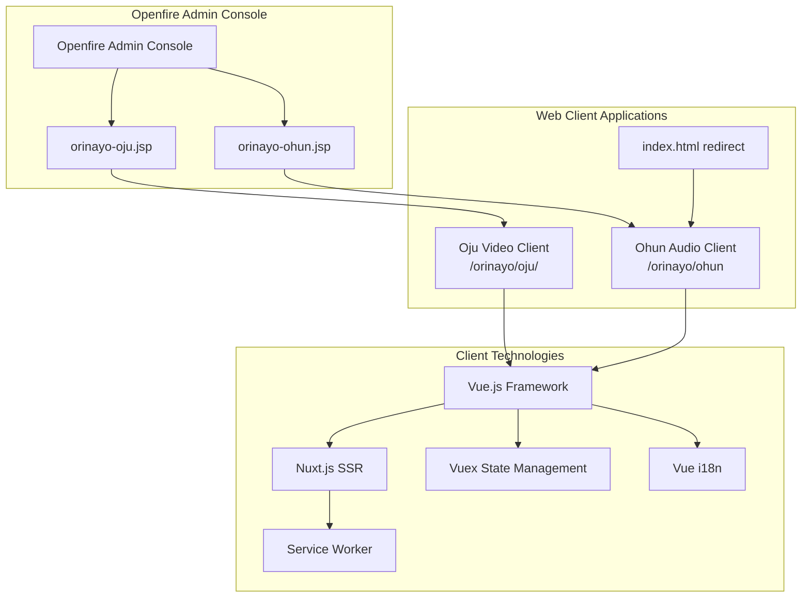
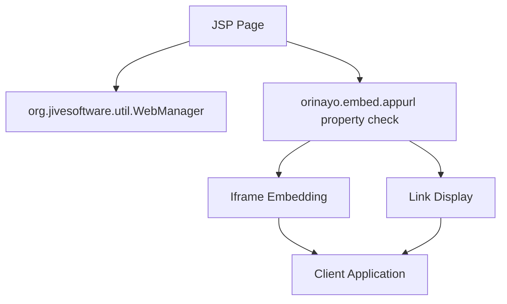
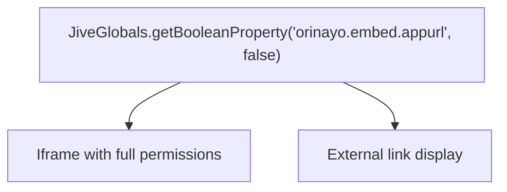
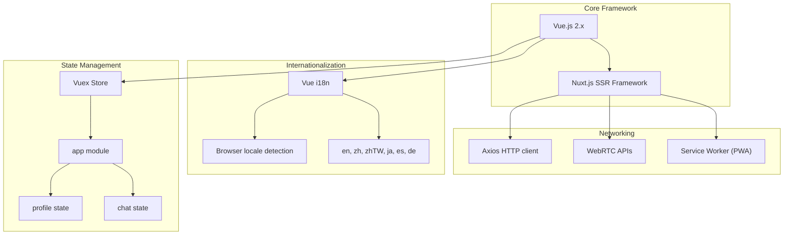
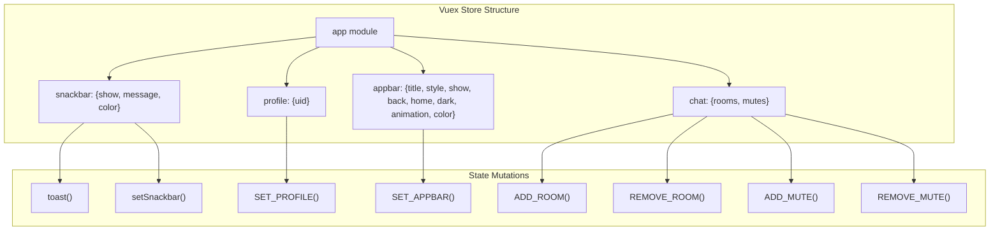
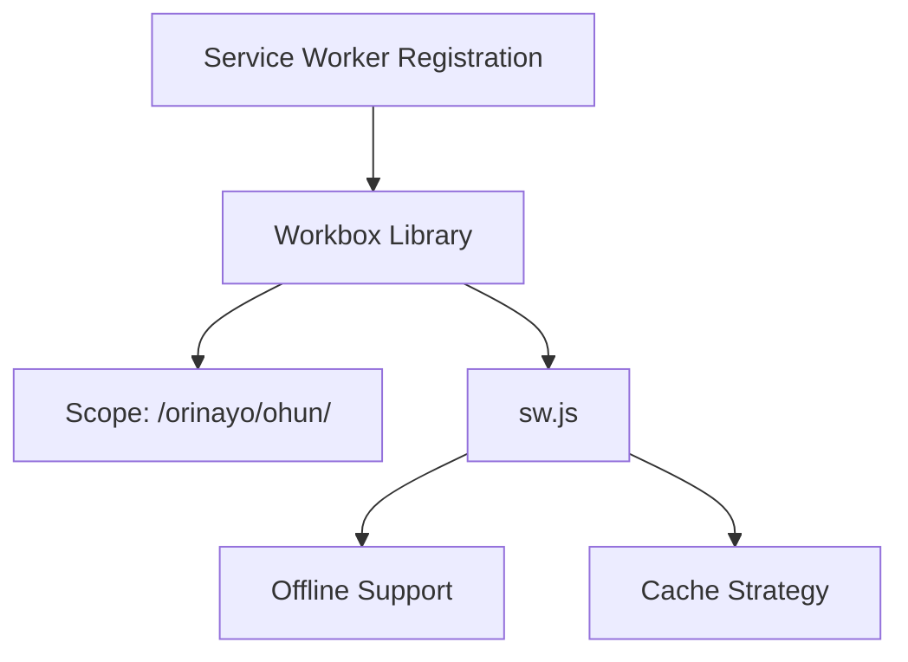
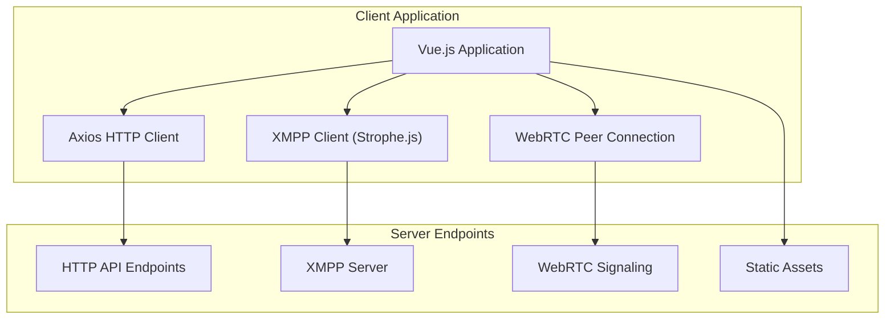

# Web Interfaces and Client Applications

> **Relevant source files**
> * [classes/jsp/index.html](https://github.com/igniterealtime/openfire-orinayo-plugin/blob/932fc61c/classes/jsp/index.html)
> * [classes/jsp/ohun/_nuxt/8512603.js](https://github.com/igniterealtime/openfire-orinayo-plugin/blob/932fc61c/classes/jsp/ohun/_nuxt/8512603.js)
> * [src/web/orinayo-ohun.jsp](https://github.com/igniterealtime/openfire-orinayo-plugin/blob/932fc61c/src/web/orinayo-ohun.jsp)
> * [src/web/orinayo-oju.jsp](https://github.com/igniterealtime/openfire-orinayo-plugin/blob/932fc61c/src/web/orinayo-oju.jsp)

This document covers the web-based user interfaces and client applications provided by the Orin Ayo plugin. This includes JSP-based admin console integration pages and the modern web client applications that end users interact with for audio/video conferencing and collaborative music features.

For information about the underlying XMPP protocol extensions that power these web interfaces, see [XMPP Protocol Extensions](/igniterealtime/openfire-orinayo-plugin/3-xmpp-protocol-extensions). For details about the core plugin architecture and server-side components, see [Core Plugin Architecture](/igniterealtime/openfire-orinayo-plugin/2-core-plugin-architecture).

## Overview

The Orin Ayo plugin provides web interfaces through two main mechanisms:

1. **JSP Integration Pages** - Server-side rendered pages that integrate with the Openfire admin console
2. **Client Applications** - Modern web applications built with Vue.js/Nuxt.js that provide the actual user experience

**Sources:** [src/web/orinayo-oju.jsp L1-L63](https://github.com/igniterealtime/openfire-orinayo-plugin/blob/932fc61c/src/web/orinayo-oju.jsp#L1-L63)

 [src/web/orinayo-ohun.jsp L1-L63](https://github.com/igniterealtime/openfire-orinayo-plugin/blob/932fc61c/src/web/orinayo-ohun.jsp#L1-L63)

 [classes/jsp/index.html L1-L9](https://github.com/igniterealtime/openfire-orinayo-plugin/blob/932fc61c/classes/jsp/index.html#L1-L9)

 [classes/jsp/ohun/_nuxt/8512603.js L1-L50](https://github.com/igniterealtime/openfire-orinayo-plugin/blob/932fc61c/classes/jsp/ohun/_nuxt/8512603.js#L1-L50)

## JSP Admin Console Integration

The plugin integrates with the Openfire admin console through JSP pages that serve as gateways to the client applications. These pages handle server-side configuration and URL construction.

### JSP Page Structure

Both `orinayo-oju.jsp` and `orinayo-ohun.jsp` follow the same architectural pattern:

**Sources:** [src/web/orinayo-oju.jsp L31-L33](https://github.com/igniterealtime/openfire-orinayo-plugin/blob/932fc61c/src/web/orinayo-oju.jsp#L31-L33)

 [src/web/orinayo-ohun.jsp L31-L33](https://github.com/igniterealtime/openfire-orinayo-plugin/blob/932fc61c/src/web/orinayo-ohun.jsp#L31-L33)

### URL Construction and Configuration

The JSP pages construct URLs using Openfire server configuration:

* **Host Construction**: Uses `XMPPServer.getInstance().getServerInfo().getHostname()`
* **Port Configuration**: Uses `JiveGlobals.getProperty("httpbind.port.secure", "7443")`
* **URL Patterns**: * Oju: `https://${publicHost}/orinayo/oju/` * Ohun: `https://${publicHost}/orinayo/ohun`

| Component | Oju JSP | Ohun JSP |
| --- | --- | --- |
| File Path | [src/web/orinayo-oju.jsp](https://github.com/igniterealtime/openfire-orinayo-plugin/blob/932fc61c/src/web/orinayo-oju.jsp) | [src/web/orinayo-ohun.jsp](https://github.com/igniterealtime/openfire-orinayo-plugin/blob/932fc61c/src/web/orinayo-ohun.jsp) |
| URL Pattern | `/orinayo/oju/` | `/orinayo/ohun` |
| Page ID | `orinayo-oju` | `orinayo-ohun` |
| Message Key | `admin.sidebar.webclients.item.oju.description` | `admin.sidebar.webclients.item.ohun.description` |

**Sources:** [src/web/orinayo-oju.jsp L35-L36](https://github.com/igniterealtime/openfire-orinayo-plugin/blob/932fc61c/src/web/orinayo-oju.jsp#L35-L36)

 [src/web/orinayo-ohun.jsp L35-L36](https://github.com/igniterealtime/openfire-orinayo-plugin/blob/932fc61c/src/web/orinayo-ohun.jsp#L35-L36)

### Embedding Behavior

The JSP pages support two display modes controlled by the `orinayo.embed.appurl` property:

When embedding is enabled, the iframe includes comprehensive permissions:

* `geolocation`
* `microphone`
* `camera`
* `fullscreen`
* `display-capture`

**Sources:** [src/web/orinayo-oju.jsp L51-L60](https://github.com/igniterealtime/openfire-orinayo-plugin/blob/932fc61c/src/web/orinayo-oju.jsp#L51-L60)

 [src/web/orinayo-ohun.jsp L51-L60](https://github.com/igniterealtime/openfire-orinayo-plugin/blob/932fc61c/src/web/orinayo-ohun.jsp#L51-L60)

## Client Application Architecture

The client applications are modern web applications built with Vue.js and Nuxt.js, providing rich interactive experiences for audio and video conferencing.

### Technology Stack

**Sources:** [classes/jsp/ohun/_nuxt/8512603.js L314-L350](https://github.com/igniterealtime/openfire-orinayo-plugin/blob/932fc61c/classes/jsp/ohun/_nuxt/8512603.js#L314-L350)

 [classes/jsp/ohun/_nuxt/8512603.js L365-L400](https://github.com/igniterealtime/openfire-orinayo-plugin/blob/932fc61c/classes/jsp/ohun/_nuxt/8512603.js#L365-L400)

### Application State Management

The Vuex store manages application state across several modules:

**Sources:** [classes/jsp/ohun/_nuxt/8512603.js L389-L450](https://github.com/igniterealtime/openfire-orinayo-plugin/blob/932fc61c/classes/jsp/ohun/_nuxt/8512603.js#L389-L450)

### Internationalization Support

The applications support multiple languages with automatic browser detection:

| Language Code | Language | Status |
| --- | --- | --- |
| `en` | English | Default |
| `zh` | Chinese Simplified | Full support |
| `zhTW` | Chinese Traditional | Full support |
| `ja` | Japanese | Full support |
| `es` | Spanish | Full support |
| `de` | German | Full support |

The i18n system includes:

* Automatic browser language detection
* Fallback to English for unsupported languages
* Dynamic locale switching
* Message interpolation and pluralization

**Sources:** [classes/jsp/ohun/_nuxt/8512603.js L365-L380](https://github.com/igniterealtime/openfire-orinayo-plugin/blob/932fc61c/classes/jsp/ohun/_nuxt/8512603.js#L365-L380)

### Service Worker and PWA Features

The client applications include Progressive Web App (PWA) capabilities:

The service worker is registered with error handling and supports:

* Offline functionality
* Resource caching
* Background sync capabilities

**Sources:** [classes/jsp/ohun/_nuxt/8512603.js L234-L250](https://github.com/igniterealtime/openfire-orinayo-plugin/blob/932fc61c/classes/jsp/ohun/_nuxt/8512603.js#L234-L250)

## Client-Server Communication

The web clients communicate with the Openfire server through multiple channels:

**Sources:** [classes/jsp/ohun/_nuxt/8512603.js L480-L520](https://github.com/igniterealtime/openfire-orinayo-plugin/blob/932fc61c/classes/jsp/ohun/_nuxt/8512603.js#L480-L520)

### HTTP Client Configuration

The Axios HTTP client is configured with:

* Base URL: `http://localhost:3000/` (development)
* Automatic loading progress integration
* Request/response interceptors
* Error handling with user feedback

**Sources:** [classes/jsp/ohun/_nuxt/8512603.js L480-L500](https://github.com/igniterealtime/openfire-orinayo-plugin/blob/932fc61c/classes/jsp/ohun/_nuxt/8512603.js#L480-L500)

### Component Architecture

The client applications use a component-based architecture:

| Component Type | Purpose | Key Features |
| --- | --- | --- |
| Layout Components | Page structure | App bar, navigation, background |
| UI Components | User interface | Buttons, dialogs, forms |
| Media Components | Audio/video | WebRTC integration, controls |
| Utility Components | Common functionality | Loading, error handling, toasts |

**Sources:** [classes/jsp/ohun/_nuxt/8512603.js L450-L480](https://github.com/igniterealtime/openfire-orinayo-plugin/blob/932fc61c/classes/jsp/ohun/_nuxt/8512603.js#L450-L480)