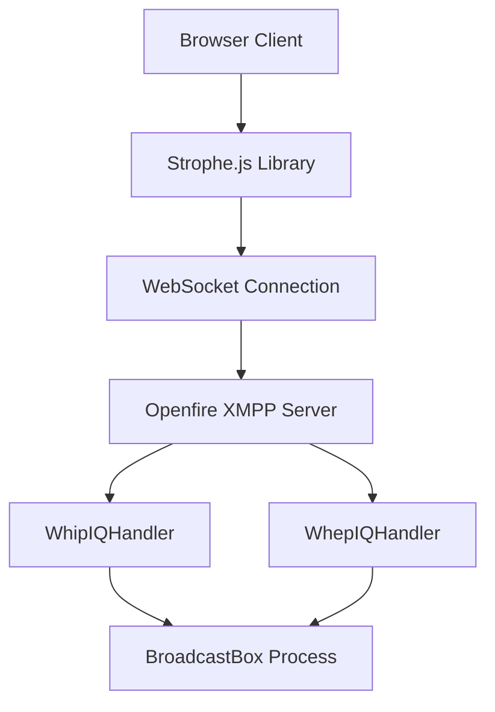
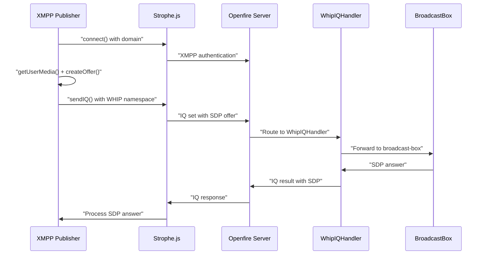
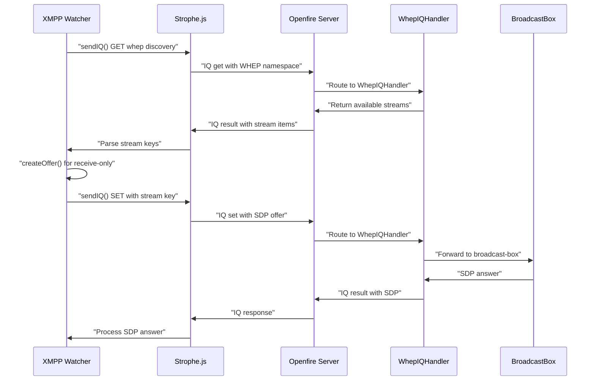

# WebRTC Examples

> **Relevant source files**
> * [classes/jsp/strophe.umd.min.js](https://github.com/igniterealtime/openfire-orinayo-plugin/blob/932fc61c/classes/jsp/strophe.umd.min.js)
> * [classes/jsp/web-audio-publisher.html](https://github.com/igniterealtime/openfire-orinayo-plugin/blob/932fc61c/classes/jsp/web-audio-publisher.html)
> * [classes/jsp/web-audio-watcher.html](https://github.com/igniterealtime/openfire-orinayo-plugin/blob/932fc61c/classes/jsp/web-audio-watcher.html)
> * [classes/jsp/web-video-publisher.html](https://github.com/igniterealtime/openfire-orinayo-plugin/blob/932fc61c/classes/jsp/web-video-publisher.html)
> * [classes/jsp/web-video-watcher.html](https://github.com/igniterealtime/openfire-orinayo-plugin/blob/932fc61c/classes/jsp/web-video-watcher.html)
> * [classes/jsp/xmpp-audio-publisher.html](https://github.com/igniterealtime/openfire-orinayo-plugin/blob/932fc61c/classes/jsp/xmpp-audio-publisher.html)
> * [classes/jsp/xmpp-audio-watcher.html](https://github.com/igniterealtime/openfire-orinayo-plugin/blob/932fc61c/classes/jsp/xmpp-audio-watcher.html)
> * [classes/jsp/xmpp-video-publisher.html](https://github.com/igniterealtime/openfire-orinayo-plugin/blob/932fc61c/classes/jsp/xmpp-video-publisher.html)
> * [classes/jsp/xmpp-video-watcher.html](https://github.com/igniterealtime/openfire-orinayo-plugin/blob/932fc61c/classes/jsp/xmpp-video-watcher.html)
> * [src/root/web/build/audio-publisher.html](https://github.com/igniterealtime/openfire-orinayo-plugin/blob/932fc61c/src/root/web/build/audio-publisher.html)
> * [src/root/web/build/audio-watcher.html](https://github.com/igniterealtime/openfire-orinayo-plugin/blob/932fc61c/src/root/web/build/audio-watcher.html)

This document covers the complete WebRTC publisher and watcher example implementations provided by the Orin Ayo plugin. These examples demonstrate both HTTP-based and XMPP-based approaches to WebRTC media streaming using WHIP (WebRTC-HTTP Ingestion Protocol) and WHEP (WebRTC-HTTP Egress Protocol) standards.

For information about the underlying WHIP/WHEP IQ handlers and protocol extensions, see [WHIP and WHEP IQ Handlers](/igniterealtime/openfire-orinayo-plugin/3.1-whip-and-whep-iq-handlers). For details about the broader WebRTC media streaming architecture, see [WebRTC Media Streaming](/igniterealtime/openfire-orinayo-plugin/5.2-webrtc-media-streaming).

## Example Categories

The Orin Ayo plugin provides two distinct sets of WebRTC examples, each demonstrating different integration approaches:

| Category | Protocol | Authentication | Use Case |
| --- | --- | --- | --- |
| HTTP API Examples | WHIP/WHEP over HTTP | Bearer Token | Direct integration with media servers |
| XMPP API Examples | WHIP/WHEP over XMPP | XMPP Authentication | XMPP-native streaming applications |

### HTTP API Examples

The HTTP API examples demonstrate direct WebRTC streaming using standard WHIP/WHEP protocols over HTTP endpoints:

* `web-audio-publisher.html` - Audio-only stream publishing
* `web-audio-watcher.html` - Audio-only stream consumption
* `web-video-publisher.html` - Audio/video stream publishing
* `web-video-watcher.html` - Audio/video stream consumption

### XMPP API Examples

The XMPP API examples show WebRTC streaming integrated with XMPP messaging using custom protocol extensions:

* `xmpp-audio-publisher.html` - Audio publishing via XMPP IQ stanzas
* `xmpp-audio-watcher.html` - Audio watching via XMPP IQ stanzas
* `xmpp-video-publisher.html` - Video publishing via XMPP IQ stanzas
* `xmpp-video-watcher.html` - Video watching via XMPP IQ stanzas

Sources: [classes/jsp/web-audio-publisher.html L1-L51](https://github.com/igniterealtime/openfire-orinayo-plugin/blob/932fc61c/classes/jsp/web-audio-publisher.html#L1-L51)

 [classes/jsp/xmpp-audio-publisher.html L1-L73](https://github.com/igniterealtime/openfire-orinayo-plugin/blob/932fc61c/classes/jsp/xmpp-audio-publisher.html#L1-L73)

 [classes/jsp/web-video-publisher.html L1-L76](https://github.com/igniterealtime/openfire-orinayo-plugin/blob/932fc61c/classes/jsp/web-video-publisher.html#L1-L76)

 [classes/jsp/xmpp-video-publisher.html L1-L90](https://github.com/igniterealtime/openfire-orinayo-plugin/blob/932fc61c/classes/jsp/xmpp-video-publisher.html#L1-L90)

## HTTP API Implementation

### Publisher Implementation

The HTTP publisher examples create WebRTC peer connections and publish media streams using the WHIP protocol:

```mermaid
sequenceDiagram
  participant Publisher Client
  participant /orinayo/api/whip
  participant BroadcastBox

  Publisher Client->>Publisher Client: "getUserMedia()"
  Publisher Client->>Publisher Client: "createOffer()"
  Publisher Client->>/orinayo/api/whip: "POST with SDP offer + Bearer token"
  /orinayo/api/whip->>BroadcastBox: "Forward to broadcast-box process"
  BroadcastBox->>/orinayo/api/whip: "SDP answer"
  /orinayo/api/whip->>Publisher Client: "Return SDP answer"
  Publisher Client->>Publisher Client: "setRemoteDescription()"
  Publisher Client->>BroadcastBox: "WebRTC media flow"
```

The publisher workflow follows this pattern in [classes/jsp/web-audio-publisher.html L21-L49](https://github.com/igniterealtime/openfire-orinayo-plugin/blob/932fc61c/classes/jsp/web-audio-publisher.html#L21-L49)

:

1. Generate stream key using `crypto.randomUUID()`
2. Acquire media stream with `navigator.mediaDevices.getUserMedia()`
3. Create `RTCPeerConnection` and add transceivers
4. Generate SDP offer and send to `/orinayo/api/whip` endpoint
5. Process SDP answer to establish WebRTC connection

Sources: [classes/jsp/web-audio-publisher.html L21-L49](https://github.com/igniterealtime/openfire-orinayo-plugin/blob/932fc61c/classes/jsp/web-audio-publisher.html#L21-L49)

 [classes/jsp/web-video-publisher.html L22-L74](https://github.com/igniterealtime/openfire-orinayo-plugin/blob/932fc61c/classes/jsp/web-video-publisher.html#L22-L74)

### Watcher Implementation

The HTTP watcher examples consume WebRTC streams using the WHEP protocol:

```mermaid
sequenceDiagram
  participant Watcher Client
  participant /orinayo/api/status
  participant /orinayo/api/whep
  participant BroadcastBox

  Watcher Client->>/orinayo/api/status: "GET available streams"
  /orinayo/api/status->>Watcher Client: "Return stream keys"
  Watcher Client->>Watcher Client: "createOffer() for receive-only"
  Watcher Client->>/orinayo/api/whep: "POST with SDP offer + Bearer token"
  /orinayo/api/whep->>BroadcastBox: "Forward to broadcast-box process"
  BroadcastBox->>/orinayo/api/whep: "SDP answer"
  /orinayo/api/whep->>Watcher Client: "Return SDP answer"
  Watcher Client->>Watcher Client: "setRemoteDescription()"
  BroadcastBox->>Watcher Client: "WebRTC media flow"
```

The watcher discovers streams via [classes/jsp/web-audio-watcher.html L23-L26](https://github.com/igniterealtime/openfire-orinayo-plugin/blob/932fc61c/classes/jsp/web-audio-watcher.html#L23-L26)

 and establishes connections using receive-only transceivers.

Sources: [classes/jsp/web-audio-watcher.html L22-L47](https://github.com/igniterealtime/openfire-orinayo-plugin/blob/932fc61c/classes/jsp/web-audio-watcher.html#L22-L47)

 [classes/jsp/web-video-watcher.html L23-L61](https://github.com/igniterealtime/openfire-orinayo-plugin/blob/932fc61c/classes/jsp/web-video-watcher.html#L23-L61)

## XMPP API Implementation

### XMPP Connection Setup

All XMPP examples use the Strophe.js library for XMPP connectivity, establishing WebSocket connections to the Openfire server:



The connection establishes via [classes/jsp/xmpp-audio-publisher.html L24](https://github.com/igniterealtime/openfire-orinayo-plugin/blob/932fc61c/classes/jsp/xmpp-audio-publisher.html#L24-L24)

:

```
window.connection = new Strophe.Connection(location.protocol.replace("http", "ws") + "//" + location.host + "/ws/");
```

Sources: [classes/jsp/xmpp-audio-publisher.html L24](https://github.com/igniterealtime/openfire-orinayo-plugin/blob/932fc61c/classes/jsp/xmpp-audio-publisher.html#L24-L24)

 [classes/jsp/xmpp-video-watcher.html L23](https://github.com/igniterealtime/openfire-orinayo-plugin/blob/932fc61c/classes/jsp/xmpp-video-watcher.html#L23-L23)

### XMPP Publisher Protocol

XMPP publishers send WebRTC offers using custom IQ stanzas with the `urn:xmpp:whip:0` namespace:



The IQ stanza structure follows [classes/jsp/xmpp-audio-publisher.html L53](https://github.com/igniterealtime/openfire-orinayo-plugin/blob/932fc61c/classes/jsp/xmpp-audio-publisher.html#L53-L53)

:

```
window.connection.sendIQ($iq({type: 'set', to: window.connection.domain})
    .c('whip', {xmlns: 'urn:xmpp:whip:0', key: streamKey})
    .c('sdp', offer.sdp)
```

Sources: [classes/jsp/xmpp-audio-publisher.html L53-L62](https://github.com/igniterealtime/openfire-orinayo-plugin/blob/932fc61c/classes/jsp/xmpp-audio-publisher.html#L53-L62)

 [classes/jsp/xmpp-video-publisher.html L71-L80](https://github.com/igniterealtime/openfire-orinayo-plugin/blob/932fc61c/classes/jsp/xmpp-video-publisher.html#L71-L80)

### XMPP Watcher Protocol

XMPP watchers discover and consume streams using the `urn:xmpp:whep:0` namespace:



Stream discovery uses [classes/jsp/xmpp-audio-watcher.html L31](https://github.com/igniterealtime/openfire-orinayo-plugin/blob/932fc61c/classes/jsp/xmpp-audio-watcher.html#L31-L31)

:

```
window.connection.sendIQ($iq({type: 'get', to: window.connection.domain})
    .c('whep', {xmlns: 'urn:xmpp:whep:0'})
```

Sources: [classes/jsp/xmpp-audio-watcher.html L31-L42](https://github.com/igniterealtime/openfire-orinayo-plugin/blob/932fc61c/classes/jsp/xmpp-audio-watcher.html#L31-L42)

 [classes/jsp/xmpp-video-watcher.html L31-L42](https://github.com/igniterealtime/openfire-orinayo-plugin/blob/932fc61c/classes/jsp/xmpp-video-watcher.html#L31-L42)

## WebRTC Configuration Patterns

### Media Constraints

The examples demonstrate different media acquisition patterns:

| Example Type | Audio | Video | Configuration |
| --- | --- | --- | --- |
| Audio Publisher | ✓ | ✗ | `{audio: true, video: false}` |
| Video Publisher | ✓ | ✓ | `{audio: true, video: true}` |
| Audio Watcher | ✓ | ✗ | `addTransceiver('audio', {direction: 'recvonly'})` |
| Video Watcher | ✓ | ✓ | `addTransceiver('audio/video', {direction: 'recvonly'})` |

### Simulcast Configuration

Video publishers implement simulcast with multiple encoding layers [classes/jsp/xmpp-video-publisher.html L49-L65](https://github.com/igniterealtime/openfire-orinayo-plugin/blob/932fc61c/classes/jsp/xmpp-video-publisher.html#L49-L65)

:

```yaml
sendEncodings: [
  { rid: 'high' },
  { rid: 'med', scaleResolutionDownBy: 2.0 },
  { rid: 'low', scaleResolutionDownBy: 4.0 }
]
```

This provides adaptive bitrate streaming with high/medium/low resolution variants.

Sources: [classes/jsp/web-video-publisher.html L49-L65](https://github.com/igniterealtime/openfire-orinayo-plugin/blob/932fc61c/classes/jsp/web-video-publisher.html#L49-L65)

 [classes/jsp/xmpp-video-publisher.html L49-L65](https://github.com/igniterealtime/openfire-orinayo-plugin/blob/932fc61c/classes/jsp/xmpp-video-publisher.html#L49-L65)

## File Locations and Deployment

### Development Files

Development versions with configurable endpoints located in [src/root/web/build/](https://github.com/igniterealtime/openfire-orinayo-plugin/blob/932fc61c/src/root/web/build/)

:

* `audio-publisher.html` - Configurable WHIP URL input
* `audio-watcher.html` - Configurable WHEP URL input

### Production Files

Production versions for deployment located in [classes/jsp/](https://github.com/igniterealtime/openfire-orinayo-plugin/blob/932fc61c/classes/jsp/)

:

* Auto-detect server endpoints using `location.origin`
* Include `strophe.umd.min.js` for XMPP examples
* Ready for Openfire admin console integration

Sources: [src/root/web/build/audio-publisher.html L11-L12](https://github.com/igniterealtime/openfire-orinayo-plugin/blob/932fc61c/src/root/web/build/audio-publisher.html#L11-L12)

 [classes/jsp/web-audio-publisher.html L22](https://github.com/igniterealtime/openfire-orinayo-plugin/blob/932fc61c/classes/jsp/web-audio-publisher.html#L22-L22)

 [classes/jsp/strophe.umd.min.js L1-L2](https://github.com/igniterealtime/openfire-orinayo-plugin/blob/932fc61c/classes/jsp/strophe.umd.min.js#L1-L2)